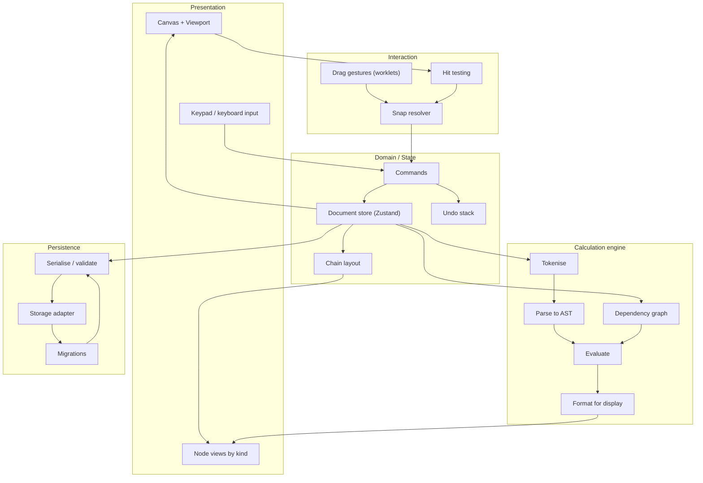
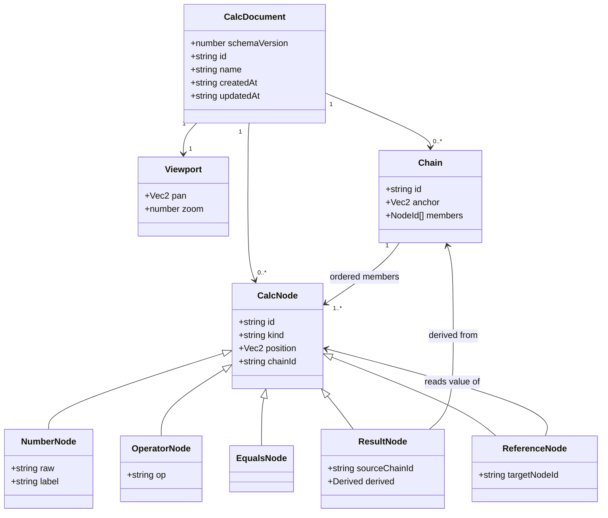
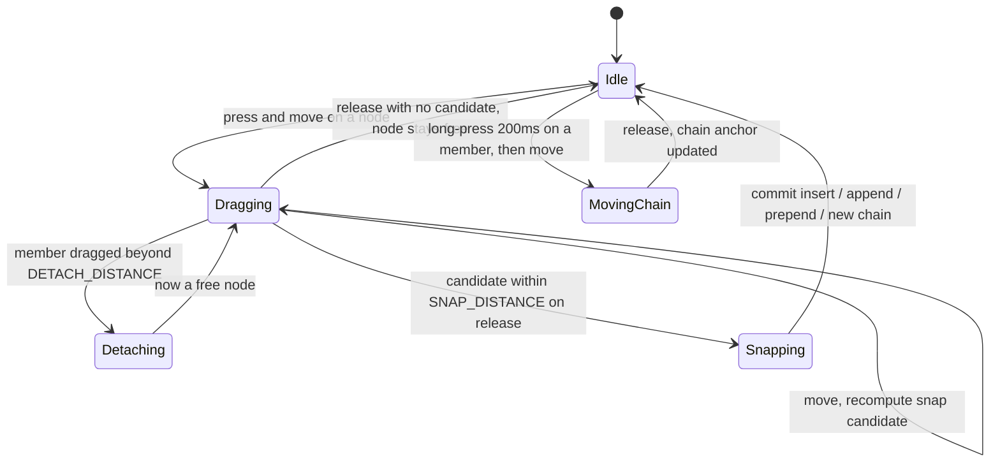
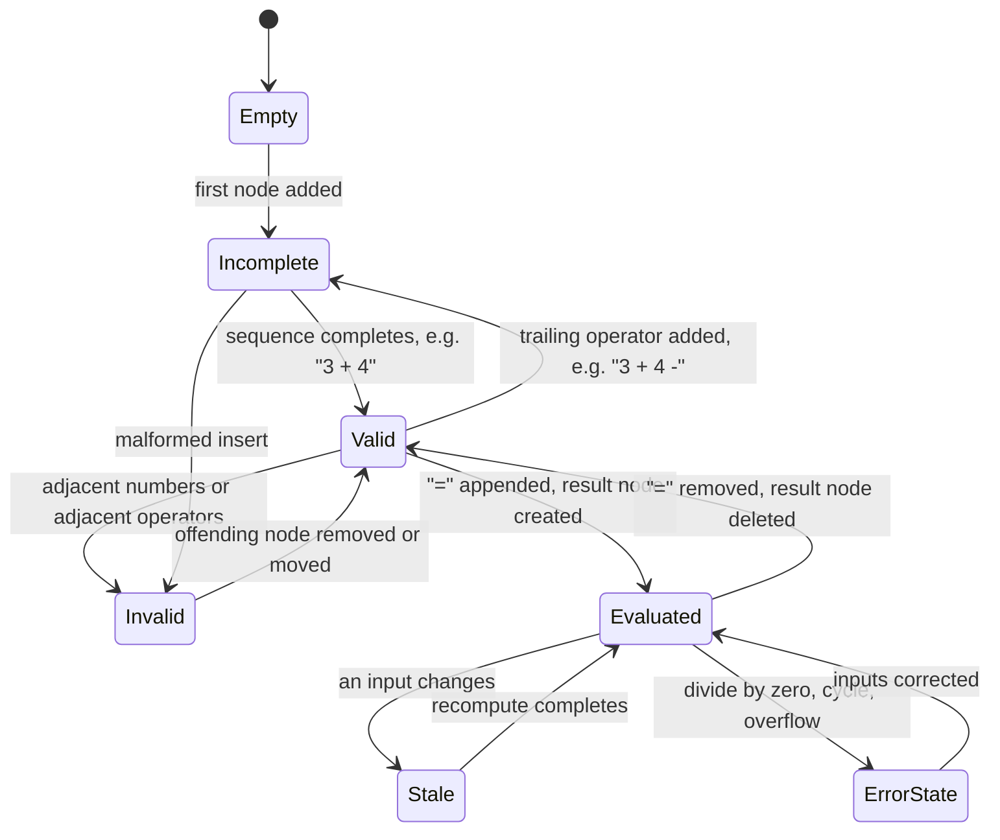
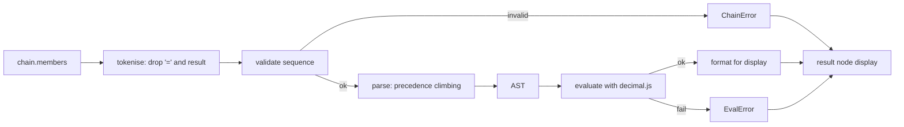
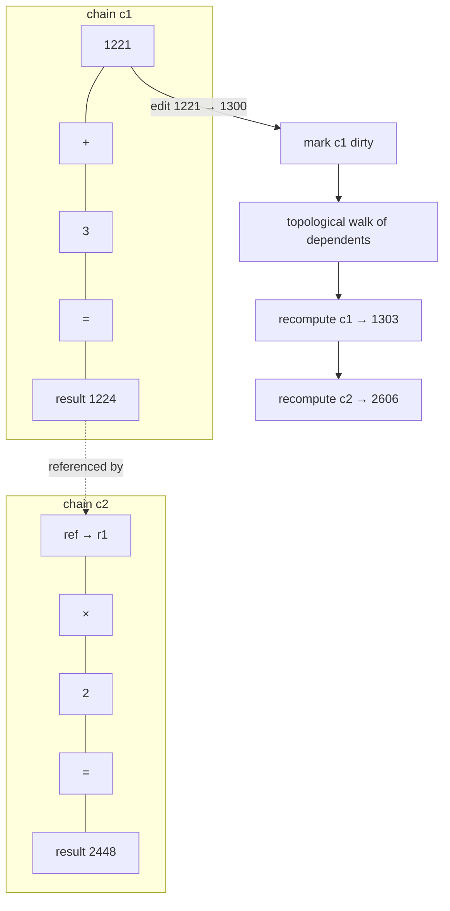
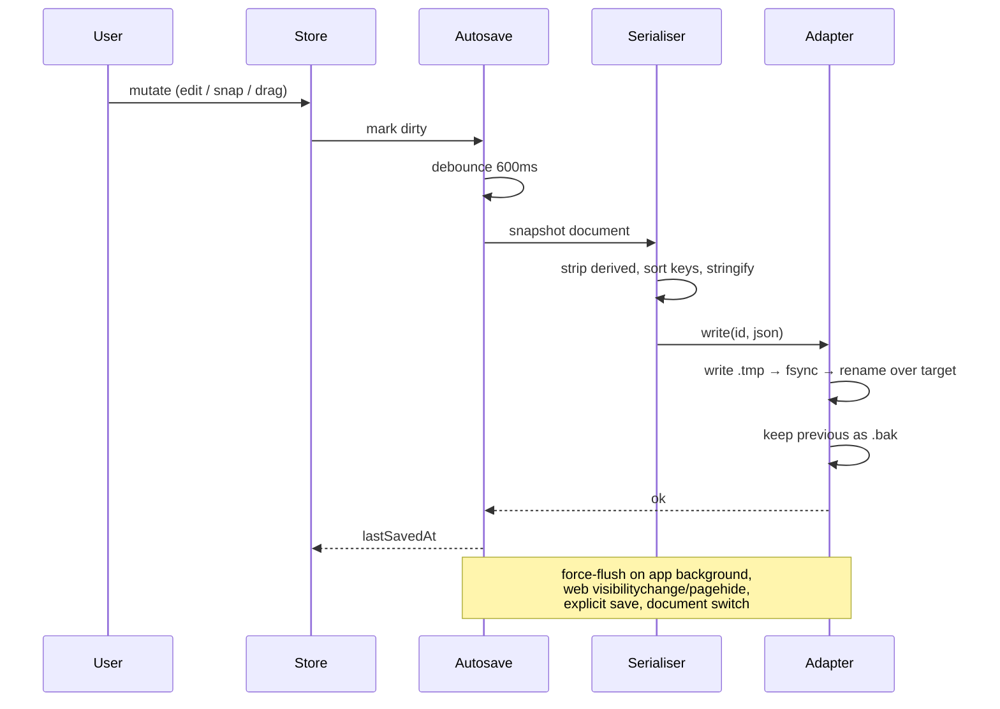
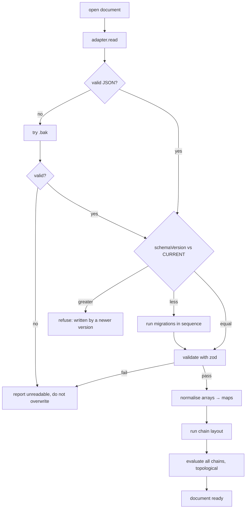
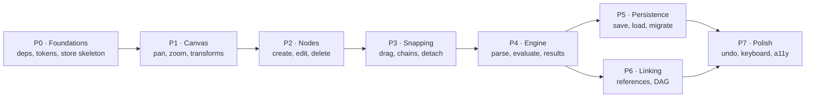

# CalcMind — Architecture & Development Plan

> **Status:** design proposal, not yet implemented. The repository currently holds a bare
> React Native scaffold with a conventional keypad calculator in `App.tsx`; everything below
> describes what replaces it.
>
> **Reference app:** [Tydlig](http://tydligapp.com/) (iOS). Its screenshots could not be
> retrieved while writing this document — outbound access to `tydligapp.com` is blocked by the
> network policy of the authoring environment. The interaction model below is therefore drawn
> from the product brief plus published feature descriptions (free-form canvas, responsive
> results, linked numbers, real-time graphing, annotations, undo). Anything inferred rather than
> specified is marked **[assumption]** so it can be corrected cheaply.

---

## 1. What we are building

CalcMind is a calculator without a fixed expression line. The screen is an **infinite canvas**.
The user types numbers and operators anywhere on it; each one becomes an independent **node**.
Dragging nodes near each other makes them **snap** into a horizontal **chain**, and a chain is a
formula. Appending an `=` node to the right end of a valid chain auto-creates a **result node**
holding the computed value. Result nodes are never directly editable — they are derived data.

The payoff is that a calculation stays on screen as a manipulable object. Change any input and
every result that depends on it updates.

### 1.1 Visual reference

Traced from the supplied reference image; colours and cell geometry were sampled from the
source pixels rather than eyeballed.


Three things in that image drive the whole visual design:

1. **Cells sit flush.** A snapped chain has no gaps between members, so it reads as a single
   pill rather than a row of separate chips. Snapping must therefore feel like *fusing*, not
   *aligning*.
2. **Node kind is encoded in colour.** Numbers teal, operators amber, `=` purple, results salmon.
   A user can parse the structure of a formula without reading it.
3. **The result node is visually "not yours to edit."** It has a different hue *and* a dot
   texture *and* its own lighter outline. Read-only-ness is communicated three times over.

### 1.2 Design tokens derived from the reference

The reference raster has a cell height of 256px. Tokens below are that geometry normalised to a
64dp node height, rounded to sensible device-independent values.

| Token | Reference (px) | Ratio to cell height | Value (dp) |
|---|---|---|---|
| `nodeHeight` | 256 | 1.000 | **64** |
| `borderBand` | 11 | 0.043 | **3** |
| `numeralFontSize` | 127 | 0.496 | **30** (weight 800) |
| `numberPaddingX` | 48 | 0.188 | **12** |
| `operatorWidth` | 136 | 0.531 | **34** |
| `equalsWidth` | 140 | 0.547 | **35** |
| `cornerRadius` | 12 | 0.047 | **8** *(bumped from 3 for a friendlier silhouette)* |
| `mathAxisOffset` | +16 from centre | 0.063 | **4** below centre |

| Role | Fill | Border band |
|---|---|---|
| number | `#44BDAD` | `#8CE0D2` |
| operator | `#FFBF28` | `#FFD78E` |
| equals | `#7030A0` | `#AA557F` |
| result | `#FF7E79` + dot texture `#FFD1CF` | `#FFA3A0` |
| numerals / glyphs | `#FFFFFF` | — |

The result texture is a 4×4 unit tile with 1-unit dots at `(1,0)` and `(3,2)`.

---

## 2. Design principles

1. **One source of truth.** Derived values (results, layout positions of chained nodes) are
   computed, never authored. Anything derived that we persist is explicitly labelled a cache and
   is recomputed on load.
2. **The document is a plain, inspectable JSON file.** No binary blobs, no proprietary container.
   A user can read, diff, and hand-edit their own work.
3. **Interaction runs on the UI thread.** Dragging must not round-trip through JS state per
   frame; commits happen on gesture release.
4. **Open source only.** Every dependency is MIT/Apache-2.0 and runs locally or in our own CI.
   No vendor build service, no metered API, nothing that acquires a price at scale.
5. **Errors are states, not exceptions.** An incomplete or invalid chain is a normal thing for a
   user to be holding mid-thought. It renders as a state; it never throws or destroys work.

---

## 3. Vocabulary

| Term | Meaning |
|---|---|
| **Node** | Atomic canvas object: a number, an operator, an `=`, a result, or (later) a reference. |
| **Chain** | Ordered left-to-right sequence of snapped nodes. A chain is a formula. |
| **Free node** | A node with no chain; owns its own position. |
| **Member** | A node belonging to a chain; its position is derived from the chain's layout. |
| **Anchor** | World position of a chain's left edge — the chain's authoritative position. |
| **Result node** | Read-only node holding the value of its source chain. |
| **Reference** | *(phase 6)* Node that displays another node's live value; how linking works. |
| **World space** | Logical, unbounded canvas coordinates. |
| **Screen space** | Device pixels after pan/zoom. |

---

## 4. Technology decisions

| Concern | Choice | Licence | Why |
|---|---|---|---|
| Framework | React Native 0.86 (bare CLI) | MIT | Already in place; no Expo/EAS dependency. |
| Web target | `react-native-web` + Webpack | MIT | Already wired; `npm run build:web` → `dist/`. |
| State | **Zustand** + **Immer** | MIT | Selector-scoped subscriptions avoid re-render storms while dragging; Immer patches give us undo nearly free. Redux Toolkit is heavier for no gain here; raw Context re-renders the world. |
| Gestures | **react-native-gesture-handler** | MIT | Native-thread gesture recognition; works on web. |
| Animation | **react-native-reanimated** | MIT | Worklets keep drag at 60fps without JS bridge traffic. |
| Numerics | **decimal.js** | MIT | A calculator that answers `0.1 + 0.2 = 0.30000000000000004` is a broken calculator. |
| IDs | **nanoid** | MIT | Small, collision-safe, URL-safe. |
| Schema validation | **zod** | MIT | Validates documents at the trust boundary (file load) and generates TS types. |
| Native filesystem | **@dr.pogodin/react-native-fs** | MIT | Maintained fork of `react-native-fs`; the original is unmaintained. |
| Web storage | **idb-keyval** | MIT | Thin IndexedDB wrapper; localStorage is too small and synchronous. |
| Result texture | **react-native-svg** | MIT | Needed only for the dot pattern; see §11.3 for the zero-dependency fallback. |
| Tests | Jest (already configured) + **fast-check** | MIT | Table-driven engine tests; property tests for parser/formatter round-trips. |

No dependency here bills by usage, gates features behind a plan, or requires an account.

---

## 5. System architecture



Dependency rule: **presentation → interaction → domain → engine → persistence**, never upward.
The engine knows nothing about React; it is pure functions over the document model, which is what
makes it cheap to test exhaustively.

### 5.1 Repository layout

```
src/
  app/           App shell, providers, theme injection
  canvas/        Canvas, viewport transform, pan/zoom gestures, coords.ts
  nodes/         One view per node kind + useNodeDrag
  chains/        layout.ts, snapping.ts, bounds.ts
  engine/        tokenize, parse, evaluate, format, numeric, graph, errors
  model/         types.ts, factories.ts, schema.ts (zod)
  store/         documentStore, selectors, commands, undo
  persistence/   serialize, migrations/, autosave,
                 adapter.ts + adapter.native.ts + adapter.web.ts
  keypad/        Keypad
  ui/            tokens.ts, theme.ts, primitives
docs/
  ARCHITECTURE.md  (this file)
  assets/          formula-reference.svg, node-anatomy.svg
```

Platform splitting already works in both bundlers with no extra config: Metro resolves
`.native.ts` automatically, and `webpack.config.js` already lists `.web.tsx/.web.ts/.web.js`
first in `resolve.extensions`.

---

## 6. Domain model



```ts
// model/types.ts
export type NodeId  = string;
export type ChainId = string;

export interface Vec2 { x: number; y: number }

export type OperatorSymbol = '+' | '-' | '×' | '÷';

interface NodeBase {
  id: NodeId;
  /** World coords of the node's top-left.
   *  AUTHORITATIVE when chainId === null.
   *  DERIVED from chain layout when chainId !== null (see §8.1). */
  position: Vec2;
  chainId: ChainId | null;
  createdAt: number;
}

export interface NumberNode extends NodeBase {
  kind: 'number';
  /** Exactly what the user typed: "1221", "3.", "-0.5". Parsing is the engine's job,
   *  so partial input like "3." survives a save/load cycle intact. */
  raw: string;
  label?: string;              // optional annotation, phase 7
}

export interface OperatorNode extends NodeBase {
  kind: 'operator';
  op: OperatorSymbol;
}

export interface EqualsNode extends NodeBase {
  kind: 'equals';
}

export interface ResultNode extends NodeBase {
  kind: 'result';
  sourceChainId: ChainId;
  /** CACHE ONLY — never trusted. Recomputed on load; lets us paint before the
   *  engine has run and makes saved files human-readable. Engine output always wins. */
  derived?: { display: string; computedAt: string };
}

/** Phase 6. Declared in v1 of the schema so adding linking is not a breaking migration. */
export interface ReferenceNode extends NodeBase {
  kind: 'reference';
  targetNodeId: NodeId;
}

export type CalcNode =
  | NumberNode | OperatorNode | EqualsNode | ResultNode | ReferenceNode;

export interface Chain {
  id: ChainId;
  /** Ordered left→right. THIS is the token order — never re-derived from x positions. */
  members: NodeId[];
  /** World position of the chain's left edge. The chain's authoritative position. */
  anchor: Vec2;
}

export interface CalcDocument {
  schemaVersion: number;
  id: string;
  name: string;
  createdAt: string;
  updatedAt: string;
  viewport: { pan: Vec2; zoom: number };
  nodes: Record<NodeId, CalcNode>;
  chains: Record<ChainId, Chain>;
}
```

### 6.1 Why token order is stored, not sorted from x

Reading order could be recovered by sorting members by `position.x`. We deliberately do not.
Floating-point drift, an interrupted animation, or a layout bug would silently **reorder the
user's formula** and change its answer. An explicit `members` array makes order an intention we
recorded, not a measurement we trust.

---

## 7. Canvas and coordinate system

World space is unbounded, `+x` right, `+y` down. Screen space is what the user touches.

```
screen = (world - pan) * zoom
world  = screen / zoom + pan
```

- `zoom ∈ [0.25, 4]`, clamped.
- Pan and zoom live in the store but are **excluded from undo history** — undoing a calculation
  should not also move the camera.
- One-finger drag on empty canvas pans; pinch zooms about the pinch centroid; on web, wheel
  scrolls and ctrl/⌘+wheel zooms.
- All snap thresholds are defined in **world units** so snapping feels identical at any zoom.

---

## 8. Chains, layout and snapping

### 8.1 Layout

A chain lays its members out flush, left to right, from `anchor`:

```
x = anchor.x
for each memberId in chain.members:
    node.position = { x, y: anchor.y }
    x += widthOf(node)
```

`widthOf` is `operatorWidth` / `equalsWidth` for symbol nodes, and for numbers/results the
measured text width plus `2 × numberPaddingX`, floored at `nodeHeight` so single digits stay
square-ish. Text measurement is cached per `(raw, fontSize)`; a change to `raw` invalidates the
chain's layout and the chain re-flows in the same commit.

Member `position` is written by this pass purely so hit testing and rendering can read a single
uniform field. It is a cache; `anchor` + `members` is the truth.

### 8.2 Drag lifecycle



Thresholds (world units): `SNAP_DISTANCE = 28`, `SNAP_VERTICAL = 48` (0.75 × `nodeHeight`),
`DETACH_DISTANCE = 44`. `DETACH_DISTANCE > SNAP_DISTANCE` deliberately, so a member does not
detach and immediately re-snap into the slot it just left.

### 8.3 Candidate resolution

On each drag frame, gather candidates and keep the nearest:

```
for each chain C where verticalOverlap(dragged, C) < SNAP_VERTICAL:
    if |dragged.right - C.left|  < SNAP_DISTANCE  → PREPEND to C
    if |dragged.left  - C.right| < SNAP_DISTANCE  → APPEND to C
    for i, boundaryX in C.memberBoundaries:
        if |dragged.centerX - boundaryX| < SNAP_DISTANCE → INSERT_AT(C, i)

for each free node F where verticalOverlap(dragged, F) < SNAP_VERTICAL:
    if |dragged.left - F.right| < SNAP_DISTANCE → NEW_CHAIN [F, dragged]
    if |dragged.right - F.left| < SNAP_DISTANCE → NEW_CHAIN [dragged, F]
```

Feedback while dragging: the chain opens a gap at the pending insertion point and an insertion
caret is drawn. The user sees the outcome before committing.

Bookkeeping on commit: a chain that drops to one member dissolves (member becomes free); an empty
chain is deleted; a chain that loses its `=` also loses its result node.

**[assumption]** Long-press to move a whole chain, plain drag to detach a member. The opposite
mapping is defensible — validate with real use and flip if wrong. This is one line in
`useNodeDrag`.

### 8.4 Spatial indexing

An O(n) scan per drag frame is fine to a few hundred nodes and is what we ship. If documents grow
past that, insert a uniform spatial hash (bucket size `2 × nodeHeight`) behind the same
`snapping.ts` interface — the call sites do not change.

---

## 9. Chain validity

A chain is a token sequence, and at any moment it is in exactly one state:



Rules:

- `Incomplete` — trailing operator, or `=` with no complete expression to its left. Renders
  normally; no result. This is the normal state of a formula being typed.
- `Invalid` — two adjacent number nodes, two adjacent operators, or any node to the right of the
  result. The offending boundary gets a red hairline; **nothing is deleted**.
- Two adjacent numbers are invalid rather than implicit multiplication or concatenation. Numbers
  are edited *inside* a node, so adjacency only ever arises from a deliberate snap, and guessing
  which of `12·34`, `1234`, or "user error" was meant would silently produce a wrong answer.
  Implicit multiplication is a reasonable phase-7 opt-in.
- A `Stale` result keeps rendering its previous value dimmed until recompute lands, rather than
  flashing empty.

---

## 10. Calculation engine

### 10.1 Pipeline



### 10.2 Grammar (v1)

```
expr   := term (addop term)*
term   := factor (mulop factor)*
factor := number | reference
addop  := '+' | '-'
mulop  := '×' | '÷'
```

Left-associative; `× ÷` bind tighter than `+ -`. Parsing is precedence climbing — compact now,
and the natural place to add unary minus, parentheses, `^`, and functions later without a
rewrite. No parentheses in v1: there is no node kind for them yet.

Negative numbers live inside a `NumberNode.raw` (`"-5"`), not as a unary operator node. This
keeps the grammar small; the cost is that negating a *result* needs a reference (phase 6).

### 10.3 Numerics

- All arithmetic in `decimal.js`, precision 34.
- Division by zero → `DivideByZero` error state, never `Infinity`.
- Display: up to 12 significant digits, trailing zeros stripped; scientific notation when
  `|x| ≥ 1e12` or `0 < |x| < 1e-6`; locale thousands separators are a display concern only and
  never touch `raw`.
- `raw` is preserved verbatim through save/load. `"3."` mid-typing stays `"3."`.

### 10.4 Errors

`Incomplete` · `InvalidSequence` · `DivideByZero` · `Overflow` · `NotANumber` · `CircularReference`.

Each is a value on the chain, rendered on the result node. None of them throw across a module
boundary.

---

## 11. Reactive dependency graph (phase 6)

Linking is what makes this more than a canvas of separate sums: a reference node reads another
node's live value, so editing one input cascades.



- Graph vertices are chains; edge `A → B` exists when `B` contains a reference to a node in `A`.
- Recompute is incremental: mark the mutated chain dirty, then evaluate its transitive dependents
  in topological order. Untouched chains are never re-evaluated.
- Cycles are detected by DFS colouring at graph-build time. Every chain in a cycle enters
  `CircularReference`; the rest of the document keeps working.
- Deleting a node that references are pointing at leaves those references in a
  `DanglingReference` state rather than cascading deletes into the user's other work.

### 11.1 Rendering approach

Nodes are plain RN `View`s with `borderRadius` — no SVG or Skia needed for the common case, which
keeps web and native identical. Only the result node's dot texture needs more, hence:

- **v1:** solid `#FF7E79` + `#FFA3A0` border band, no texture. The hue and border already
  distinguish it; the texture is decorative.
- **v1.1:** add the pattern with `react-native-svg` (works on native and web), or a 4×4 tiled
  `Image` with `resizeMode: 'repeat'` for zero new dependencies.

### 11.2 Performance budget

| Concern | Approach |
|---|---|
| 60fps drag | Reanimated worklets; store commit only on release |
| Re-render scope | Per-node Zustand selectors + `React.memo`; a node re-renders only when its own slice changes |
| Snap search | O(n) to ~500 nodes; spatial hash beyond (§8.4) |
| Evaluation | Dirty-set only; never a full document sweep |
| Text measurement | Memoised per `(raw, fontSize)` |

---

## 12. Persistence

### 12.1 File format

One document is one JSON file: `<name>.calcmind.json`. Plain JSON so it is inspectable,
diffable, and readable by anything.

```json
{
  "$schema": "https://calcmind.app/schema/document-1.json",
  "schemaVersion": 1,
  "id": "doc_V1StGXR8Z5jdHi6B",
  "name": "Kitchen remodel",
  "createdAt": "2026-08-02T10:00:00.000Z",
  "updatedAt": "2026-08-02T10:04:12.412Z",
  "viewport": { "pan": { "x": -120, "y": 40 }, "zoom": 1 },
  "nodes": [
    { "id": "n1", "kind": "number",   "raw": "1221", "position": { "x": 0,    "y": 0 }, "chainId": "c1", "createdAt": 1785664800000 },
    { "id": "n2", "kind": "operator", "op": "+",     "position": { "x": 88,   "y": 0 }, "chainId": "c1", "createdAt": 1785664801000 },
    { "id": "n3", "kind": "number",   "raw": "3",    "position": { "x": 122,  "y": 0 }, "chainId": "c1", "createdAt": 1785664802000 },
    { "id": "n4", "kind": "operator", "op": "-",     "position": { "x": 186,  "y": 0 }, "chainId": "c1", "createdAt": 1785664803000 },
    { "id": "n5", "kind": "number",   "raw": "20",   "position": { "x": 220,  "y": 0 }, "chainId": "c1", "createdAt": 1785664804000 },
    { "id": "n6", "kind": "equals",                  "position": { "x": 275,  "y": 0 }, "chainId": "c1", "createdAt": 1785664805000 },
    { "id": "n7", "kind": "result",   "sourceChainId": "c1", "position": { "x": 310, "y": 0 }, "chainId": "c1", "createdAt": 1785664805000,
      "derived": { "display": "1204", "computedAt": "2026-08-02T10:04:12.412Z" } }
  ],
  "chains": [
    { "id": "c1", "members": ["n1", "n2", "n3", "n4", "n5", "n6", "n7"], "anchor": { "x": 0, "y": 0 } }
  ]
}
```

Notes on the format:

- **Arrays on disk, maps in memory.** `nodes` and `chains` serialise as arrays in stable id order
  so the file diffs cleanly in git and stays compact; they are normalised into `Record`s on load
  for O(1) lookup. Serialisation sorts keys so two identical documents produce byte-identical
  files.
- **`derived` is a cache.** It exists so a freshly opened document can paint before evaluation
  runs, and so a human reading the file sees the answers. On load, the engine recomputes and
  overwrites it. If they disagree, the engine wins, silently.
- **Member `position` is redundant** with `anchor` + `members`. Kept because it makes the file
  self-describing and lets a reader reconstruct the picture without implementing the layout pass.
  Load ignores it for members and re-runs layout.
- **`schemaVersion` is separate from the app version.** It changes only when the document shape
  changes.

### 12.2 Storage adapter

```ts
// persistence/adapter.ts
export interface DocumentMeta { id: string; name: string; updatedAt: string; bytes: number }

export interface StorageAdapter {
  list(): Promise<DocumentMeta[]>;
  read(id: string): Promise<string>;
  write(id: string, json: string): Promise<void>;   // must be atomic
  remove(id: string): Promise<void>;
  /** Optional: OS share sheet (native) or file download (web). */
  exportDocument?(id: string): Promise<void>;
  /** Optional: file picker → raw JSON string. */
  importDocument?(): Promise<string | null>;
}
```

| Platform | File | Mechanism |
|---|---|---|
| iOS / Android | `adapter.native.ts` | `@dr.pogodin/react-native-fs`, documents at `DocumentDirectoryPath/calcmind/<id>.calcmind.json`. Export via the share sheet. |
| Web | `adapter.web.ts` | IndexedDB via `idb-keyval`. Export = `Blob` download; import = `<input type="file">`, upgrading to the File System Access API where available. |

### 12.3 Save and load flows





Key safety properties:

- **Atomic writes.** Write to `<id>.tmp`, fsync, rename over the target. A crash mid-save leaves
  either the old file or the new one, never a truncated one. IndexedDB transactions give this for
  free on web.
- **One generation of backup.** The previous good file is retained as `.bak` and is the fallback
  when the primary fails to parse.
- **A document from a newer schema is refused, not migrated.** Guessing at a shape we do not know
  would corrupt the user's work. We say so plainly and leave the file alone.
- **Validation happens at the trust boundary.** A file on disk is untrusted input; zod runs on it
  before anything reaches the store.

### 12.4 Migrations

```ts
type Migration = { from: number; to: number; migrate: (doc: unknown) => unknown };
export const CURRENT_SCHEMA_VERSION = 1;
export const migrations: Migration[] = []; // v1 is the origin
```

Applied in ascending order until `doc.schemaVersion === CURRENT_SCHEMA_VERSION`. Every migration
gets a fixture pair (`before.json` / `after.json`) committed as a test — migrations are the code
most likely to silently eat data and the least likely to be exercised by hand.

---

## 13. Undo / redo

`immer.produceWithPatches` yields forward and inverse patches for every command. Each entry on a
bounded stack (100 deep) holds both, so undo and redo are patch applications rather than full
document snapshots.

- Rapid text edits to the same node within 500ms coalesce into one entry, so undo does not walk
  back one keystroke at a time.
- Viewport changes are excluded (§7).
- Autosave and undo are independent: undo mutates the store, which marks it dirty, which saves.

---

## 14. Testing strategy

The engine is pure functions over plain data, which is the whole reason to keep it free of React.
Jest is already configured and green in this repo.

| Layer | What we test |
|---|---|
| `engine/` | Table-driven: tokenise, validate, precedence (`2 + 3 × 4 = 14`), all error states, formatter boundaries (1e12, 1e-6, trailing zeros), `0.1 + 0.2 = 0.3` |
| `engine/graph` | Topological order, incremental dirty propagation, cycle detection, dangling references |
| `chains/` | Layout arithmetic, bounds, snap candidate selection at threshold boundaries, detach hysteresis |
| `persistence/` | Round-trip equality (document → JSON → document), byte-stability of serialisation, every migration fixture, malformed-file and newer-schema handling |
| Components | Each node kind renders; result nodes reject edit attempts |
| Integration | create → snap → `=` → result; edit input → result updates; save → reload → identical document |
| Property (`fast-check`) | parse∘print round-trips; formatter never emits something it cannot re-parse |

---

## 15. Development plan



| Phase | Goal | Acceptance criteria |
|---|---|---|
| **P0** | Foundations | Deps installed; `ui/tokens.ts` matches §1.2; empty store + commands compile; `tsc`, `eslint`, `jest` green; `npm run build:web` still produces `dist/`. |
| **P1** | Canvas | Pan and pinch-zoom at 60fps on device and web; `worldToScreen`/`screenToWorld` are inverses under unit test; zoom clamps at 0.25/4. |
| **P2** | Nodes | Tap empty canvas → number node in edit mode; keypad and hardware keyboard both enter digits; operator and `=` nodes can be placed; delete works; `raw` round-trips `"3."`. |
| **P3** | Snapping | Two free nodes snap into a chain; insertion between members works with a visible caret; dragging out past `DETACH_DISTANCE` detaches without re-snapping; single-member chains dissolve; chains lay out flush with no gaps. |
| **P4** | Engine | `1221 + 3 - 20 =` produces a read-only `1204`; precedence correct; editing an input updates the result; every error state in §10.4 renders; result node rejects edits. |
| **P5** | Persistence | Autosave debounces and force-flushes on background; kill the app mid-edit and lose at most the debounce window; corrupt the primary file and `.bak` recovers it; a `schemaVersion: 99` file is refused with a clear message; round-trip test passes. |
| **P6** | Linking | Dragging a result into another chain creates a reference; edits cascade in topological order; a deliberate cycle marks only the cycle as `CircularReference`; deleting a target leaves `DanglingReference`. |
| **P7** | Polish | Undo/redo across all commands with edit coalescing; full keyboard support; result dot texture; light/dark theme; screen-reader labels announce node kind and value. |

Sequencing notes: P5 and P6 both depend only on P4 and can proceed in parallel. P4 is the
critical path — it is what turns a drawing app into a calculator, so it should not be deferred
behind polish.

---

## 16. Decisions log

| # | Decision | Rationale | Revisit if |
|---|---|---|---|
| 1 | Bare React Native CLI, no Expo | No dependency that can acquire a price; already migrated | Needing many native modules makes manual linking painful |
| 2 | Token order stored explicitly | Sorting by `x` lets a rendering bug change a user's answer (§6.1) | Never |
| 3 | `decimal.js`, not native floats | `0.1 + 0.2` must be `0.3` in a calculator | Bundle size becomes critical |
| 4 | Adjacent numbers are invalid | Guessing between `12·34` and `1234` produces silently wrong answers (§9) | Users ask for implicit multiplication |
| 5 | Plain JSON documents | Inspectable, diffable, hand-editable; no lock-in | Documents grow large enough to need a binary format |
| 6 | Derived values persisted as labelled cache | Paint before evaluating; readable files. Engine always wins | Cache drift causes real confusion |
| 7 | Newer-schema files refused, not migrated | Guessing an unknown shape corrupts work | Never |
| 8 | Zustand over Redux | Selector subscriptions matter during drag; less ceremony | State grows to need middleware ecosystem |
| 9 | Result texture deferred to v1.1 | Decorative; hue + border already carry the meaning | It tests as load-bearing for comprehension |

## 17. Open questions

1. **Chain move vs member detach gesture** (§8.3) — needs validation with real use.
2. **Keypad model** — a fixed bottom keypad like Tydlig, or a radial/contextual input at the tap
   point? Affects P2. Tydlig's non-fullscreen keypad is the safer default.
3. **Multi-document UX** — is there a document browser, or one canvas that grows forever?
   §12 supports many documents either way.
4. **Graphing** — Tydlig plots linked numbers. Out of scope here; the DAG in §11 is the
   prerequisite, so this stays cheap to add later.
5. **Number labels/annotations** — modelled in `NumberNode.label`, unspecified in UI. Phase 7.
