# CalcMind — Architecture

> **Status:** partially implemented. P0 (foundations) and P1 (canvas pan/zoom) are built, and
> `App.tsx` renders the canvas. Everything else below is design ahead of implementation.
> **[`DEVELOPMENT_PLAN.md`](DEVELOPMENT_PLAN.md)** tracks what is done and what the remaining
> tasks are; this document defines the design they are built against.
>
> **Reference app:** [Tydlig](http://tydligapp.com/) by Andreas Karlsson (iOS, 2013).
> `tydligapp.com` itself is unreachable from the authoring environment — plain HTTP to that host
> is refused by the egress policy (`x-deny-reason: host_not_allowed`) and it serves no working
> TLS on 443 — so §1.3 is reconstructed from Tydlig's own release screenshots and a detailed
> contemporaneous review, both of which *were* reachable. Sources are cited there. Anything still
> inferred rather than observed is marked **[assumption]**.

---

## 1. What we are building

CalcMind is a calculator without a fixed expression line. The screen is an **infinite canvas**.
The user types numbers and operators anywhere on it; each one becomes an independent **node**.
Dragging nodes near each other makes them **snap** into a horizontal **chain**, and a chain is a
formula. Appending an `=` node to the right end of a valid chain auto-creates a **result node**
holding the computed value. Result nodes are never directly editable — they are derived data.

The payoff is that a calculation stays on screen as a manipulable object. Change any input and
every result that depends on it updates.

### 1.1 Visual reference

Traced from the supplied reference image; colours and cell geometry were sampled from the
source pixels rather than eyeballed.

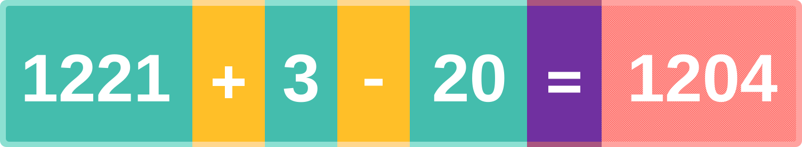

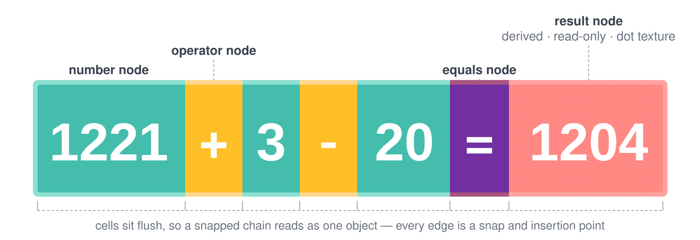

Three things in that image drive the whole visual design:

1. **Cells sit flush.** A snapped chain has no gaps between members, so it reads as a single
   pill rather than a row of separate chips. Snapping must therefore feel like *fusing*, not
   *aligning*.
2. **Node kind is encoded in colour.** Numbers teal, operators amber, `=` purple, results salmon.
   A user can parse the structure of a formula without reading it.
3. **The result node is visually "not yours to edit."** It has a different hue *and* a dot
   texture *and* its own lighter outline. Read-only-ness is communicated three times over.

Note that this pill styling is **CalcMind's own choice**, taken from the supplied reference.
Tydlig renders formulas as plain text and only switches to filled pills when a group is
*selected* (§1.3). Always-on pills make structure permanently legible, at the cost of a busier
canvas. Keeping it is a deliberate call, revisitable once there is real content on screen.

### 1.2 Design tokens derived from the reference

The reference raster has a cell height of 256px. Tokens below are that geometry normalised to a
64dp node height, rounded to sensible device-independent values.

| Token | Reference (px) | Ratio to cell height | Value (dp) |
|---|---|---|---|
| `nodeHeight` | 256 | 1.000 | **40** *(reduced from the ratio-accurate 64 in two steps (64→48→40) alongside the numeral shrink; held near the ~44dp common touch-target minimum since it also sizes the cell's tap/drag hit box — see decision 18. This is now only the compiled-in default at the default font size — §12.5's `nodeHeightFor(fontSize)` is the live value everywhere the cell's actual box is computed, decision 20)* |
| `borderBand` | 11 | 0.043 | **3** |
| `numeralFontSize` | 127 | 0.496 | **22** (weight 400) *(reduced from the ratio-accurate 30/800 — read as oversized on-screen; this is now only the compiled-in default — §12.5's Settings sheet lets the user override it live, 14–30dp)* |
| `numberPaddingX` | 48 | 0.188 | **4** *(reduced from the ratio-accurate 12, in two steps — see decision 18)* |
| `operatorWidth` | 136 | 0.531 | **26** *(reduced from the ratio-accurate 34 — measured live at ~10.5dp either side of the glyph, well past `numberPaddingX`'s own already-trimmed 4dp; also the paren cell's width, unchanged, since it deliberately shares this token — see decision 22)* |
| `equalsWidth` | 140 | 0.547 | **35** |
| `cornerRadius` | 12 | 0.047 | **8** *(bumped from 3 for a friendlier silhouette)* |
| `mathAxisOffset` | +16 from centre | 0.063 | **2** below centre *(scaled down from 4 with `nodeHeight`'s two reductions to stay near the same ratio — decision 18)* |

| Role | Fill | Border band |
|---|---|---|
| number | `#44BDAD` | `#8CE0D2` |
| operator | `#FFBF28` | `#FFD78E` |
| equals | `#7030A0` | `#AA557F` |
| result | `#FF7E79` + dot texture `#FFD1CF` | `#FFA3A0` |
| numerals / glyphs | `#FFFFFF` | — |

| Identity (link) | Swatch | Notes |
|---|---|---|
| 1 | `#2F6BFF` | blue — first-guess kept |
| 2 | `#0D8A4A` | green — deepened vs `#22A75B` (deutan vs result) |
| 3 | `#880E4F` | magenta — deepened vs `#E0479E` (deutan vs number) |
| 4 | `#00B8D9` | cyan — first-guess kept |
| 5 | `#B8860B` | gold — replaces `#8E6E53` (protan vs result) |
| 6 | `#560BAD` | violet — replaces `#5B4CC4` (protan vs equals) |

Identity hues are render-time only (decision #12, §11.1). Validated under Machado et al.
(2009) protanopia/deuteranopia simulation to ΔE₇₆ ≥ 15 against every other identity swatch
and the structural fills above (P6.8); method locked in `src/ui/paletteAccessibility.ts`.

The result texture is a 4×4 unit tile with 1-unit dots at `(1,0)` and `(3,2)`.

### 1.3 Reference app: what Tydlig actually does

Reconstructed from Tydlig's 1.0/1.1 release screenshots (iPad and iPhone) and Federico Viticci's
review. Everything in this subsection is **observed**, not guessed.

**Rendering has two modes.** Normally a formula is plain dark text on white — `25 + 2 = 27` —
with no cell backgrounds at all. Filled orange pills appear only when a group is *selected*. In
selected mode every ordinary cell (numbers, operators, `=`) is orange and only identity-carrying
results take another colour.

**Colour is the linking mechanism, and it is per-result identity.** A result that something else
references is drawn as a rounded outlined box in a hue unique to it — purple, green, pink, blue in
the screenshots. The reference to it, on another line, is drawn in *that same hue*. So the user
traces a dependency by colour alone. A **terminal result that nothing references gets no hue and no
box** — it is plain text. Colour is spent only where it carries information.

**Links are also drawn explicitly.** A curved bezier with an arrowhead runs from the parent result
to the referencing cell, in the parent's hue. In the screenshots only the selected link's curve is
visible, which the review flags as a problem: lines are "sometimes hiding … until you swipe".

**Continuation is the primary way links get made.** With a result selected, pressing an operator
spawns a *new line* seeded with a reference to that result, connected by a coloured curve. The
iPhone screenshots catch this mid-gesture: `25 + 10 = 35` above, and below it `35 +` with `35` in
the result's cyan and a freshly pressed orange `+`. This is much faster than dragging, and it is
what makes the app feel like a calculator rather than a diagram editor.

**Editing cascades in real time.** One screenshot pair shows `10` edited to `1.020` in the first
of four linked lines; all three downstream results update in the same frame. The cell being edited
renders as a filled orange pill.

**Numbers are locale-formatted.** `13,5`, `262,5`, `1.020` — comma decimal separator, period
thousands separator (Swedish). Display formatting is locale-driven; the stored value is not.

**Keypad.** Not full-screen. iPhone: bottom half, digits `0-9`, `,`, `+/-`, backspace, and
**parentheses `(` `)`**, with `÷ × − + =` in an orange column down the right and a strip of mode
switches on the left (dismiss, keypad, documents, functions, graph). iPad: a right-hand sidebar,
and tapping a number raises a compact floating keypad in the bottom-right. Swiping across
backspace turns it red and clears the document.

**Long-press menus are context-dependent.** On empty canvas: add a number or a graph. On a number:
select the whole group, select all numbers on the canvas, or — for a linked number — unlink from
its parent. A selected cell gets a small black `Copy | Delete` tooltip.

**Two failure modes worth designing out.** The review names both: (1) there is **no snapping**, so
large documents force constant panning to keep things tidy; (2) dragging a number onto an existing
operation can orphan a result, and Tydlig then shows a bare **`?`** "without telling you why the
error is there."

CalcMind's answer to those two: snapping is the core mechanic rather than an absent one (§8), and
a broken reference is a named, explained state rather than a question mark (§11).

#### Where it ended up: Tydlig 1.6

The above is version 1.0/1.1. The developer's final release (1.6, 2017) shows what the idea grows
into, which is useful for knowing what not to design ourselves into a corner on:

- **Labels are a headline feature, not a footnote.** Numbers *and* results carry a short user-typed
  caption rendered directly above the cell in that value's identity hue — `Pluto mass`,
  `Earth mass`, `Wave`, `Disturbance`, `Year`, `Orbit`. A canvas of labelled values reads like a
  small spreadsheet with no grid. There is a dedicated tag button in the toolbar.
- **Fan-out is normal.** One screenshot has a single pink `1` feeding four separate consumers —
  `log₂(1)`, `ln(1)`, `log₁₀(1)` and a graph — with four connector curves radiating from it in its
  hue. So the dependency structure is a real DAG with 1→N edges, not a chain of 1→1 links, and
  connector rendering has to cope with a fan.
- **Functions and scientific operators.** `^`, `%`, `√`, `!`, `x^y`, `)²`, `)³`, `ln`, `log₁₀`,
  `log₂`, `e`, `π`, `Rand`, `mod`, `×10^`, `abs`, `ceil`, `floor`, and the full trig/hyperbolic set,
  applied as `sin( 2 × 30 )` — function application over a parenthesised argument.
- **Graphs are canvas objects.** A line-graph object references a formula and sweeps one of its
  referenced inputs across a range, plotting a series per dependent result and colour-coding the
  axis ticks to match each result's hue.
- **Light and dark themes** both ship.
- The toolbar gains **undo** and the label/tag button next to settings, share, documents, keypad.

Two things this validates in the design below: `label` has to live on the node base rather than
only on numbers (§6), and the grammar has to have a credible path to function application (§10.2).

#### The developer's own feature list, and the idiom that ties it together

From the product site itself, plus its full-resolution screenshots. Direct quotes are the
developer's:

- **Responsive results** — "Edit any number on the canvas and see all affected results update
  automatically."
- **Linked numbers** — "With a result selected, press any operation to make a linked number **on
  the line below**. You can also **drag a result** to create a link." Both paths, confirmed: the
  continuation shortcut in §8.7 *and* drag-to-link. CalcMind also lets continuation start from a
  selected number (not only a result) so a value can be linked without pressing `=` first.
- **Text labels** — "Add a text label to a number to describe what it represents. **Like a
  spreadsheet, but with freedom.**"
- **Value sliders** — "Use the slider on any number to tweak its value and see how results and
  graphs update live. Tap on the slider to make it snap to whole numbers." See §8.8.
- **Graphing** — "Long press any number you want to make **x** and tap the graph action to create a
  graph. You can link **multiple values as x**, even **up a hierarchy** of linked numbers."
- **Freeform canvas** — "Drag numbers **and expressions** around … the canvas will expand
  indefinitely." Whole expressions are draggable, not only individual nodes — see §17.1.
- **External keyboard** — Bluetooth keyboards for digits and `+ - * /`.
- **And more** — PDF sharing, printing, left-handed mode, undo, adjustable text size,
  scientific notation.

**The idiom that makes it usable: declare, label, reference.** The clearest screenshot builds a
compound-interest model out of three named values:

```
10,000  = [10,000]    ← labelled "Initial Deposit"   (blue)
20      = [20]        ← labelled "Years"             (cyan)
4 %     = [0.04]      ← labelled "Interest"          (pink)

Initial Deposit   Interest      Years        Accumulated
10,000 ( 1 + 0.04 / 12 ) ^ ( 12 × 20 ) = [22,225.82]   (purple)

Accumulated   Initial Deposit   Profit
22,225.82  −  10,000  = [12,225.82]                    (green)

Profit        Years       Profit per month
12,225.82  /  20  / 12  = [50.94]                      (orange)
```

Three things fall out of that, and they change the design below:

1. **A trivial expression is how you declare a variable.** `10,000 = [10,000]` exists purely so its
   result can be labelled and referenced. No separate "variable" concept is needed — the result
   node *is* the named value.
2. **Labels render above every cell that shares an identity, not just the declaration.** In the
   screenshot "Initial Deposit" appears above the declaration's result *and* above both references
   to it. So a label belongs to the identity and is drawn on all its cells (§11.1).
3. **Implicit multiplication exists, but only before a parenthesis.** `10,000 ( 1 + … )` has no `×`.
   That is standard maths notation, and it is a narrower rule than "adjacent numbers multiply" —
   see §10.2 and decision 4.

The graph in that screenshot also shows its **current operating point**: dotted crosshairs at
`(20, 22,225.82)`, with each axis tick labelled in the hue of the value it tracks.

*Sources:* [tydligapp.com](http://tydligapp.com/), supplied as a complete MHTML archive and unpacked
locally — 34 images including the developer's own feature illustrations and 2048×1536 iPad
screenshots
· [MacStories review](https://www.macstories.net/reviews/tydlig-an-innovative-free-form-calculator-for-ios/)
· [App Store listing](https://apps.apple.com/us/app/tydlig/id721606556)
· 1.0/1.1 screenshots via `cdn.macstories.net/002/…tydlig-iPad Screenshot 1/2.png`
· 1.6 screenshots via the iTunes lookup API for app id `721606556`

All of it referenced, none redistributed in this repository — the screenshots and illustrations
are Tydlig Software AB's and the publication's.

---

## 2. Design principles

1. **One source of truth.** Derived values (results, layout positions of chained nodes) are
   computed, never authored. Anything derived that we persist is explicitly labelled a cache and
   is recomputed on load.
2. **The document is a plain, inspectable JSON file.** No binary blobs, no proprietary container.
   A user can read, diff, and hand-edit their own work.
3. **Interaction runs on the UI thread.** Dragging must not round-trip through JS state per
   frame; commits happen on gesture release.
4. **Open source only.** Every dependency is MIT/Apache-2.0 and runs locally or in our own CI.
   No vendor build service, no metered API, nothing that acquires a price at scale.
5. **Errors are states, not exceptions.** An incomplete or invalid chain is a normal thing for a
   user to be holding mid-thought. It renders as a state; it never throws or destroys work.

---

## 3. Vocabulary

| Term | Meaning |
|---|---|
| **Node** | Atomic canvas object: a number, an operator, an `=`, a result, or (later) a reference. |
| **Chain** | Ordered left-to-right sequence of snapped nodes. A chain is a formula. |
| **Free node** | A node with no chain; owns its own position. |
| **Member** | A node belonging to a chain; its position is derived from the chain's layout. |
| **Anchor** | World position of a chain's left edge — the chain's authoritative position. |
| **Result node** | Read-only node holding the value of its source chain. |
| **Reference** | *(phase 6)* Node that displays another node's live value; how linking works. |
| **World space** | Logical, unbounded canvas coordinates. |
| **Screen space** | Device pixels after pan/zoom. |

---

## 4. Technology decisions

| Concern | Choice | Licence | Why |
|---|---|---|---|
| Framework | React Native 0.86 (bare CLI) | MIT | Already in place; no Expo/EAS dependency. |
| Web target | `react-native-web` + Webpack | MIT | Already wired; `npm run build:web` → `dist/`. |
| State | **Zustand** + **Immer** | MIT | Selector-scoped subscriptions avoid re-render storms while dragging; Immer patches give us undo nearly free. Redux Toolkit is heavier for no gain here; raw Context re-renders the world. |
| Gestures | **react-native-gesture-handler** | MIT | Native-thread gesture recognition; works on web. |
| Animation | **react-native-reanimated** | MIT | Worklets keep drag at 60fps without JS bridge traffic. |
| Numerics | **decimal.js** | MIT | A calculator that answers `0.1 + 0.2 = 0.30000000000000004` is a broken calculator. |
| IDs | **nanoid** | MIT | Small, collision-safe, URL-safe. |
| Schema validation | **zod** | MIT | Validates documents at the trust boundary (file load) and generates TS types. |
| Native filesystem | **@dr.pogodin/react-native-fs** | MIT | Maintained fork of `react-native-fs`; the original is unmaintained. |
| Web storage | **idb-keyval** | MIT | Thin IndexedDB wrapper; localStorage is too small and synchronous. |
| SVG | **react-native-svg** | MIT | Load-bearing for connector beziers (P6.6) and the result dot texture (P7.3) (§11.3). |
| Icons | **react-native-heroicons** ([Heroicons](https://github.com/tailwindlabs/heroicons)) | MIT | Tailwind Labs' SVG set, packaged for `react-native-svg` so the same import works on native and web. Prefer `react-native-heroicons/{outline,solid,mini,micro}` over `@heroicons/react`, which emits DOM `<svg>` and breaks the native target. |
| Tests | Jest (already configured) + **fast-check** | MIT | Table-driven engine tests; property tests for parser/formatter round-trips. |

No dependency here bills by usage, gates features behind a plan, or requires an account.

---

## 5. System architecture

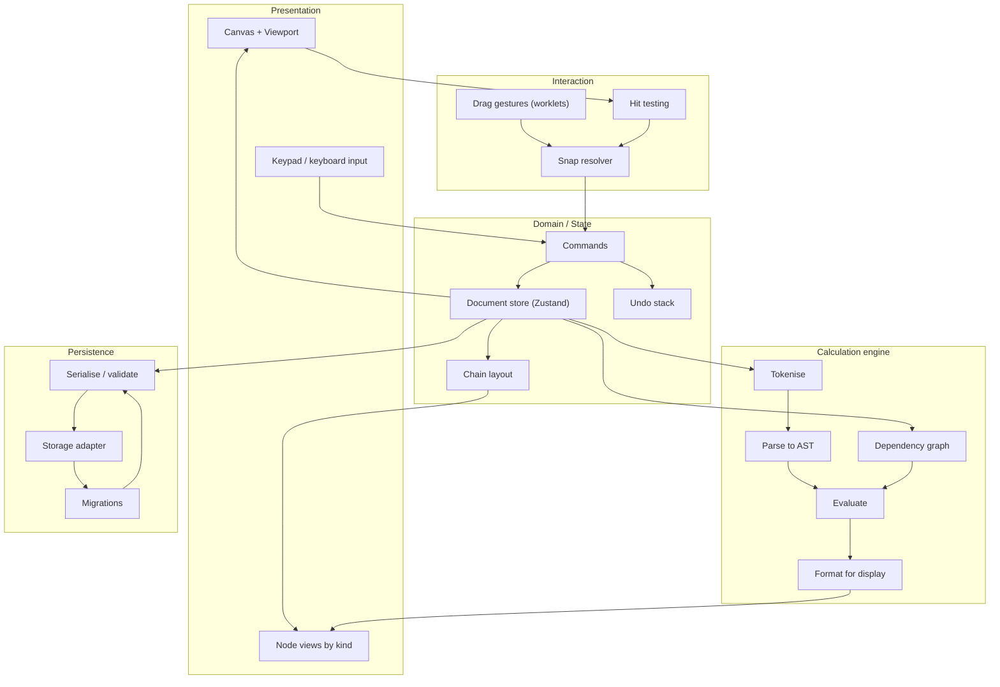

Dependency rule: **presentation → interaction → domain → engine → persistence**, never upward.
The engine knows nothing about React; it is pure functions over the document model, which is what
makes it cheap to test exhaustively.

### 5.1 Repository layout

```
src/
  app/           App shell, providers, theme injection
  canvas/        Canvas, viewport transform, pan/zoom gestures, coords.ts,
                 ConnectorLayer + connectors.ts (SVG link overlay, §11.3)
  nodes/         One view per node kind + useNodeDrag + ValueSlider (§8.8)
  chains/        layout.ts, snapping.ts, bounds.ts
  engine/        tokenize, parse, evaluate, format, numeric, graph, errors
  model/         types.ts, factories.ts, schema.ts (zod)
  store/         documentStore, selectors, commands, undo
  persistence/   serialize, migrations/, autosave,
                 adapter.ts + adapter.native.ts + adapter.web.ts
  keypad/        Keypad
  ui/            tokens.ts, theme.ts, primitives
docs/
  ARCHITECTURE.md  (this file)
  assets/          formula-reference.svg, node-anatomy.svg, linking-model.svg
```

Platform splitting already works in both bundlers with no extra config: Metro resolves
`.native.ts` automatically, and `webpack.config.js` already lists `.web.tsx/.web.ts/.web.js`
first in `resolve.extensions`.

---

## 6. Domain model

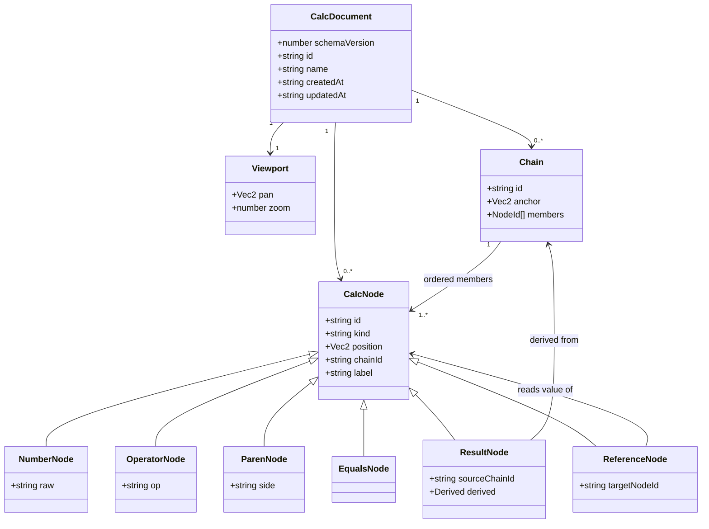

```ts
// model/types.ts
export type NodeId  = string;
export type ChainId = string;

export interface Vec2 { x: number; y: number }

export type OperatorSymbol = '+' | '-' | '×' | '÷';

interface NodeBase {
  id: NodeId;
  /** World coords of the node's top-left.
   *  AUTHORITATIVE when chainId === null.
   *  DERIVED from chain layout when chainId !== null (see §8.1). */
  position: Vec2;
  chainId: ChainId | null;
  createdAt: number;
  /** Short user caption rendered above the cell in the node's identity hue.
   *  On the base rather than on numbers alone: the reference app labels results
   *  at least as often as inputs (§1.3). */
  label?: string;
}

export interface NumberNode extends NodeBase {
  kind: 'number';
  /** Exactly what the user typed: "1221", "3.", "-0.5". Parsing is the engine's job,
   *  so partial input like "3." survives a save/load cycle intact. */
  raw: string;
}

export interface OperatorNode extends NodeBase {
  kind: 'operator';
  op: OperatorSymbol;
}

export interface EqualsNode extends NodeBase {
  kind: 'equals';
}

/** Grouping. Present in v1 because Tydlig's keypad has parens and retrofitting a
 *  node kind means a schema migration (§10.2). */
export interface ParenNode extends NodeBase {
  kind: 'paren';
  side: 'open' | 'close';
}

export interface ResultNode extends NodeBase {
  kind: 'result';
  sourceChainId: ChainId;
  /** CACHE ONLY — never trusted. Recomputed on load; lets us paint before the
   *  engine has run and makes saved files human-readable. Engine output always wins. */
  derived?: ResultDerived;
}

/** What the result cell last painted (§9, §10.4). `display` holds the numeric string for a
 *  successful value (and the previous value kept under `stale`); an `error` outcome is
 *  rendered as an explanation, never as `display` and never as a bare glyph (§11.2). */
export interface ResultDerived {
  display: string;
  computedAt: string;
  /** Absent → successful value. Written by the recompute lifecycle (P4.7–P4.8). */
  outcome?: ResultOutcome;
}

export type ResultOutcome =
  | { status: 'stale' }
  | { status: 'error'; error: EngineErrorKind };

/** The six error kinds §10.4 lists. */
export type EngineErrorKind =
  | 'Incomplete'
  | 'InvalidSequence'
  | 'DivideByZero'
  | 'Overflow'
  | 'NotANumber'
  | 'CircularReference';

/** Phase 6. Declared in v1 of the schema so adding linking is not a breaking migration. */
export interface ReferenceNode extends NodeBase {
  kind: 'reference';
  targetNodeId: NodeId;
  /** Display string stamped when the target is deleted (§11.2 / P6.4). Absent on live refs. */
  lastKnownDisplay?: string;
}

export type CalcNode =
  | NumberNode | OperatorNode | ParenNode | EqualsNode | ResultNode | ReferenceNode;

export interface Chain {
  id: ChainId;
  /** Ordered left→right. THIS is the token order — never re-derived from x positions. */
  members: NodeId[];
  /** World position of the chain's left edge. The chain's authoritative position. */
  anchor: Vec2;
}

export interface CalcDocument {
  schemaVersion: number;
  id: string;
  name: string;
  createdAt: string;
  updatedAt: string;
  viewport: { pan: Vec2; zoom: number };
  nodes: Record<NodeId, CalcNode>;
  chains: Record<ChainId, Chain>;
}
```

### 6.1 Why token order is stored, not sorted from x

Reading order could be recovered by sorting members by `position.x`. We deliberately do not.
Floating-point drift, an interrupted animation, or a layout bug would silently **reorder the
user's formula** and change its answer. An explicit `members` array makes order an intention we
recorded, not a measurement we trust.

---

## 7. Canvas and coordinate system

World space is unbounded, `+x` right, `+y` down. Screen space is what the user touches.

```
screen = (world - pan) * zoom
world  = screen / zoom + pan
```

- `zoom ∈ [0.25, 4]`, clamped.
- Pan and zoom live in the store but are **excluded from undo history** — undoing a calculation
  should not also move the camera.
- One-finger drag on empty canvas pans; pinch zooms about the pinch centroid; on web, wheel
  scrolls and ctrl/⌘+wheel zooms.
- All snap thresholds are defined in **world units** so snapping feels identical at any zoom.

---

## 8. Interaction: chains, snapping and input

### 8.1 Layout

A chain lays its members out flush, left to right, from `anchor`:

```
x = anchor.x
for each memberId in chain.members:
    node.position = { x, y: anchor.y }
    x += widthOf(node)
```

`widthOf` is `operatorWidth` / `equalsWidth` for symbol nodes, and for numbers/results the
measured text width plus `2 × numberPaddingX`, floored at `nodeHeight` so single digits stay
square-ish. Text measurement is cached per `(raw, fontSize)`; a change to `raw` invalidates the
chain's layout and the chain re-flows in the same commit.

Member `position` is written by this pass purely so hit testing and rendering can read a single
uniform field. It is a cache; `anchor` + `members` is the truth.

### 8.2 Drag lifecycle

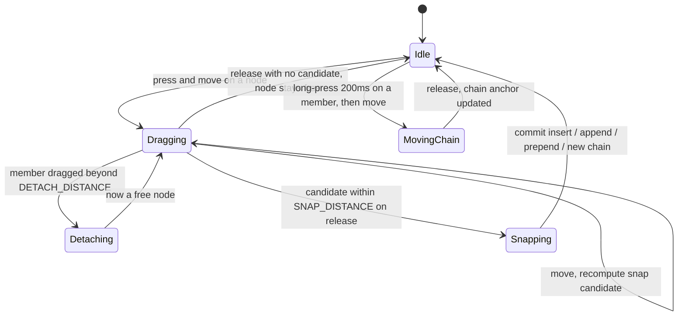

Thresholds (world units): `SNAP_DISTANCE = 28`, `SNAP_VERTICAL = 48` (was 0.75 × `nodeHeight`
when set, against the reference-accurate 64; `nodeHeight` has since shrunk twice, to 48 then 40,
for the smaller cell font — decision 18 — but `SNAP_VERTICAL` is an independently-tuned
drag-gesture constant, not a rendering token, so it was left as-is both times rather than
recomputed against the new ratio; it is now numerically larger than `nodeHeight` itself),
`DETACH_DISTANCE = 44`. `DETACH_DISTANCE > SNAP_DISTANCE` deliberately, so a member does not
detach and immediately re-snap into the slot it just left.

### 8.3 Candidate resolution

On each drag frame, gather candidates and keep the nearest:

```
for each chain C where verticalOverlap(dragged, C) < SNAP_VERTICAL:
    if |dragged.right - C.left|  < SNAP_DISTANCE  → PREPEND to C
    if |dragged.left  - C.right| < SNAP_DISTANCE  → APPEND to C
    for i, boundaryX in C.memberBoundaries:
        if |dragged.centerX - boundaryX| < SNAP_DISTANCE → INSERT_AT(C, i)

for each free node F where verticalOverlap(dragged, F) < SNAP_VERTICAL:
    if |dragged.left - F.right| < SNAP_DISTANCE → NEW_CHAIN [F, dragged]
    if |dragged.right - F.left| < SNAP_DISTANCE → NEW_CHAIN [dragged, F]
```

Feedback while dragging: the chain opens a gap at the pending insertion point and an insertion
caret is drawn. The user sees the outcome before committing.

Bookkeeping on commit: a chain that drops to one member dissolves (member becomes free); an empty
chain is deleted; a chain that loses its `=` also loses its result node.

Long-press (≥200 ms) then drag moves a whole chain; a plain drag detaches the member. The opposite
mapping was tried interactively and rejected — see §17.1. `Select group` (§8.6) is the other
move-chain route (no dwell required). An open context menu blocks move-chain so the 500 ms menu
keeps precedence.

### 8.4 Spatial indexing

An O(n) scan per drag frame is fine to a few hundred nodes. P7.6 measured the pre-hash
path at ~10 ms p95 for 500 nodes when the neighbour index was rebuilt every frame (~60% of
a 60 fps budget), so a uniform spatial hash (bucket size `2 × nodeHeight`, Y-axis — the
neighbour filter is vertical-only; horizontal gating stays in `resolveSnapCandidate`) now
backs `SnappingNeighbours`. The index is built **once at drag start** and queried each
frame; rebuilding every frame would re-pay O(n) bounds work the hash cannot avoid. The
linear scan stays exported for behavioural parity tests. Call sites of
`resolveSnapCandidate` / `SnappingNeighbours` are unchanged.

### 8.5 Keypad

Modelled on Tydlig's (§1.3), which is worth copying: it is not full-screen, it is dismissible, and
operators are visually separated from digits.

| Region | Keys |
|---|---|
| Digits | `7 8 9 / 4 5 6 / 1 2 3`, bottom row decimal separator (locale glyph, inserts canonical `.`) / `0` / `+/-` — decimal and sign flank `0` rather than sitting in their own row |
| Number editing | **Create link**, **Add components**, **Notes** |
| History | undo, redo, backspace |
| Operators (accent column) | `÷ × − + () =` — `()` sits underneath `+` |
| Mode strip | dismiss keypad, **Workspace** *(later — documents, P5)*, functions *(later)*, **Chart** *(later — graph, §17.2)*, **Clear all**, **Settings** (icon-only cog) |

- Keys act on the **selected node** if there is one, otherwise they create a new node at the
  caret/last-tap point.
- **Every key is the same 48px tall.** The main column (digit grid + number-editing row +
  history row) and the accent column (operators + `()` + `=`) both stack six rows, and every
  row uses the same `KEY_GAP` bottom margin, so a shared height is what keeps the two columns'
  rows landing on the same lines instead of drifting apart by a few px per row. This was a
  real, reported bug: `key`'s base height (and therefore every key built on it —
  `OperatorKey`, `EqualsKey`, `Create link`, etc.) used to be 44px against `digitKey`'s 48px,
  invisible while the two columns had different row counts and only became a visible
  cumulative stagger once `()`'s move (above) made them match.
- Decimal and `+/-` share `0`'s fill (`rolePalette.number.fill`, the same teal as every digit)
  and label style, so the bottom digit row reads as one colour rather than `0` standing out
  from its neighbours — and share its `disabled` rule too: they are number keys, not a
  separate "number-editing" carve-out, so a selected result/reference/operator disables them
  right alongside the digits (§8.7). Disabled, they swap to the same grey-with-a-teal-cast as
  a disabled digit (`digitKeyDisabled`) rather than just fading their teal fill — a generic
  `Key`'s ordinary disabled treatment (opacity only) would have left them visibly green next
  to flat-grey digits. That disabled colour is a placeholder pending a real design pass, not a
  finished palette choice.
- The grouping key is a single **`()`**, in the accent column underneath `+` (own row between
  `+` and `=`, not a wide bottom-row key, and not separate `(` / `)`). Each press inserts
  whichever side fits the chain through the selection: `)` when there is an unmatched open and a
  close is grammatical (after a number, reference, or close paren); otherwise `(`. Hardware
  `(`/`)` still map to an explicit side. Styled as an `OperatorKey` — same amber
  `rolePalette.operator.fill` and white label as `÷ × − +` — and follows the same `disabled`
  rule as before the move (off while an operator is selected, §8.5's number-editing gate).
- **`Create link`** sits in decimal's old slot on the number-editing row: a link-glyph key,
  filled in `identityHues[0]`'s blue (the palette's own primary blue, already checked for
  deuteranopia/protanopia — reused rather than inventing a new one for keypad chrome). Enabled
  for a selected **number**, **result**, or **live reference** — same eligibility as the
  `Create link` context-menu item (§8.6), so chaining a link off an existing link works from
  the keypad too; a **dangling** reference (target gone) stays disabled, same as every other
  data-entry key. Disabled during Select group and Select all regardless. Pressing it calls the
  same `createLinkToValue` the context-menu item uses — a free reference near the selected
  value, with no bundled operator or empty number.
- **`Add components`** (squares-plus glyph) and **`Notes`** (pencil-square glyph) fill out the
  rest of the number-editing row, sharing `Create link`'s blue fill. Declared but not yet
  functional — same "affordance before behaviour" pattern as the context menu's `Copy` or the
  canvas menu's `Add number` / `Add graph` (§8.6): always rendered disabled, with no `onPress`,
  until their behaviour is specified.
- The history row exposes **undo** and **redo** next to backspace — the same commands as
  `Ctrl/Cmd+Z` / `Ctrl/Cmd+Shift+Z` (or `Y`).
- Pressing `=` on a chain selects the new **result** (not the `=` glyph) so the next operator
  is ready for continuation without an extra tap.
- **`=` disables once its chain already has one** (§9: at most one `=` per chain). Selecting
  the equals cell itself, the result, or any other member of an already-`=`'d chain all grey
  the keypad's `=` key out (`chainHasEquals`, `keymap.ts`) rather than let a second `=` splice
  in front of the existing equals+result pair. `dispatchEditorCommand`'s own `equals` case
  carries the identical check, so a hardware Enter/`=` press can't do what the on-screen button
  already refuses to — and selecting the `=` cell directly rejects every key (digit, paren,
  operator, `=`), not only `=`, since nothing is meant to append after it at all; a chain's
  result is what belongs there, placed by `finalizeChain`, never further user input.
- **Continuation shortcut (§8.7).** With a result — or a number that is selected but not being
  edited — pressing an operator starts a new chain that references that value.
- Tapping empty canvas creates a number node there, in edit mode, and shows the keypad if it
  was hidden (§8.6) — superseding the placeholder from when nothing was on the canvas yet to
  tap on. Dismissing the keypad is the mode strip's chevron key.
- Hardware and web keyboards map to the same commands: digits, `+ - * /` → `+ − × ÷`,
  `Enter` → `=`, `Backspace`, `Escape` deselects (a second Escape with nothing focused
  dismisses the keypad), arrows move selection along a chain (←/→) and between chains
  (↑/↓), `_` / `F9` toggle sign, and `Ctrl/Cmd+Z` / `Ctrl/Cmd+Shift+Z` (or `Y`) undo/redo.
- **Swipe across backspace clears the document** (Tydlig's gesture). Ours requires a confirm —
  wiping a canvas on a stray swipe is not recoverable enough to be worth the speed, even with undo.
  The mode strip also exposes a **Clear all** button that raises the same confirmation (decision
  #15) — the gesture stays for parity with the reference app; the button is the discoverable path.
  While that confirm is visible the keypad chrome (mode strip and keys) is hidden so Cancel/Clear
  are the only bottom UI; dismissing or confirming restores the keypad.
- **Group mode.** While a Select-group highlight is active (§8.6), the keypad disables digits,
  number-editing keys, and `=` — they stay visible but inert. Undo / redo / backspace remain
  enabled. If the group includes a result, the operator column (`÷ × − +`) stays enabled for
  §8.7 continuation; otherwise those operators are disabled too. Backspace deletes the whole
  group in one undo entry.
- **Settings** (`SettingsSheet.tsx`) is a full-screen sheet opened from the mode strip's cog,
  with its own `settingsVisible` flag on `uiStore` — ephemeral like every other prompt in this
  section, not a document edit. Styled as a one-off dark/amber sheet (not this app's usual light
  keypad chrome, and not a preview of P7.4's still-pending theme system) so it can match a
  concrete visual reference without waiting on that work. Holds a **Canvas Number Font Size**
  row (§1.2 P7 — the live override of `tokens.numeralFontSize`, persisted via
  `store/preferencesStore.ts` and §12.5) — +/− stepper buttons and a typable `TextInput`
  reading the same value, with a non-editable "pt" unit label so the number's meaning isn't
  ambiguous — and an **About** row (app name, `package.json` version, tagline) — everything
  else that plausibly belongs here (angle units, decimal format, Clear all content, theme) has
  no feature behind it yet, so it stays off the sheet rather than appearing as an inert
  placeholder row.

### 8.6 Selection and context menus

- Tap selects a node; the selected node is the target for keypad input. Numbers are selected
  *without* entering edit mode so a following operator can continue from them (§8.7); the first
  digit, decimal, or sign key opens in-place text editing (caret, digits, decimal, backspace).
  Every other kind is selected but not itself a text field. Fresh numbers created by typing with
  nothing selected (or by tapping empty canvas) still open in edit mode so `5 + 3` keeps
  appending in-chain. **Focus is always visible:** a white outset ring on the cell marks the
  keypad target, including read-only results and selected-but-not-editing numbers (continuation,
  §8.7). The selected node's wrapper stacks above flush chain neighbours so the ring is not
  painted under the next member — and a node showing its own outset identity ring (§11.1)
  elevates the same way while unselected, for the same reason. While selected, the identity
  ring is omitted so focus is a single chrome layer (an outset white ring in the same spot);
  hue still reads from the caption and connectors.
- `Escape` deselects. Committing an empty number (backspace to nothing, or deselecting with
  nothing typed) discards it rather than leaving a blank cell on the canvas.
- Long-press on a node → `Copy`, `Delete`, `Select group`, `Label` and `Create link` on values
  (number / result / live reference — P6b.1), and for a reference `Unlink from parent`.
  `Create link` drops a free reference to the value near it — no operator, not attached to a
  chain — for a link the user wants to place and drag elsewhere rather than keep computing from
  immediately (§8.7's third path, alongside continuation and drag-to-link).
- Long-press on empty canvas → `Add number`, `Add graph` *(later)*, `Paste`, `Select all`.
- `Select group` selects the whole chain, which is how a chain gets moved or deleted as a unit.
  Double-tap / double-click any cell is the fast path to the same command (dwell-free, no
  context menu); long-press → `Select group` remains. When the group includes a result, that
  result becomes the primary keypad target so an operator press continues from it (§8.7). The
  group highlight is cleared by the next single-node selection, edit, or deselect (tap another
  cell, Escape, keypad navigation) — it must not stick after the user has moved on.
  **The focus ring merges across the group** (§11.3): every member still shows the ring, but
  an interior seam between two flush, both-selected cells carries no border on either side of
  it — only the group's own outer edge does — so the whole selection reads as one big cell
  rather than each member individually outlined. An ordinary single selection (the keypad
  target alone, not a group) always keeps the full ring on every side, even on a structurally
  mid-chain cell, since its neighbours are not also selected.
- `Select all` selects every node on the canvas (same ephemeral group-selection set as
  `Select group`). Disabled when the canvas is empty. Dragging any selected node then
  translates the whole selection — every selected chain (via its anchor) and every
  selected free node — by the same delta, in one undo entry. A single-chain
  `Select group` still uses the ordinary MovingChain path. The same clear-on-single-select
  rule applies. While the whole canvas is selected, keypad **data-entry** keys (digits,
  operators, `=`, decimal, sign, backspace, `()`) are grayed out — there is no single
  edit target. The mode strip (dismiss / Workspace / functions / Chart / Clear all /
  settings) stays live, and hardware undo/redo / Escape still work.
- **`Label` opens an in-place caption editor on the identity source** (§11.1). The write always
  lands on the declaring number or result, so every reference that shares the identity updates
  together; successive keystrokes coalesce into one undo entry (§13).

### 8.7 Continuation: how links are normally made

Dragging is not the fast path. Observed in Tydlig for results and extended here to numbers so a
value can be linked without first pressing `=`:

```
given: a value V (a free number with no chain, or a result) is selected, and V is
         not being edited
when:  the user presses an operator ⊕
then:  create chain C' underneath the first cell of V's group (or under V when free),
         containing [ reference→V , ⊕ , empty number ]
       C'.anchor.x matches that first cell; if that column's landing row
         is already occupied, stack C' under the occupant (and keep
         stacking through a contiguous column) while still starting at
         the first-cell x
       select the empty number so the next digits edit it in place
       draw a connector from V to the reference, in V's identity hue
```

A number that *is* being edited still appends the operator in-chain — that is how `5 + 3` is
typed. Tap or arrow selection leaves the number selected-but-not-editing, which is the
continuation-ready state (mirroring a selected result) **only while that number has no chain of
its own.** A selected number that already belongs to a chain — mid-formula, or already `=`'d —
is still an operand of that formula rather than a free-standing value: an operator there extends
*that* chain in place, immediately after the selected member (§8.5's append-after-anchor
targeting), the same as typing does. `1 + 2 = 3`, select `2`, press `+` builds `1 + 2 + _` (the
stale `=`/result get pushed past the new operand and the chain reads Incomplete until it's
filled in, then recomputes) — it must not spin off a reference to `2` elsewhere. This
append-after-anchor targeting is exactly why the `=` cell itself is a hard stop rather than
just another anchor (§8.5, §9): appending *after* `=` is never a formula edit, so selecting the
`=` cell rejects every key outright instead of splicing a new member past it.

**A selected live reference never continuation-links, regardless of whether it's free or
already a chain member — it always extends in place**, the same append-after-anchor path a
chain-member number uses. A reference is already a link; pressing an operator on one means "keep
computing with what this points to" (`ref ⊕ _`), not "make another link to this link". A
freshly-dropped `Create link` reference (§8.6), still free (`chainId === null`) at that point,
gets exactly the same treatment as a chain-member number getting its first extension: the
operator+empty-number pair becomes the reference's *own* new chain, anchored at the reference's
position, rather than spinning off a second reference elsewhere. (This was a shipped bug, caught
live: continuation used to apply to references too, so pressing an operator on a linked cell
created a reference-to-the-reference instead of continuing the calculation from it.)

A **result**, **operator**, or **linked cell** (reference) rejects digits — keypad number keys,
decimal, and `+/-` are all disabled while any of those is selected (decimal / `+/-` are number
keys now, not a separate "number-editing" carve-out — §8.5). `()` is looser: it only disables
while an **operator** is selected, since pressing an operator key there instead **replaces**
that operator's symbol in place. Continuation (or, for a reference, extend-in-place) seeds an
empty number and focuses it, so the next digits edit in place rather than relying on a selected
operator. For a reference, `=` / paren still append too, so a just-dropped link can finish its
expression without first needing an operator.

This is the single most important interaction in the app: it turns "I have a value" into "…and
now I keep working with it" in one keystroke, and it is what produces the linked trees that make
the canvas worth having.

**The second path is drag-to-link (§11).** Dragging result `R` onto another chain (or onto a free
node to form a new chain) uses the same §8.3 snap outcomes — no special case in `snapping.ts` —
but the commit inserts a fresh **reference** to `R` rather than moving `R`. The source chain keeps
its result; a miss (no candidate) cancels so `R` never becomes a free node. Number drags stay on
the ordinary snap/move path so chaining by drag is unchanged — only continuation (and
result-drag) create links.

**The third path is the `Create link` context-menu item (§8.6).** Accepts a number, result, or
live reference — broader than continuation's operator-key gesture, which only fires for a free
number or a result (a selected reference never continuation-links, per above) — but skips the
bundled operator and empty number: it drops a lone, unattached reference at the same anchor
continuation would use (reusing its stacking rule) and selects it. Useful when the user wants a
linked cell sitting somewhere else on the canvas — read by a later formula, or just placed as a
labelled copy — without
committing to an operation on it yet. From there it is an ordinary free node: drag it onto a
chain via the normal snap path, or select it and press an operator to continue from it like any
other live reference.

### 8.8 Value slider

Selecting a number raises a slider in a popover anchored beneath its cell, with the range endpoints
labelled. Dragging it rewrites that number and the whole dependent subgraph recomputes live —
results, and any graphs, updating per frame.

This is the feature that makes the dependency graph *felt* rather than merely correct: a static
model answers one question, a scrubable one answers "what if". It is cheap to build on top of §11
and should not be deferred to the far end of the plan.

- **Range** is inferred from the current value: `[0, 10^ceil(log10(|v|))]` for positive values,
  symmetric about zero when the value is negative, `[0, 10]` when the value is zero. The user can
  edit the bounds.
- **Tap the slider to snap** to integers; drag again for continuous values.
- **Scrubbing is a drag, not a commit.** The whole gesture coalesces into a single undo entry, and
  autosave is suppressed until release — otherwise one scrub writes hundreds of documents.
- Recompute during scrub runs on the dirty subgraph only (§11) and must hold 60fps; if a subgraph
  is too expensive, throttle recompute to the frame budget rather than dropping the interaction.

---

## 9. Chain validity

A chain is a token sequence, and at any moment it is in exactly one state:

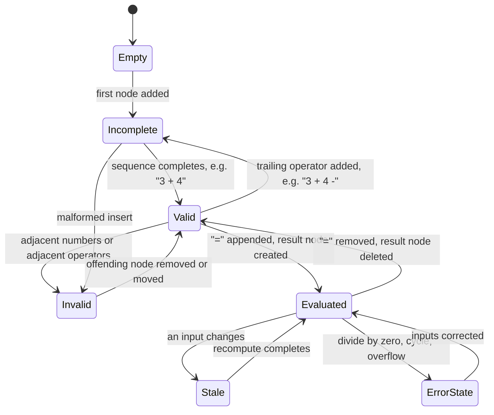

Rules:

- `Incomplete` — trailing operator, or `=` with no complete expression to its left. Renders
  normally; no result. This is the normal state of a formula being typed.
- `Invalid` — two adjacent number nodes, two adjacent operators, or any node to the right of the
  result. The offending boundary gets a red hairline; **nothing is deleted**.
- Two adjacent numbers are invalid rather than implicit multiplication or concatenation. Numbers
  are edited *inside* a node, so adjacency only ever arises from a deliberate snap, and guessing
  which of `12·34`, `1234`, or "user error" was meant would silently produce a wrong answer.
  Implicit multiplication is a reasonable phase-7 opt-in.
- A `Stale` result keeps rendering its previous value dimmed until recompute lands, rather than
  flashing empty.

---

## 10. Calculation engine

### 10.1 Pipeline

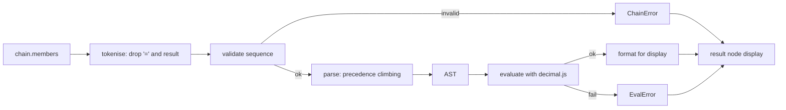

### 10.2 Grammar (v1)

```
expr   := term (addop term)*
term   := factor ((mulop | ε) factor)*     -- ε only where the next factor is '('
factor := number | reference | '(' expr ')'
addop  := '+' | '-'
mulop  := '×' | '÷'
```

**Implicit multiplication, but only before `(`.** The reference app writes
`10,000 ( 1 + 0.04 / 12 )` with no `×` (§1.3), which is ordinary maths notation. So a factor
directly followed by an open paren multiplies. This is deliberately *not* the general
"adjacent operands multiply" rule — two adjacent **numbers** remain invalid (§9, decision 4),
because `12 34` is far more likely a mis-snap than a product, whereas `12(…)` is unambiguous.

Left-associative; `× ÷` bind tighter than `+ -`. Parsing is precedence climbing — compact, and the
natural place to add unary minus, `^`, and functions later without a rewrite.

**Parentheses are in v1.** Tydlig puts `(` and `)` on the primary keypad (§1.3), which means users
of this kind of calculator expect grouping, and retrofitting it would mean a new node kind, a new
schema version, and new snapping rules for unbalanced pairs. Cheaper to carry from the start:

- `paren` is a fifth structural node kind, `{ kind: 'paren', side: 'open' | 'close' }`.
- Validation adds one rule: parens must balance. Unbalanced → `Incomplete`, not `Invalid` — an
  open paren with nothing closing it yet is the normal state of a formula being typed.
- Depth is rendered as a subtle tint step on the paren cells so nesting is readable.

Negative numbers live inside a `NumberNode.raw` (`"-5"`), not as a unary operator node. This
keeps the grammar small; the cost is that negating a *result* needs a reference (phase 6).

**Extension path.** The mature reference app has `^`, `%`, `!`, `mod` and ~25 named functions
applied as `sin( 2 × 30 )` (§1.3). Precedence climbing absorbs all of it without restructuring:

```
factor := number | reference | '(' expr ')' | function '(' expr ')' | prefix factor
         ( postfix )*
```

- `^` is a right-associative level above `× ÷`; `!` and `²` `³` are postfix; `√` is prefix.
- A `function` node kind holds the function name and renders as `name(` — the open paren is part of
  the function cell, so paren balancing already covers it.
- Nothing here changes the node model beyond adding one kind, which is why it can wait.

### 10.3 Numerics

- All arithmetic in `decimal.js`, precision 34.
- Division by zero → `DivideByZero` error state, never `Infinity`.
- Display: up to 12 significant digits, trailing zeros stripped; scientific notation when
  `|x| ≥ 1e12` or `0 < |x| < 1e-6`.
- `raw` is preserved verbatim through save/load. `"3."` mid-typing stays `"3."`.

**Locale formatting is not optional.** Tydlig's own screenshots show `13,5` and `1.020` — comma
decimal separator, period thousands separator. So:

- A **display layer** formats values per `Intl.NumberFormat` for the active locale. It is the only
  place separators exist.
- The **stored** `raw` and all computation use a canonical `.` decimal point and no grouping, so a
  document written in one locale opens correctly in another. Serialising locale-formatted strings
  would make `1.020` ambiguous between one thousand and twenty, and roughly one.
- The **decimal key** on the keypad shows the locale's separator and inserts a canonical `.`.
- Parsing user input accepts the locale separator and normalises immediately.

### 10.4 Errors

`Incomplete` · `InvalidSequence` · `DivideByZero` · `Overflow` · `NotANumber` · `CircularReference`.

Each is a value on the chain, rendered on the result node. None of them throw across a module
boundary.

---

## 11. Reactive dependency graph (phase 6)

Linking is what makes this more than a canvas of separate sums: a reference node reads another
node's live value, so editing one input cascades.

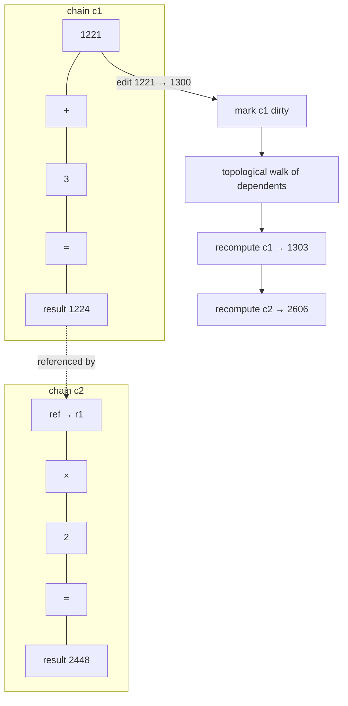

- Graph vertices are chains; edge `A → B` exists when `B` contains a reference to a node in `A`.
- Recompute is incremental: mark the mutated chain dirty, then evaluate its transitive dependents
  in topological order. Untouched chains are never re-evaluated.
- Cycles are detected by DFS colouring at graph-build time. Every chain in a cycle enters
  `CircularReference`; the rest of the document keeps working.
- Deleting a node that references are pointing at leaves those references in a
  `DanglingReference` state rather than cascading deletes into the user's other work.
  `deleteNode` / `removeResultNodesForChain` stamp `lastKnownDisplay` via
  `prepareReferencesForDeletion` (`engine/reference.ts`) before the target is removed.
- References are created two ways: continuation from a number or result (§8.7) and **dragging a
  result** into another chain (same §8.3 snap outcomes; the commit inserts a reference and leaves
  the result in place). Number drags still move/snap; they do not insert references.

`src/engine/graph.ts` owns the cascade: `buildDependencyGraph` / `topologicalOrder`
(vertices are chains; edges keyed `(sourceNodeId, referenceNodeId)`, §11.1), and
`dirtyClosure(seed)` returns the seed ∪ its transitive dependents in topo order.
P6.3 colours cycles at build time (`DependencyGraph.cycles` via DFS) and
`recomputeFromSeeds` paints every cycle member `CircularReference` with named-cycle
metadata while leaving unrelated chains alone. Evaluation marks the dirty set stale
then runs it in one turn via `documentStore.applyCommand`'s `recomputeSeeds` option
(or directly from chain finalisation). Callers and the store API were kept stable
through P4.8 → P6.3.

### 11.1 Identity hues: the visual language of a link

Tydlig's cleverest idea (§1.3) and worth taking wholesale: **a link is communicated by colour
identity, not just by a line.**

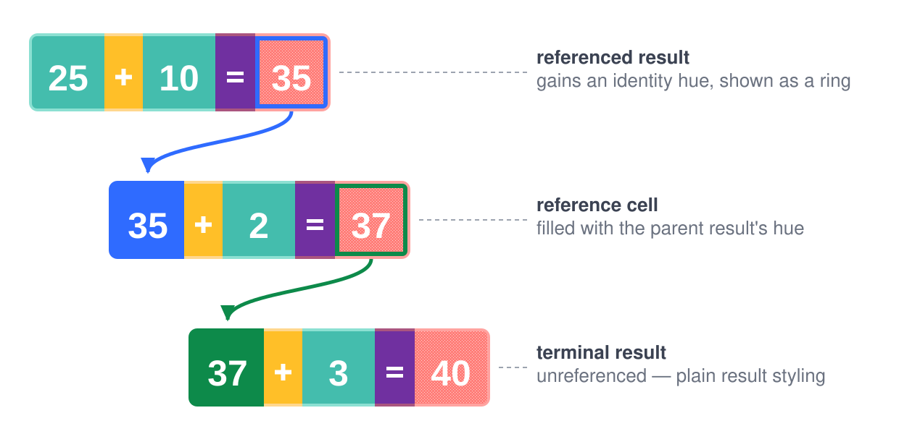

- A value with **no identity** carries no hue — it is a plain node. Colour is spent only where it
  means something.
- A value **acquires an identity** when it becomes a named thing, which happens two ways: something
  **references** it, or the user gives it a **label**. Either grants an **identity hue** from a
  rotating palette, drawn as a ring outside the cell — same geometry as the P7.2 selection focus
  ring, and replaced by that ring (white) while the cell is selected, rather than stacking both.
  (The reference-only rule was wrong: the reference app's own labels illustration colours three
  *inputs* purely because they are labelled.)
- Every **reference** to that value is filled with the same hue. Two cells sharing a hue are the
  same value, wherever they sit on the canvas. A reference whose ultimate source (walking through
  any nested reference→reference chain) is a *result* also carries the §1.2 dot texture, same
  pattern as the result cell itself — colour still carries *which* identity, the pattern alone
  carries *derived from a result*.
- The **connector** between them is drawn in that hue too, as a bezier with an arrowhead.
- **The label belongs to the identity, not the cell.** It renders above the declaring cell *and*
  above every reference to it. In the compound-interest screenshot (§1.3) "Initial Deposit" appears
  three times — once on the declaration, once over each reference. So `label` is looked up through
  the identity (`labelForNode` / `identitySourceId` in `src/engine/identity.ts`), and editing it
  via `setNodeLabel` updates every cell at once. References never own the caption — a `label`
  field on a reference node is ignored at render time.

Rules that follow from this:

- Hues are assigned from a fixed palette (`#2F6BFF`, `#0D8A4A`, `#880E4F`, `#00B8D9`, `#B8860B`,
  `#560BAD`), chosen to stay distinguishable from the structural teal/amber/purple/salmon and
  from each other. Validated for deuteranopia/protanopia (P6.8) — colour is load-bearing here,
  so it is still not the *only* channel: the connector line and the long-press `Unlink from
  parent` affordance carry the same information non-chromatically.
- Hue is a **render-time property derived from the graph**, never persisted. Reopening a document
  reassigns hues deterministically by traversal order, so they are stable across loads without
  being stored. Implemented in `src/engine/identity.ts`: identity-bearing node ids (referenced
  or labelled) are sorted lexicographically and coloured from `identityHues` in `ui/tokens.ts`.
  Sorting, not `Object.keys` insertion order, is what keeps save→reload assignment identical
  (serialize writes nodes sorted by id).
- Connectors are drawn for **all** links by default, not only the selected one. Tydlig hides them
  until you swipe and the review calls that out as confusing; showing them costs a little visual
  noise and buys comprehension. If density becomes a problem, fade unselected connectors rather
  than hiding them. Implemented in `src/canvas/ConnectorLayer.tsx` + `connectors.ts` (P6.6):
  every live reference gets a cubic in the source's identity hue with an SVG arrowhead; when
  something is selected, unrelated curves fade to `CONNECTOR_UNSELECTED_OPACITY` instead of
  vanishing. Dangling refs draw no curve (§11.2 owns their chrome).
- **A source can have many consumers.** The reference app shows one value feeding four
  consumers at once, with four curves fanning out of it (§1.3). So the renderer must handle 1→N:
  curves leave the source at fanned-out angles rather than all from the same point, and a source
  with more than ~4 consumers collapses to a count badge that expands on selection. Edges are
  keyed `(sourceNodeId, referenceNodeId)`, never by source alone. Fan exit points and control
  offsets live in `connectors.ts`; collapse threshold is `CONNECTOR_FAN_COLLAPSE_AT` (5).

### 11.2 Broken links are explained, not marked with a punctuation glyph

The review's sharpest criticism of Tydlig is that orphaning a result leaves a bare `?` "without
telling you why the error is there." So:

- `DanglingReference` renders the reference cell in a neutral struck-through style with the last
  known value dimmed — not a bare glyph. Implemented: `referenceCellContent` + `ReferenceNode`
  (P6.4); tap opens `DanglingRecoverySheet` with re-point and convert-to-number; long-press
  adds `Unlink from parent` (§8.6).
- Tapping it explains what happened and offers the two useful actions: *re-point at another value*
  or *convert to a plain number* freezing the last known value.
- The same applies to `CircularReference`: name the cycle and offer to unlink the edge that closed
  it.

### 11.3 Rendering approach

Nodes are plain RN `View`s with `borderRadius` — no SVG or Skia needed for the common case, which
keeps web and native identical. A chain's members sit flush (§1.1), so `Cell.tsx` rounds and
borders only the outer edge of the chain rather than every member's own four corners: each node
component reads its `chainId` through `useGroupPosition` and passes the result (`'solo' | 'start'
| 'middle' | 'end'`) as `groupPosition`, which `Cell` turns into per-corner radii and left/right
border widths (`cornerRadii/sideBorderWidths` in `Cell.tsx`) so a multi-member chain reads as one
rounded rectangle — same silhouette as `docs/assets/formula-reference.svg`'s clipped outer/inner
rects — rather than a row of individually-rounded, individually-bordered chips. The result node's
dot texture is the exception to "plain `View`":

- Solid `#FF7E79` + `#FFA3A0` border band always — hue and border carry read-only-ness on their
  own (decision #9).
- Dot texture (P7.3 / §1.2): `ResultDotTexture` paints a `react-native-svg` `Pattern` — 4×4 unit
  tile, 1-unit dots at `(1,0)` and `(3,2)` in `#FFD1CF` — as a `Cell` `bandBackground`, clipped to
  the band's own rounded corner. `textureSize` (`ResultDotTexture.tsx`) sizes it to the band's
  actual content box via the same `sideBorderWidths(groupPosition, …)` the band itself uses,
  rather than assuming both left and right always carry a border. Any `ReferenceNode` whose
  ultimate source is a result (§11.1) passes the same component as its own `bandBackground`.
- The identity ring and the P7.2 selection focus ring are both outset (painted outside the band,
  not inset within it) and are laid out as **siblings** of the band inside a shared, unclipped
  `cellOuter` wrapper — not children of the band itself. This matters specifically because the
  band clips its own content whenever a `bandBackground` is present: an outset ring nested inside
  that clipped View would be clipped away along with it, rendering correctly in the tree but
  invisible on screen. Same geometry as `docs/assets/formula-reference.svg`; decorative only.
- The selection focus ring's left/right border width is `sideBorderWidths(groupPosition, …)` —
  the *same* group-position mask the band itself uses — whenever `groupSelected` is true
  (§8.6: this cell's selection is `Select group`/`Select all` membership, from
  `useNodeGroupSelected`, not just the lone `selectedNodeId` keypad target). That is what makes
  a whole selected chain's ring merge into one outline instead of each member drawing a
  complete ring around itself, which would otherwise double up as a visible border on every
  interior seam between two flush, both-selected cells. An ordinary single selection passes
  `'solo'` regardless of the cell's actual chain position, so a lone selected mid-chain cell
  still gets a complete ring on every side — its neighbours are not selected, so there is no
  seam to merge across.

Connector curves (§11.1) also use `react-native-svg` — beziers in an overlay layer above the
nodes, sharing the canvas transform. Implemented: `ConnectorLayer` is a sibling of `NodeLayer`
inside `Canvas` (same pan/zoom), `pointerEvents="none"`, z-index above idle nodes and below
mid-drag chrome. Mid-drag it reads `uiStore.dragSnap` (including `movingChainId` for P3.7) so
endpoints track the finger before the store commits on release — same ephemeral feed
`NodeLayer` uses for the insertion gap. The dependency has been load-bearing since P6.6; the
result texture reuses it.

Chrome icons (toolbar, mode strip, dialogs) use **Heroicons** via `react-native-heroicons`,
which renders through the same `react-native-svg` dependency. Import from a style subpath
(`outline` / `solid` / `mini` / `micro`); deep imports
(`react-native-heroicons/outline/TrashIcon`) keep the web bundle from pulling the whole set.

### 11.4 Performance budget

| Concern | Approach |
|---|---|
| 60fps drag | Reanimated worklets; store commit only on release |
| Re-render scope | Per-node Zustand selectors + `React.memo`; a node re-renders only when its own slice changes |
| Snap search | Spatial hash behind `SnappingNeighbours`; build once per drag (§8.4) |
| Evaluation | Dirty-set only; never a full *evaluation* sweep. Cycle bookkeeping (P6.3) builds the reference graph and, only when the dirty set touches a cycle or is clearing a `CircularReference`, scans result outcomes to recover/refresh circular paints — it does not re-evaluate untouched chains. |
| Text measurement | Memoised per `(raw, fontSize)` |

---

## 12. Persistence

### 12.1 File format

One document is one JSON file: `<name>.calcmind.json`. Plain JSON so it is inspectable,
diffable, and readable by anything.

```json
{
  "$schema": "https://calcmind.app/schema/document-1.json",
  "schemaVersion": 1,
  "id": "doc_V1StGXR8Z5jdHi6B",
  "name": "Kitchen remodel",
  "createdAt": "2026-08-02T10:00:00.000Z",
  "updatedAt": "2026-08-02T10:04:12.412Z",
  "viewport": { "pan": { "x": -120, "y": 40 }, "zoom": 1 },
  "nodes": [
    { "id": "n1", "kind": "number",   "raw": "1221", "position": { "x": 0,    "y": 0 }, "chainId": "c1", "createdAt": 1785664800000 },
    { "id": "n2", "kind": "operator", "op": "+",     "position": { "x": 88,   "y": 0 }, "chainId": "c1", "createdAt": 1785664801000 },
    { "id": "n3", "kind": "number",   "raw": "3",    "position": { "x": 122,  "y": 0 }, "chainId": "c1", "createdAt": 1785664802000 },
    { "id": "n4", "kind": "operator", "op": "-",     "position": { "x": 186,  "y": 0 }, "chainId": "c1", "createdAt": 1785664803000 },
    { "id": "n5", "kind": "number",   "raw": "20",   "position": { "x": 220,  "y": 0 }, "chainId": "c1", "createdAt": 1785664804000 },
    { "id": "n6", "kind": "equals",                  "position": { "x": 275,  "y": 0 }, "chainId": "c1", "createdAt": 1785664805000 },
    { "id": "n7", "kind": "result",   "sourceChainId": "c1", "position": { "x": 310, "y": 0 }, "chainId": "c1", "createdAt": 1785664805000 }
  ],
  "chains": [
    { "id": "c1", "members": ["n1", "n2", "n3", "n4", "n5", "n6", "n7"], "anchor": { "x": 0, "y": 0 } }
  ]
}
```

Notes on the format:

- **Arrays on disk, maps in memory.** `nodes` and `chains` serialise as arrays in stable id order
  so the file diffs cleanly in git and stays compact; they are normalised into `Record`s on load
  for O(1) lookup. Serialisation sorts keys so two identical documents produce byte-identical
  files.
- **`derived` is a cache, stripped on write.** The in-memory result node still carries `derived`
  so the UI can paint between keystrokes; the serialiser drops it (§12.3 save sequence). On load
  the engine recomputes before the document is ready. A file that somehow still has `derived`
  (hand-edited, older writer) is tolerated — the engine overwrites it, silently, and wins.
- **Member `position` is redundant** with `anchor` + `members`. Kept because it makes the file
  self-describing and lets a reader reconstruct the picture without implementing the layout pass.
  Load ignores it for members and re-runs layout.
- **`schemaVersion` is separate from the app version.** It changes only when the document shape
  changes.

### 12.2 Storage adapter

```ts
// persistence/adapter.ts
export interface DocumentMeta { id: string; name: string; updatedAt: string; bytes: number }

export interface StorageAdapter {
  list(): Promise<DocumentMeta[]>;
  read(id: string): Promise<string>;
  write(id: string, json: string): Promise<void>;   // must be atomic
  remove(id: string): Promise<void>;
  /** Optional: one-generation `.bak` (native). Load falls back here when primary is missing or not valid JSON. */
  readBackup?(id: string): Promise<string>;
  /** Optional: OS share sheet (native) or file download (web). */
  exportDocument?(id: string): Promise<void>;
  /** Optional: file picker → raw JSON string. */
  importDocument?(): Promise<string | null>;
}
```

| Platform | File | Mechanism |
|---|---|---|
| iOS / Android | `adapter.native.ts` | `@dr.pogodin/react-native-fs`, documents at `DocumentDirectoryPath/calcmind/<id>.calcmind.json`. Export via the share sheet. |
| Web | `adapter.web.ts` | IndexedDB via `idb-keyval`. Export = `Blob` download; import = `<input type="file">`, upgrading to the File System Access API where available. |

### 12.3 Save and load flows

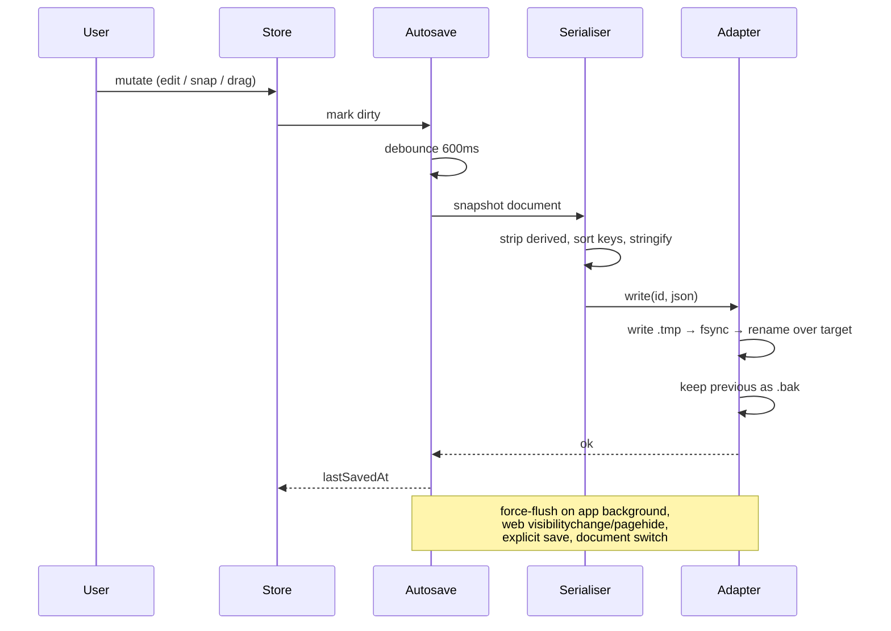

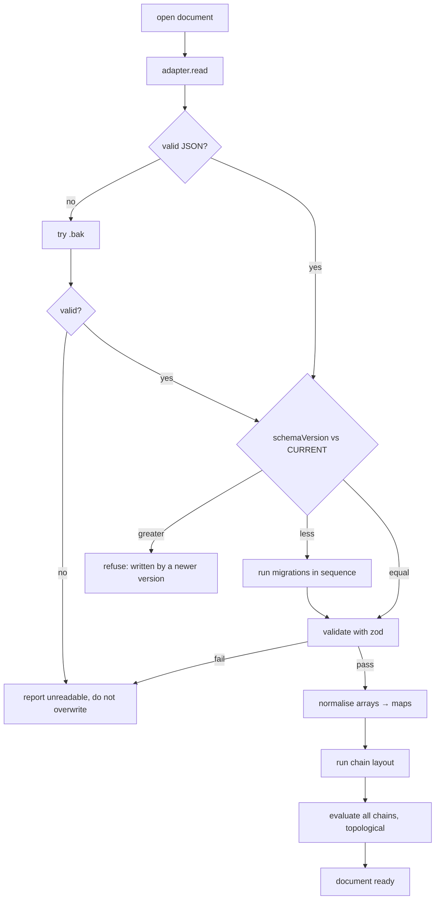

Key safety properties:

- **Atomic writes.** Write to `<id>.tmp`, fsync, rename over the target. A crash mid-save leaves
  either the old file or the new one, never a truncated one. IndexedDB transactions give this for
  free on web.
- **One generation of backup.** The previous good file is retained as `.bak` and is the fallback
  when the primary fails to parse.
- **A document from a newer schema is refused, not migrated.** Guessing at a shape we do not know
  would corrupt the user's work. We say so plainly and leave the file alone.
- **Validation happens at the trust boundary.** A file on disk is untrusted input; zod runs on it
  before anything reaches the store.

### 12.4 Migrations

```ts
// persistence/migrations/index.ts
type Migration = { from: number; to: number; migrate: (doc: unknown) => unknown };
export const CURRENT_SCHEMA_VERSION = 1;
export const migrations: Migration[] = []; // v1 is the origin
```

Applied in ascending order until `doc.schemaVersion === CURRENT_SCHEMA_VERSION`. Every migration
gets a fixture pair (`before.json` / `after.json`) committed as a test — migrations are the code
most likely to silently eat data and the least likely to be exercised by hand. The harness lives
in `src/persistence/migrations/`; the fixture rule is restated at the top of that module so the
next author cannot miss it. A synthetic v0→v1 fixture pair proves the runner before any real
migration ships (production `migrations` stays empty while v1 is current).

### 12.5 User preferences (§1.2 P7)

A third category of state, alongside `documentStore` (persisted + undoable) and `uiStore`
(never persisted, never undoable): **persisted, but not undoable, and not part of any
document.** Currently one setting — the numeral font size, `store/preferencesStore.ts`'s
`numeralFontSize` — surfaced as the Settings sheet's Canvas Number Font Size row (§8.5).

- **Contract** (`persistence/preferences.ts`, same bundler platform-resolution trick as
  `adapter.ts` §12.2) is deliberately smaller than the document `StorageAdapter`: `read()` /
  `write()` over one small `Preferences` blob, no atomic-write/backup machinery — a corrupt or
  lost preferences file loses a display setting, never user data, so a failed read/write is
  swallowed and the caller stays on in-memory defaults.
- **Native** (`preferences.native.ts`): a single JSON file at
  `DocumentDirectoryPath/calcmind-preferences.json` — a sibling of, not inside, the `calcmind`
  documents directory, so it can never be mistaken for a document by `readDir`.
- **Web** (`preferences.web.ts`): its own IndexedDB database, `calcmind-preferences` —
  deliberately **not** a second object store inside documents' `calcmind` database. Two
  independent `idb-keyval.createStore(sameDbName, differentStoreName)` calls each open that
  database name on their own, uncoordinated; IndexedDB only creates the object stores present
  in whichever `createStore` call's `upgradeneeded` handler happens to fire first, so the other
  store is silently missing for the lifetime of that database. Caught live: preferences
  hydrate before any document loads (below), so on a fresh profile its `createStore` opened
  `calcmind` first and created only a `preferences` store — every subsequent document autosave
  then threw `NotFoundError` because `documents` was never created. A separate database
  sidesteps the ordering hazard entirely.
- **Hydration order.** `AppShell.tsx` awaits `usePreferencesStore.getState().hydrate()` before
  calling `loadMostRecentDocument()` — the loaded document's chains re-flow (§12.3) using
  whatever font size was just hydrated, not the compiled-in default, so a document saved under
  a non-default size lays out correctly on the very first paint.
- **Applying a change.** `setNumeralFontSize` clamps to range, persists (best-effort), then
  re-flows every chain in the *currently open* document at the new size via
  `store/reflowAllChains.ts`'s `reflowAllChainsForDisplay`. That re-flow calls
  `documentStore`'s `mutateWithoutUndo` — the same bypass-undo primitive `setViewport` (§7)
  uses — because a display preference change is not a document edit a user would expect
  Ctrl+Z to touch, even though the re-flowed `position`s do live on document nodes and do get
  autosaved. `reflowAllChainsForDisplay` lives outside `store/commands.ts` (which has its own
  private, per-chain `reflowChain` for after document edits) specifically to avoid an import
  cycle: `commands.ts` already reads the live font size from `preferencesStore.ts` for its own
  `widthOf` calls, so `preferencesStore.ts` cannot also import `commands.ts` — and takes
  `fontSize` as a parameter rather than reading `preferencesStore.ts` itself for the same
  reason, since `preferencesStore.ts` is *its* caller.
- **Threading the live value.** `chains/measure.ts`, `chains/layout.ts`, `chains/bounds.ts`,
  and `chains/snapping.ts` stay free of any store import (pure functions over their explicit
  arguments, same as `locale` already was) — `fontSize` is a parameter defaulted to
  `tokens.numeralFontSize`, mirroring `widthOf`'s own existing convention, so every pre-existing
  test call site that predates the setting keeps compiling and behaving identically. Production
  call sites (`store/commands.ts`, `canvas/hitTest.ts`, `nodes/useNodeDrag.ts`,
  `canvas/NodeLayer.tsx`) pass `usePreferencesStore.getState().numeralFontSize` explicitly — a
  plain non-reactive read, the same pattern already used for `uiStore` in those same
  non-component modules. Node view components (`NumberNode`, `OperatorNode`, `EqualsNode`,
  `ParenNode`, `ReferenceNode`, `ResultNode`) subscribe reactively via `Cell.tsx`'s
  `useGlyphTextStyle()` hook (replacing the former static `glyphTextStyle` constant) so an
  already-mounted cell repaints immediately on a Settings change, not just on its next
  unrelated re-render. `persistence/load.ts` sits below `store/` in §5's dependency rule
  (never upward), so its own reflow-on-open takes `fontSize` as a parameter from its caller
  rather than reading the store directly.
- **`nodeHeight` tracks the live font size; `numberPaddingX` / `mathAxisOffset` stay fixed.**
  `ui/tokens.ts`'s `nodeHeightFor(fontSize)` (`fontSize + 2 × numberPaddingY`) replaces the
  static `tokens.nodeHeight` everywhere a cell's actual box is computed — `chains/measure.ts`
  (the width floor), `chains/bounds.ts` (`boundsOf`/`chainBounds`), `chains/layout.ts`
  (`caretAt`, now taking `fontSize` as a third parameter), `canvas/hitTest.ts`
  (`containsPoint`), and `store/commands.ts` (`continuationAnchor`'s slot pitch and column
  bounds) — so a chosen size that no longer fits the old 40dp band doesn't clip or leave the
  cell's tap/drag hit box out of sync with what's drawn. `tokens.nodeHeight` itself stays as
  the *default-size* value only, used where a live per-render size isn't warranted:
  `SPATIAL_HASH_BUCKET` in `bounds.ts` (a coarse performance partition, not a hit-test bound)
  and `CONTINUATION_OFFSET` in `commands.ts` (a fallback default, not the value
  `continuationAnchor` actually places against). `nodeHeightFor` was calibrated so
  `nodeHeightFor(22) === 40`, matching today's compiled-in default exactly — nothing about the
  fixed-size layout changed, only how the height is derived. `numberPaddingX` and
  `mathAxisOffset` stay fixed tokens, not user-adjustable, since neither needs to track size to
  keep the cell's proportions readable. The Settings range (14–30dp, `NUMERAL_FONT_SIZE_MIN`/
  `MAX`/`STEP` in `preferencesStore.ts`) was chosen to stay legible against those fixed values.

---

## 13. Undo / redo

`immer.produceWithPatches` yields forward and inverse patches for every command. Each entry on a
bounded stack (100 deep) holds both, so undo and redo are patch applications rather than full
document snapshots. Helpers live in `store/undo.ts`; `documentStore` is the only writer.

- Rapid text edits to the same node within 500ms coalesce into one entry, so undo does not walk
  back one keystroke at a time. Coalescing **amends the stack-top in place** rather than
  push-then-merge — at the 100-deep cap a push would drop the oldest entry before the merge
  shrank the stack by one, silently losing unrelated history.
- A value-slider scrub (§8.8) coalesces the whole gesture into one entry regardless of duration —
  it is a drag, not a keystroke burst — via the same amend path.
- Viewport changes are excluded (§7).
- Autosave and undo are independent: undo mutates the store, which marks it dirty, which saves.
- Autosave is suppressible (`setSuppressed`) so a continuous gesture such as value scrubbing
  (§8.8) does not enqueue a write per frame; force-flush (background / explicit save / document
  switch) still writes once if dirty — kill-safety outranks suppress.

---

## 14. Testing strategy

The engine is pure functions over plain data, which is the whole reason to keep it free of React.
Jest is already configured and green in this repo.

| Layer | What we test |
|---|---|
| `engine/` | Table-driven: tokenise, validate, precedence (`2 + 3 × 4 = 14`), all error states, formatter boundaries (1e12, 1e-6, trailing zeros), `0.1 + 0.2 = 0.3` |
| `engine/graph` | Topological order, incremental dirty propagation, cycle detection, dangling references |
| `engine/reference` | Live/dangling display text, delete-time `lastKnownDisplay` stamp, re-point eligibility |
| `chains/` | Layout arithmetic, bounds, snap candidate selection at threshold boundaries, detach hysteresis |
| `persistence/` | Round-trip equality (document → JSON → document), byte-stability of serialisation, every migration fixture, malformed-file and newer-schema handling; preferences adapters (native fs, web IndexedDB) round-trip and swallow corrupt/missing files to `{}` |
| `store/preferencesStore`, `store/reflowAllChains` | Clamping, persist-on-set, hydrate-over-default, reflow bypasses undo and matches `layoutChain` directly at the given font size |
| Components | Each node kind renders; result nodes reject edit attempts; value slider range inference + popover |
| `canvas/connectors` | Live-link collection, 1→N fan paths, >4 collapse badge, selection fade (decision #13) |
| Integration | create → snap → `=` → result; edit input → result updates; save → reload → identical document; scrub gesture → one undo + cascade |
| Property (`fast-check`) | parse∘print round-trips; formatter never emits something it cannot re-parse |

---

## 15. Development plan

**Moved to [`DEVELOPMENT_PLAN.md`](DEVELOPMENT_PLAN.md).** The phase order, per-phase acceptance
criteria and sequencing notes live there, expanded into tasks that each carry an objective, the
architecture sections they implement, and their own acceptance criteria — with the phases already
built struck through.

This section number is kept, rather than renumbering §16 and §17 up, because both are cited from
the journal, from commit messages, and from within this document.

The split is deliberate. This document describes the design and is rewritten in place as the
design changes; the plan is a progress record that gets ticked off. Holding both in one file made
it unclear which parts were claims about the present and which were intentions.

---

## 16. Decisions log

| # | Decision | Rationale | Revisit if |
|---|---|---|---|
| 1 | Bare React Native CLI, no Expo | No dependency that can acquire a price; already migrated | Needing many native modules makes manual linking painful |
| 2 | Token order stored explicitly | Sorting by `x` lets a rendering bug change a user's answer (§6.1) | Never |
| 3 | `decimal.js`, not native floats | `0.1 + 0.2` must be `0.3` in a calculator | Bundle size becomes critical |
| 4 | Adjacent numbers invalid, but `n(` multiplies | `12 34` is more likely a mis-snap than a product; `12(…)` is unambiguous maths and the reference app uses it (§10.2) | Never for the paren case; the number-number case if users ask |
| 5 | Plain JSON documents | Inspectable, diffable, hand-editable; no lock-in | Documents grow large enough to need a binary format |
| 6 | `derived` stripped on write; tolerated on load as labelled cache | §12.3 save sequence keeps files free of stale paint; load still accepts `derived` so a hand-edited file can hint answers. Engine always wins | Wanting instant paint from autosaved files without waiting for evaluate |
| 7 | Newer-schema files refused, not migrated | Guessing an unknown shape corrupts work | Never |
| 8 | Zustand over Redux | Selector subscriptions matter during drag; less ceremony | State grows to need middleware ecosystem |
| 9 | Result texture is decorative (shipped P7.3) | Hue + border already carry read-only-ness; the §1.2 dots are an extra channel, not the carrier | It tests as load-bearing for comprehension — then promote it in a11y copy / remove the "decorative only" carve-out |
| 10 | Parentheses in v1, not deferred | Tydlig puts them on the primary keypad, so users expect grouping; retrofitting costs a node kind + schema version + snapping rules (§10.2) | Never |
| 11 | Locale display, canonical storage | `1.020` is ambiguous between two numbers across locales; storing formatted strings corrupts documents on travel (§10.3) | Never |
| 12 | Identity hues derived, never persisted | Deterministic from traversal order, so stable across loads without occupying the schema (§11.1) | Users want to pin a specific colour to a value |
| 13 | All connectors shown, not just selected | Tydlig hides them and the review names that as confusing (§11.1) | Density testing shows it is too noisy — then fade, don't hide |
| 14 | Always-on pills | Taken from the supplied reference; makes structure permanently legible | The canvas reads as too busy with real content |
| 15 | Swipe-to-clear / Clear all require confirmation | Tydlig's bare swipe wipes a document; too destructive for one stray gesture even with undo. The mode-strip Clear all button shares the same confirm (§8.5) | Never |
| 16 | Typing builds chains directly, not through P3's snapping | Typing always knows exactly which chain to extend (whichever the selected node belongs to), so it appends deterministically (`store/commands.ts`'s `appendMembersToChain`) instead of running §8.2-8.4's geometric candidate search, which exists to disambiguate a *dragged* node's several nearby neighbours (P2.8) | P3's chain layout pass changes how `Chain.anchor`/positions are derived and this stops matching it |
| 17 | Plain drag detaches; long-press-then-drag moves chain | Detach/rearrange is the frequent edit and must not require a dwell; lifting a whole expression is deliberate. Opposite mapping tried interactively (P3.7); both work, this one won (§8.3, §17.1) | Real-device use shows accidental detaches dominate over accidental chain moves |
| 18 | `numeralFontSize`/`numeralFontWeight` reduced to 22/400 from the reference-accurate 30/800; `numberPaddingX` reduced to 4 from 12, in two steps (12→8→4); `nodeHeight` reduced to 40 from 64, in two steps (64→48→40), with `mathAxisOffset` scaled 4→2 to match | User-reported live: the ratio-accurate glyph size read as oversized in the cell; regular weight at the smaller size stays legible without the bold's extra visual weight; the number-cell width table in `measure.ts` had to be re-derived by hand too, since it is a fixed lookup keyed to the *value* of `numeralFontSize`, not a live scale from it; 8 still read as excess whitespace on further feedback; a fixed 64dp then 48dp band around the shrunk 22px glyph kept reading as excess space above/below the text even after the first cut — asked the user how far to take it given `nodeHeight` also sizes the tap/drag hit box, and 40 (near the common ~44dp touch-target minimum) was the answer (§1.2, §8.1) | A future reference restyle re-derives the ratio and disagrees; padding or band height reads too tight against the border band, or tap targets prove too small in real use |
| 19 | Numeral font size made a live, persisted user preference (§12.5) rather than staying a fixed token; `nodeHeight`/`numberPaddingX`/`mathAxisOffset` stay fixed | Direct follow-on from decision #18's thread: the user asked to be able to change it themselves rather than keep asking for a different fixed value. Only the glyph size needed to be adjustable to satisfy the request; moving the padding/height tokens too would have meant re-deriving `measure.ts`'s glyph-width table and the tap-target floor on every change, for no requested benefit | Users want padding/height to visually track a much larger or smaller chosen size too — **fired**, see decision #20 |
| 20 | `nodeHeight` made a live function of the font size (`nodeHeightFor`, §12.5), not a fixed token; `numberPaddingX`/`mathAxisOffset` stay fixed. Settings row also renamed to "Canvas Number Font Size", given a non-editable "pt" unit label, and its value made directly typable alongside the existing +/− stepper | User noticed the cell stayed a fixed height across a font-size change while its width already tracked live (decision #19 had only wired width) — an inconsistency between the two axes of the same cell, not a new feature. `nodeHeightFor` is derived (`fontSize + 2 × numberPaddingY`), not a second independently-threaded parameter, so most call sites needed no new argument — only `caretAt` (`chains/layout.ts`) gained one, since it's the one site without `fontSize` already in scope. `numberPaddingX`/`mathAxisOffset` were left fixed, matching #19's reasoning: nothing asked for the cell's *proportions* to change, only for both axes of its *size* to agree | A future request wants the padding or maths-axis offset to also scale with the chosen size |
| 21 | Identity ring moved from inset to outset (same geometry as the P7.2 selection focus ring, replaced by it while selected); any reference tracing back to a result also gets the result's dot texture, transitively through nested reference→reference chains | User pointed at the shipped-inset ring directly: it read as chrome buried inside the cell rather than the cell's own outer identity, and wanted it to *become* the white focus ring on selection rather than being hidden in favour of a separate one. Reusing the focus ring's exact geometry (`cornerRadii`/outset offsets) made that literal — the same physical ring, recoloured. Also required moving both outset rings out from being children of the band to being its siblings (`cellOuter` wrapper, §11.3): the band clips its own content for a `bandBackground` texture, and a ring nested inside a clipped parent is invisible regardless of its own style being correct — caught live, not by any test, since Jest's renderer doesn't compute real overflow clipping | Never for the ring geometry (it is now the same code path as focus); revisit the pattern-propagation rule if a future request wants it to mean something narrower than "traces back to a result" |
| 22 | `=` is a hard stop: selecting the equals cell rejects every key, and the keypad's `=` key disables once its chain already has one (`chainHasEquals`), regardless of which member is selected; `operatorWidth` reduced 34→26 | User reported two gaps directly. First: selecting `=` and pressing a digit/paren/operator/`=` spliced a new member in right after it (`appendMembersToChain` inserts after whatever node is targeted) — a chain's result belongs there, placed by `finalizeChain`, never further user input; fixed with a full early-return once `selectedNode.kind === 'equals'`, plus a `chainHasEquals` guard inside `dispatchEditorCommand`'s own `equals` case so a hardware Enter/`=` can't bypass what the on-screen key's `disabled` prop already refuses (mirrored in both places rather than only the UI, since the UI gate never covered the hardware path). Second: operator-cell padding (~10.5dp either side of a ~13dp glyph, measured live via `getBoundingClientRect`) read as excessive next to `numberPaddingX`'s already-trimmed 4dp; picked 26 to cut it visibly without leaving the glyph cramped. 26 sits *below* `chains/bounds.ts`'s `SNAP_DISTANCE` (28) — a value `chains/snapping.test.ts` had one fixture built to stay clear of — but the full suite (`resolveSnapCandidate`'s "nearest wins" tie-break) passed unchanged regardless, so no snapping fix was needed. Kept the paren cell sharing the same token, unchanged design intent (§1.2), and left `equalsWidth` untouched since only "operator cells" were named | Never for the equals hard-stop; revisit `operatorWidth` if a future request wants parens sized independently of operators, or `equalsWidth` brought in line with the now-narrower operator cells |
| 23 | `Select group`/`Select all` merges the selection focus ring across interior seams (new `useNodeGroupSelected`, reusing the band's own `sideBorderWidths(groupPosition, …)` mask) rather than every member drawing a complete ring around itself | User asked for exactly this: a selected group should read as one big cell, not N individually-outlined ones. Each group member already drew its own full 4-sided ring (`selected` is true for every id in `groupSelectedIds`), so two flush, both-selected cells doubled up a border on the shared seam between them. Reusing the *band's* own group-position mask was the direct fix, but it had to be gated on group membership specifically (`useNodeGroupSelected`, not the general `useNodeSelected`) — an ordinary single selection (the lone keypad target, `selectedNodeId`) must keep its full ring even on a structurally mid-chain cell, since its neighbours are not selected and there is nothing to merge across; conflating the two would have silently broken every existing single-selection ring | Never — this is now the same code path the band uses, so it inherits whatever `sideBorderWidths` does |

## 17. Open questions

### 17.1 Chain move vs member detach

~~Still the one genuinely unresolved interaction (§8.3).~~ **Resolved (P3.7).** Plain drag
detaches a member; long-press (≥200 ms) then drag moves the whole chain (anchor update). The
opposite mapping was tried interactively (Playwright/CDP against the web build) and both
gestures work mechanically; the shipped mapping won because detach/rearrange is the frequent
edit and should not require a dwell, while lifting a whole expression is a deliberate act that
fits long-press. `Select group` — via double-tap/double-click on any cell, or the context-menu
item — remains the dwell-free alternative (§8.6). Context menu at 500 ms still wins over
move-chain (P2.9). Flip point is `LONG_PRESS_MOVES_CHAIN` in `src/nodes/dragLifecycle.ts`.

### 17.2 Everything else
2. ~~**Keypad model**~~ — **resolved** (§8.5). Tydlig's dismissible, non-fullscreen keypad with a
   separated operator column, observed directly from its screenshots.
3. **Multi-document UX** — is there a document browser, or one canvas that grows forever? Tydlig
   has a documents button in its toolbar, implying a browser. §12 supports many documents either
   way, so this is a UI question, not a model one.
4. **Graphing** — in Tydlig 1.6 a line-graph is a canvas object that references a formula, sweeps
   one referenced input across a range, and plots one series per dependent result with axis ticks
   colour-matched to each result's hue (§1.3). Out of scope for v1, but it is the clearest reason
   the DAG must be a real graph: a graph node is just another consumer.
5. ~~**Labels**~~ — **resolved (P6b.1).** Modelled on the node base (§6); looked up through the
   identity so editing updates every cell that shares it. Context-menu `Label` opens the in-place
   editor; the toolbar tag button from §1.3 remains a future discoverability nicety.
6. ~~**Identity palette accessibility**~~ — **resolved (P6.8).** Machado et al. (2009)
   protanopia/deuteranopia simulation; ΔE₇₆ ≥ 15 for every identity×identity pair and every
   identity×structural pair. Four of the six first-guess swatches failed and were replaced
   (§1.2). Method locked in `src/ui/paletteAccessibility.ts`; results in the journal.
   Non-chromatic channels (connector line, `Unlink from parent`) remain required — hue is
   never the only carrier (§11.1).
