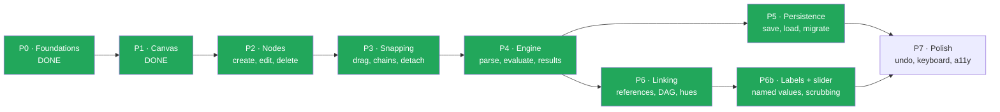
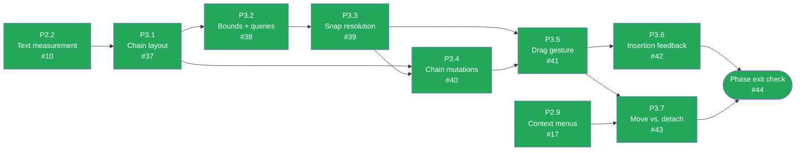
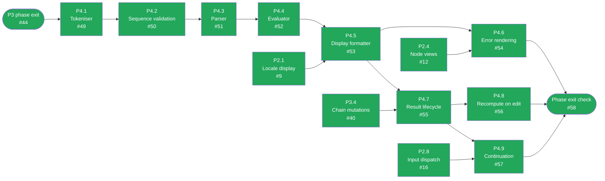
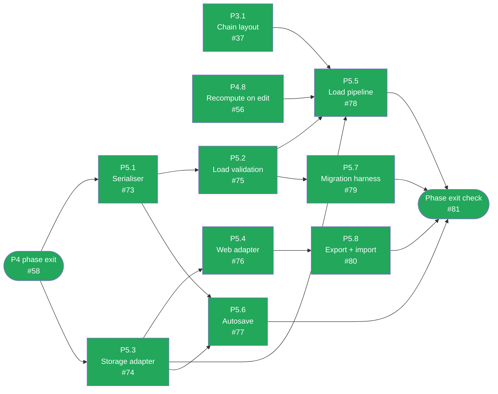
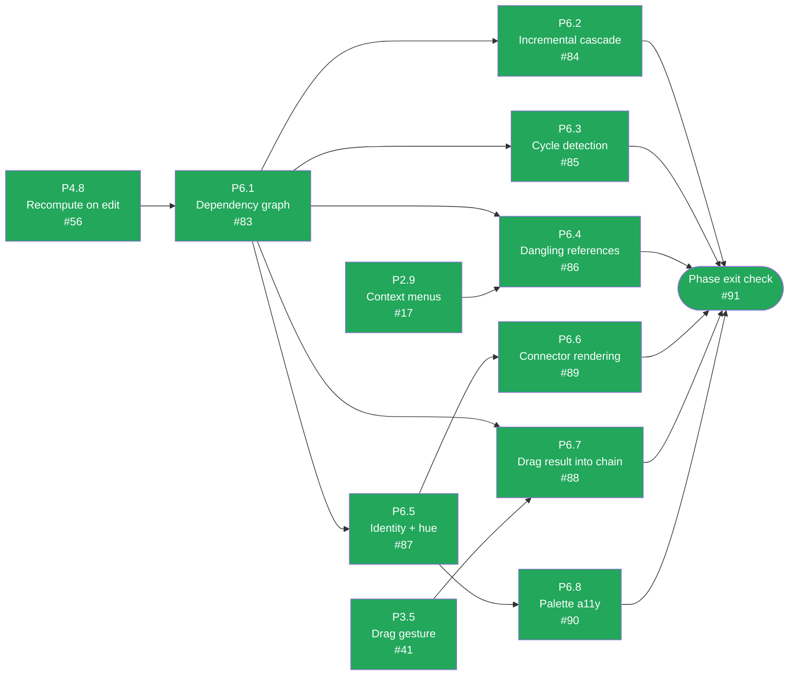
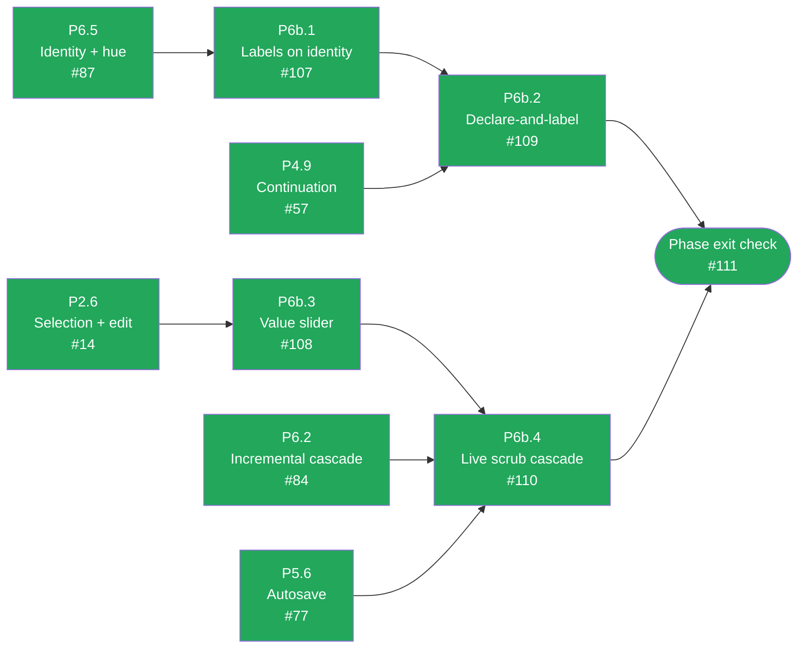
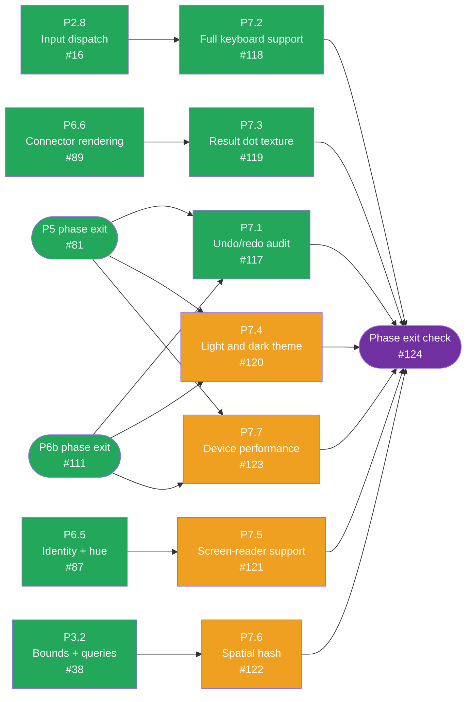

# CalcMind — Development plan

The build order, expanded into tasks an agent can pick up one at a time. Split out of
`ARCHITECTURE.md` §15, which now points here.

**This file tracks progress; `ARCHITECTURE.md` defines the design.** Never restate design detail
here — cite the section (`§8.3`) and let the architecture document stay the single authority. If a
task's acceptance criteria and the architecture ever disagree, the architecture wins and this file
is stale: fix it.

## How to use this as an agent

1. Read `AGENTS.md`, then `docs/journal/GUIDELINES.md`. Both are expected of you, and the journal
   has very likely already disproved something you are about to assume.
2. Take the lowest-numbered unchecked task whose **Depends on** is satisfied. Tasks within a phase
   are ordered so dependencies point backwards.
3. Read the architecture sections the task cites — in full, not by keyword search — before writing
   anything.
4. Build it. Check it against the task's acceptance criteria, then tick the boxes **in the same
   commit as the code**. Once every box on a task is ticked, also flip its mermaid node (if its
   phase has a dependency diagram) to the green "done" fill in that same commit — the diagram is
   read for status by colour alone; headings are never struck through.
5. Write your journal entry.

Each phase ends with a **Phase exit check** quoting §15's original acceptance criteria verbatim.
The tasks are an expansion of those criteria, not a replacement — if every task in a phase is
ticked but the exit check does not pass, the expansion missed something and the phase is not done.

### Definition of done — applies to every task below

Not repeated in individual tasks. A task with all its own boxes ticked but any of these unmet is
not finished.

- [ ] `npx tsc --noEmit`, `npm run lint`, `npm test`, `npm run build:web` all pass.
- [ ] New pure logic has tests. `ARCHITECTURE.md` §14 says what each layer's tests should cover.
- [ ] Anything user-visible has been **run and looked at** (`npm run web`), not merely
      type-checked. This is a recorded mistake — `docs/journal/2026-08-03.md` revision 8.
- [ ] Mutations go through the store's command layer, so undo works (§13). Ephemeral UI state —
      selection, drag position, keypad visibility, edit caret — stays **out** of undo history.
- [ ] `src/engine/` imports nothing from `src/store/` or any component. It is pure functions over
      plain data, which is the entire reason it is testable (§14).
- [ ] Docs the change contradicts are fixed in the same commit.
- [ ] Journal entry written per `docs/journal/GUIDELINES.md`.

---

## Status

| Phase | Goal | Tasks | State |
|---|---|---|---|
| ~~**P0**~~ | ~~Foundations~~ | — | **Done** — `08620f9` |
| ~~**P1**~~ | ~~Canvas pan/zoom~~ | — | **Done** — `08de0fc` |
| ~~**P2**~~ | ~~Nodes + keypad~~ | — | **Done** — 10/10, phase exit check verified live |
| ~~**P3**~~ | ~~Snapping~~ | — | **Done** — 7/7, phase exit check verified live |
| ~~**P4**~~ | ~~Engine~~ | — | **Done** — 9/9, phase exit check verified live |
| ~~**P5**~~ | ~~Persistence~~ | — | **Done** — 8/8, phase exit check verified live |
| ~~**P6**~~ | ~~Linking~~ | — | **Done** — 8/8, phase exit check verified live |
| ~~**P6b**~~ | ~~Labels + slider~~ | — | **Done** — 4/4, phase exit check verified live |
| **P7** | Polish | 7 | In progress — P7.1–P7.3 done; 4/7 remaining |

Sequencing notes, carried over from §15:

- **P4 is the critical path.** It is what turns a drawing app into a calculator, so it must not be
  deferred behind polish.
- **P5 and P6 depend only on P4** and can proceed in parallel.
- **P6b is not optional garnish.** Labels are what let a canvas be read back a week later, and the
  slider is what turns a correct dependency graph into something you can ask "what if" of. If the
  plan has to be cut, cut graphing (§17.2), not these.
- **Continuation (§8.7) is pulled forward into P4** as task P4.9. §15's own caveat: it is the
  *primary* way users create links, so leaving it in P6 risks shipping a canvas of unrelated sums.

---

## ~~P0 · Foundations~~ — done

> ~~Deps installed; `ui/tokens.ts` matches §1.2; empty store + commands compile; `tsc`, `eslint`,
> `jest` green; `npm run build:web` still produces `dist/`.~~

Delivered in `08620f9`. Dependencies from §4; design tokens transcribed from §1.2 rather than
re-derived; the §6 domain model with its zod mirror for the later persistence boundary; a Zustand
store with immer-patch undo/redo (§13) whose viewport writes deliberately bypass history (§7).
Session notes in `docs/journal/2026-08-03.md`.

## ~~P1 · Canvas~~ — done

> ~~Pan and pinch-zoom at 60fps on device and web; `worldToScreen`/`screenToWorld` are inverses
> under unit test; zoom clamps at 0.25/4.~~

Delivered in `08de0fc`. `src/canvas/coords.ts` property-tested as exact inverses;
`src/canvas/Canvas.tsx` driving Reanimated shared values every frame and committing to the store
only on gesture end (§11.4); web scroll-to-pan and ctrl/⌘+wheel-to-zoom-at-cursor.

**Carried forward:** 60fps was verified on web only. No device measurement yet — see P7.7.

---

## P2 · Nodes + keypad

Nothing in this phase evaluates anything. A chain of nodes is inert until P4. Resist wiring
arithmetic in early: the validation and precedence rules in §9 and §10.2 are subtler than they
look, and a provisional version will have to be deleted rather than extended.

### P2.1 — Locale-aware number display and input parsing

**Objective.** The display/storage boundary from §10.3, as pure functions, before anything renders
a number. This goes first because it is the one thing in P2 that corrupts documents if retrofitted
— a stored locale-formatted string is ambiguous forever.
**Architecture.** §10.3 (numerics and locale), decision #11.
**Touches.** `src/engine/format.ts`, `src/engine/numeric.ts`.

- [x] `formatForDisplay(raw, locale)` renders through `Intl.NumberFormat`. This is the **only**
      place separators exist anywhere in the codebase.
- [x] `parseUserInput(text, locale)` accepts the locale separator and normalises to a canonical
      `.` immediately, at the input edge.
- [x] Stored `raw` keeps a canonical `.` and no grouping. Under `de-DE`, `13.5` displays as `13,5`;
      typing `13,5` stores `13.5`.
- [x] `decimalSeparatorFor(locale)` returns the glyph the keypad key will display (P2.7 consumes
      this).
- [x] Partial input survives verbatim: `"3."`, `"-0.5"`, `"-"`, `""` all round-trip unchanged.
      `"3."` must not normalise to `"3"` — §6 requires it to survive a save/load cycle intact.
- [x] Property test (`fast-check`): parse ∘ format is identity over generated decimals, and the
      formatter never emits a string it cannot re-parse (§14).
- Grouping for integers beyond `Number.MAX_SAFE_INTEGER` degrades to ungrouped digits rather than
  risk float64 altering what's on screen. See `docs/journal/2026-08-03.md` for why.

### P2.2 — Text measurement and node width

**Objective.** `widthOf(node)` per §8.1, memoised. Needed for node sizing now and reused verbatim
by P3's chain layout, which is why it is not folded into the view components.
**Architecture.** §8.1 (`widthOf` rules), §11.4 (memoise per `(raw, fontSize)`), §1.2 (tokens).
**Touches.** `src/chains/measure.ts`.
**Depends on.** P2.1.

- [x] Symbol nodes use `operatorWidth` / `equalsWidth`; numbers and results use measured text
      width + `2 × numberPaddingX`, **floored at `nodeHeight`** so single digits stay square-ish.
- [x] Measurement is cached per `(raw, fontSize)`; changing `raw` invalidates that entry only.
- [x] Works identically on web and native — no DOM-only measurement path.
- [x] Width is computed from the **displayed** string (P2.1), not the raw one, so `1.020` and
      `1020` are not silently the same width in a grouping locale.
- [x] Unit tests cover the `nodeHeight` floor and cache invalidation on `raw` change.
- No native or DOM text engine is asked for glyph widths — there is no synchronous,
  platform-identical API for it. `measure.ts` sums a fixed per-glyph advance-width table instead,
  a first guess like the identity palette (§11.1), not a measurement. See
  `docs/journal/2026-08-03.md` for why and what would replace it.

### P2.3 — Node CRUD commands

**Objective.** Create, edit and delete nodes through the command layer, so every mutation is
undoable and the P3/P4 commands have a pattern to follow.
**Architecture.** §6 (node kinds), §13 (undo; 500ms edit coalescing), §5.1 (layout).
**Touches.** `src/store/commands.ts`, `src/model/factories.ts`.
**Depends on.** P2.1.

- [x] Commands: `addNumberNode(position, raw)`, `addOperatorNode`, `addParenNode`, `addEqualsNode`,
      `setNodeRaw`, `deleteNode`.
- [x] Each produces exactly one undo entry. Successive `setNodeRaw` calls to the **same** node
      within 500ms coalesce into one, so undo does not walk back a keystroke at a time (§13).
- [x] A free node carries `chainId: null` and an **authoritative** `position` (§6).
- [x] `deleteNode` on a chain member never leaves a dangling id in `chain.members`. Re-layout is
      P3's job; consistency is this task's.
- [x] A no-op command records no history entry. See `2026-08-03` Findings for the unconditional-
      timestamp trap that made this test pass only by coincidence.
- [x] Undo/redo test per command.

### P2.4 — Node views, one per kind

**Objective.** Render each node kind to the visual reference.
**Architecture.** §6 (kinds), §11.3 (plain `View`s with `borderRadius` — no SVG in v1), §1.2
(tokens), §1.1 and `docs/assets/node-anatomy.svg` (what the cells look like).
**Touches.** `src/nodes/NumberNode.tsx`, `OperatorNode.tsx`, `ParenNode.tsx`, `EqualsNode.tsx`,
`ResultNode.tsx`.
**Depends on.** P2.1, P2.2.

- [x] One component per kind, styled entirely from `ui/tokens.ts` — no hard-coded colours or sizes.
- [x] Cells sit **flush** with the correct border band per §1.2's role table; numbers teal,
      operators amber, `=` purple, results salmon.
- [x] `ResultNode` renders solid `#FF7E79` with the `#FFA3A0` band and **no dot texture** — §11.3
      defers texture to v1.1 (P7.3), and hue plus border already carry read-only-ness.
- [x] `ResultNode` is read-only: edit attempts are rejected, not silently swallowed.
- [x] Paren nesting depth renders as a subtle tint step on the paren cells (§10.2).
- [x] `label` renders above the cell when present. Identity hue is P6.5, so a neutral colour is
      correct here — do not invent a provisional hue rule.
- [x] Each is `React.memo`'d and reads its own slice through a per-node selector, so one node
      changing does not re-render its siblings (§11.4).
- [x] A component test per kind, plus one asserting the result node rejects edits (§14).

### P2.5 — Node layer inside the canvas

**Objective.** Put nodes on the canvas at their world coordinates.
**Architecture.** §7 (the transform), §8.1 (`position` is the uniform field hit testing and
rendering read), §11.4 (re-render scope).
**Touches.** `src/canvas/NodeLayer.tsx`, `src/canvas/Canvas.tsx`.
**Depends on.** P2.4.

- [x] Nodes are positioned with plain `left`/`top` equal to their **world** coordinates, as
      children of `Canvas`. The existing translate-wrapping-scale nesting already maps them to
      `worldToScreen` with no per-node arithmetic — read the comment at the top of `Canvas.tsx`
      before touching this.
- [x] A node stays under the pointer that drags the canvas at every zoom level from 0.25 to 4.
- [x] The layer subscribes to node **ids**, not to the node map, so adding one node does not
      re-render the others (§11.4).
- [x] Verified in a browser at minimum, middle and maximum zoom — not type-checked only.

### P2.6 — Selection and in-place number editing

**Objective.** Tap empty canvas → a number node already in edit mode. Tap a node → select it.
**Architecture.** §8.6 (selection), §8.5 (keys act on the selected node), §13 (selection is not
undoable).
**Touches.** `src/store/uiStore.ts` (ephemeral slice — not `documentStore.ts`; see the P2.6
journal addendum for why), `src/store/commands.ts`, `src/nodes/NumberNode.tsx`,
`src/canvas/hitTest.ts`, `src/app/AppShell.tsx`.
**Depends on.** P2.3, P2.5.

- [x] `selectedNodeId` and `editingNodeId` live outside undo history (§13).
- [x] Tap empty canvas creates a number node at that **world** point, in edit mode, `raw: ""`.
- [x] Tap a node selects it. `Escape` deselects.
- [x] An editing number node shows a caret and takes digits, the decimal key and backspace.
- [x] Backspace on empty `raw` deletes the node; committing an empty `raw` removes it rather than
      leaving a blank cell on the canvas.
- [x] Tap is distinguished from pan: a press that travels beyond a small threshold pans the canvas
      and creates nothing. Verify by dragging the canvas from empty space and confirming no node
      appears.

### P2.7 — Keypad

**Objective.** The keypad from §8.5 — not full-screen, dismissible, operators visually separated
from digits.
**Architecture.** §8.5 (the regions table), §1.3 (what the reference keypad looks like), §1.2
(tokens), decision #15.
**Touches.** `src/keypad/Keypad.tsx`, `src/app/AppShell.tsx`.
**Depends on.** P2.1 (decimal glyph).

- [x] Regions exactly as tabulated in §8.5: digits `7 8 9 / 4 5 6 / 1 2 3 / 0`; number editing
      (locale decimal separator, `+/-`, backspace); grouping `(` `)`; operators `÷ × − + =` in a
      separated accent column; mode strip.
- [x] Not full-screen, and dismissible. Tapping empty canvas toggles it (§8.5).
- [x] The decimal key **shows the locale glyph** (P2.1) and inserts a canonical `.`.
- [x] `functions` and `graph` in the mode strip render visibly **disabled** — they are later work
      (§10.2 extension path, §17.2), so they must read as not-yet rather than silently missing.
- [x] Keypad visibility is ephemeral state, outside undo history.

### P2.8 — Input dispatch: keypad and hardware keyboard

**Objective.** Make keys do things, from the on-screen keypad and a real keyboard, through one
code path.
**Architecture.** §8.5 (targeting rules and the full key map).
**Touches.** `src/keypad/keymap.ts`, `src/keypad/Keypad.tsx`, `src/app/AppShell.tsx`,
`src/nodes/NumberNode.tsx`, `src/store/commands.ts`, `src/store/uiStore.ts`.
**Depends on.** P2.3, P2.6, P2.7.

- [x] A key acts on the **selected node** if there is one, otherwise creates a new node at the
      caret/last-tap point (§8.5).
- [x] Hardware and web keyboards map to the same commands: digits; `+ - * /` → `+ − × ÷`;
      `Enter` → `=`; `Backspace`; `Escape` deselects; arrows move selection along a chain.
- [x] On-screen and hardware input go through **one** dispatch function. Two parallel
      implementations will diverge.
- [x] Pressing an operator with a **result** selected is reserved for continuation (§8.7). Until
      P4.9 lands, make it an explicit no-op with a `TODO` citing §8.7 — do **not** ship a
      placeholder behaviour that users would have to unlearn.
- [x] Verified with a real keyboard in a browser, completing a full chain by typing.

### P2.9 — Long-press context menus

**Objective.** The §8.6 menus, which are how `Delete` and `Select group` are reached.
**Architecture.** §8.6 (both menus and their items), §1.3 (observed in the reference app).
**Touches.** `src/nodes/NodeContextMenu.tsx`, `src/canvas/Canvas.tsx`.
**Depends on.** P2.6.

- [x] Long-press a node → `Copy`, `Delete`, `Select group`. (`Unlink from parent` for
      references landed with P6.4.)
- [x] Long-press empty canvas → `Add number`, `Paste`, and `Add graph` rendered **disabled**
      (§17.2 defers graphing).
- [x] `Select group` selects the whole chain — this is how a chain is moved or deleted as a unit
      (§8.6), and P3.7 depends on it existing.
- [x] Long-press must not conflict with P3.7's long-press-to-move-chain. Decide the precedence now
      and record it, rather than discovering the clash in P3.
- [x] Delete removes the node in one undo entry.

### P2.10 — Swipe-to-clear, with confirmation

**Objective.** The reference app's swipe-across-backspace clear, gated behind a confirm.
**Architecture.** §8.5, decision #15 (a bare swipe wiping a document is too destructive for one
stray gesture, even with undo).
**Touches.** `src/keypad/Keypad.tsx`, `src/store/commands.ts`.
**Depends on.** P2.7.

- [x] Swiping across backspace raises a confirmation. **Only confirming clears.**
- [x] Clearing is a single undo entry (§13).
- [x] Dismissing the confirmation leaves the document byte-identical.

### Phase exit check — P2

> Tap empty canvas → number node in edit mode; keypad per §8.5 with digits, operators, parens,
> locale decimal key; hardware keyboard mapped; delete works; `raw` round-trips `"3."`; `13,5`
> displays per locale while storing `13.5`.

- [x] All of the above demonstrated by hand in a browser, in one sitting.

Demonstrated in a real Chromium session (not merely type-checked — see `docs/journal/2026-08-04.md`
revision 2, the recorded mistake this guards against). Found and fixed one real bug in the
process: hardware-typed `-` after a number leaked into the freshly-appended operand's `raw`
(`3 −` produced a new operand pre-loaded with `"-"` instead of `""`), silently negating the
second operand of every keyboard-typed subtraction. `+` masked the same underlying defect
because `+` isn't valid canonical raw, so the leaked character was silently rejected rather
than visible.

---

## P3 · Snapping

Every threshold in this phase is in **world units** so snapping feels identical at any zoom (§7).
A threshold compared against screen pixels is a bug, and it will only show up at non-default zoom.

Green = done, amber = ready to start, grey = blocked on a dependency, purple = the phase-exit
gate. Kept current by hand alongside the acceptance-criteria boxes below — if a task's status
here disagrees with its boxes, the boxes win and this diagram is stale.

### P3.1 — Chain layout pass

**Objective.** Lay a chain's members out flush, left to right, from its anchor.
**Architecture.** §8.1 (the algorithm and what `position` means for a member), §6.1 (`members`
order is the truth and is never re-derived from `x`).
**Touches.** `src/chains/layout.ts`.
**Depends on.** P2.2.

- [x] Pure function `(chain, nodes) → positions`. No store access, no React.
- [x] Members lay out flush — no gaps, no overlaps — all at `y = anchor.y`.
- [x] Changing a member's `raw` re-flows the chain **in the same commit** as the edit (§8.1), so no
      frame ever renders a stale layout.
- [x] Member `position` is written as a cache; `anchor` + `members` remain the truth (§8.1, §6.1).
- [x] Test that reordering `members` reorders the layout, and that **identical `x` values never
      reorder anything** — the §6.1 guarantee that a rendering bug cannot change a user's answer.

### P3.2 — Node bounds and neighbour queries

**Objective.** The geometry snapping needs, behind an interface that can later hide a spatial hash.
**Architecture.** §8.3 (what gets compared), §8.4 (O(n) now; hash later behind the same interface).
**Touches.** `src/chains/bounds.ts`.
**Depends on.** P3.1.

- [x] `boundsOf(node)`, `verticalOverlap(a, b)`, `memberBoundaries(chain)`.
- [x] Neighbour lookup is O(n) and exposed through an interface whose **call sites will not change**
      when a uniform spatial hash is inserted (§8.4). P7.6 depends on this holding.
- [x] Unit tested at exact threshold values, not only clearly-inside and clearly-outside cases.

### P3.3 — Snap candidate resolution

**Objective.** Given a dragged node, decide the single best snap outcome for this frame.
**Architecture.** §8.2 (`SNAP_DISTANCE = 28`, `SNAP_VERTICAL = 48`, `DETACH_DISTANCE = 44`), §8.3
(the candidate-gathering pseudocode).
**Touches.** `src/chains/snapping.ts`.
**Depends on.** P3.2.

- [x] Pure function returning one of `PREPEND` / `APPEND` / `INSERT_AT(chain, i)` /
      `NEW_CHAIN[a, b]` / none. **The nearest candidate wins** (§8.3).
- [x] Implements §8.3's rules for chains *and* for free nodes, including which side a new chain
      orders its two members on.
- [x] Thresholds are named constants in world units, imported — never inlined at a comparison.
- [x] Table-driven tests at each threshold boundary, including the hysteresis case: because
      `DETACH_DISTANCE > SNAP_DISTANCE` (§8.2), a member dragged just past detach must **not**
      immediately re-snap into the slot it just left.

### P3.4 — Chain mutation commands

**Objective.** Commit a snap outcome, with all the bookkeeping §8.3 requires.
**Architecture.** §8.3 ("bookkeeping on commit"), §13.
**Touches.** `src/store/commands.ts`.
**Depends on.** P3.1, P3.3.

- [x] Commands for insert / append / prepend / new-chain / detach — one undo entry each.
- [x] A chain dropping to **one** member dissolves; that member becomes free with an authoritative
      `position`.
- [x] An empty chain is deleted.
- [x] A chain that loses its `=` also loses its result node.
- [x] Detach sets `chainId: null` and writes the node's authoritative `position`.
- [x] Layout re-runs **in the same commit** as the mutation, never as a follow-up effect.

### P3.5 — Node drag gesture

**Objective.** The §8.2 drag lifecycle, at 60fps.
**Architecture.** §8.2 (the state machine), §11.4 (worklets; commit only on release).
**Touches.** `src/nodes/useNodeDrag.ts`.
**Depends on.** P3.3, P3.4.

- [x] Implements the §8.2 states: Idle → Dragging → Detaching / Snapping → Idle.
- [x] Drag position lives in Reanimated shared values. The store is written **only on release** —
      no mid-drag frame may touch undo history (§11.4, and the pattern P1 already established in
      `Canvas.tsx`).
- [x] The snap candidate is recomputed per frame and exposed to the caret (P3.6).
- [x] Drag composes correctly with the canvas pan gesture: a press on a node drags the node, a
      press on empty canvas pans the canvas.
- [x] Verified interactively at zoom 0.25 **and** 4 — snapping must feel the same at both.

### P3.6 — Insertion feedback

**Objective.** Let the user see the outcome before committing to it.
**Architecture.** §8.3 ("the user sees the outcome before committing").
**Touches.** `src/chains/layout.ts`, `src/nodes/useNodeDrag.ts`, `src/canvas/NodeLayer.tsx`.
**Depends on.** P3.5.

- [x] The chain opens a gap at the pending insertion point during the drag.
- [x] An insertion caret is drawn at that point.
- [x] Both disappear when no candidate is in range, and the gap closes without a visual jump.
- [x] Runs on the UI thread — no store write per frame.

### P3.7 — Chain move vs member detach

**Objective.** Settle §17.1, the one genuinely open interaction in the design.
**Architecture.** §8.2 (`MovingChain`), §8.3, §17.1, §8.6 (`Select group` is the
other route).
**Touches.** `src/nodes/useNodeDrag.ts`.
**Depends on.** P3.5, P2.9.

- [x] Long-press 200ms on a member then move drags the **whole chain** (anchor updates); a plain
      drag detaches that member.
- [x] No conflict with P2.9's long-press context menu — one gesture, one outcome, decided
      deliberately.
- [x] **Decide this on a real device, not on paper.** §17.1 says the opposite mapping is
      defensible, that both gestures exist in the reference app, and that this is one line in
      `useNodeDrag`. Try both.
- [x] Whichever way it lands, record it in the journal with what convinced you. This closes an open
      question, so it earns a `Now known:` line — and if the shipped mapping is the opposite of the
      assumption above, update §8.3 and §17.1 in the same commit.

### Phase exit check — P3

> Two free nodes snap into a chain; insertion between members works with a visible caret; dragging
> out past `DETACH_DISTANCE` detaches without re-snapping; single-member chains dissolve; chains
> lay out flush with no gaps.

- [x] All of the above demonstrated by hand, at more than one zoom level.

Demonstrated live at zoom 0.25 and 4 (not merely type-checked — `docs/journal/2026-08-03.md`
revision 8). See `docs/journal/2026-08-04.md` for the session, including a caret-visibility
false alarm from imprecise test targeting at extreme zoom (resolved — the underlying candidate
detection is correct at both extremes) and an unrelated pre-existing finding about ctrl+wheel
zoom's `preventDefault`.

---

## P4 · Engine — critical path

The engine is pure functions over plain data and must stay free of React (§14) — that is the whole
reason it is testable. Enforced by the definition of done above.

Green = done, amber = ready to start, grey = blocked on a dependency, purple = the phase-exit
gate before it is demonstrated live — turns green once ticked, same as every other node. `P4.1`
carries no *task*-level dependency of its own (§10.1's pipeline just needs `chain.members`, which
already exists), but the plan sequences the whole phase behind P3 as the **critical path** —
shown here as a gate from P3's own phase-exit check rather than jumping the queue the moment
P4.1's box would otherwise look open. Kept current by hand alongside the
acceptance-criteria boxes below — if a task's status here disagrees with its boxes, the boxes win
and this diagram is stale.

### P4.1 — Tokeniser

**Objective.** Turn `chain.members` into a token stream the parser can consume.
**Architecture.** §10.1 (the pipeline: drop `=` and the result node).
**Touches.** `src/engine/tokenize.ts`.

- [x] Reads `chain.members` **in stored order** — never sorted by position (§6.1).
- [x] Drops the `=` and the result node; keeps numbers, operators, parens and references.
- [x] Number tokens carry canonical `raw`; a partial `"3."` tokenises without throwing.
- [x] Table-driven tests (§14).

### P4.2 — Sequence validation and chain state

**Objective.** Classify a chain into exactly one §9 state.
**Architecture.** §9 (the state machine and all its rules), §10.2 (parens must balance).
**Touches.** `src/engine/validate.ts`, `src/engine/errors.ts`.
**Depends on.** P4.1.

- [x] Returns exactly one of `Empty` / `Incomplete` / `Valid` / `Invalid` / `Evaluated` / `Stale` /
      `ErrorState`.
- [x] A trailing operator is `Incomplete`, renders normally, and produces no result — this is the
      normal state of a formula being typed, not an error (§9).
- [x] Two adjacent **numbers** → `Invalid`. Not implicit multiplication, not concatenation (§9,
      decision #4).
- [x] Two adjacent operators, or any node to the right of the result → `Invalid`.
- [x] **Unbalanced parens → `Incomplete`, not `Invalid`** (§10.2). An unclosed paren is normal
      mid-typing and must not be punished.
- [x] `Invalid` **deletes nothing** — it marks the offending boundary with a red hairline (§9).
- [x] Table-driven tests covering every transition in the §9 diagram.

### P4.3 — Parser

**Objective.** Tokens → AST, by precedence climbing.
**Architecture.** §10.2 (grammar, associativity, the narrow implicit-multiplication rule, and the
extension path).
**Touches.** `src/engine/parse.ts`.
**Depends on.** P4.2.

- [x] Implements the §10.2 grammar. Left-associative; `× ÷` bind tighter than `+ -`.
- [x] **Implicit multiplication only before `(`**: `10000 ( 1 + 0.04 )` is a product, while two
      adjacent numbers stay invalid (§10.2, decision #4).
- [x] Negative numbers come from `NumberNode.raw` (`"-5"`), **not** a unary operator node (§10.2).
- [x] Structured so `^`, prefix/postfix operators and function application can be added later
      without restructuring (§10.2 extension path). Do **not** implement them now.
- [x] Tests include `2 + 3 × 4 = 14` and `2 × (3 + 4) = 14`.

### P4.4 — Evaluator

**Objective.** AST → value, exactly.
**Architecture.** §10.3 (decimal.js at precision 34), §10.4 (errors are values, decision #3).
**Touches.** `src/engine/evaluate.ts`.
**Depends on.** P4.3.

- [x] All arithmetic in `decimal.js` at precision 34. `0.1 + 0.2` is exactly `0.3` (§14) — this is
      the reason for the dependency (decision #3).
- [x] Division by zero returns a `DivideByZero` **value** — never `Infinity` (§10.3).
- [x] Overflow → `Overflow`; non-numeric → `NotANumber`.
- [x] **Nothing throws across a module boundary** (§10.4).

### P4.5 — Display formatter

**Objective.** Value → the string on the result cell.
**Architecture.** §10.3 (display rules and the locale split).
**Touches.** `src/engine/format.ts`.
**Depends on.** P4.4, P2.1.

- [x] Up to 12 significant digits, trailing zeros stripped.
- [x] Scientific notation when `|x| ≥ 1e12` or `0 < |x| < 1e-6`.
- [x] Locale separators are applied here and nowhere else; stored values stay canonical (§10.3).
- [x] Boundary tests at exactly `1e12` and `1e-6`, and either side of both (§14).
- [x] Property test: the formatter never emits something it cannot re-parse (§14).

### P4.6 — Error rendering

**Objective.** Make every §10.4 state visible on the result cell.
**Architecture.** §10.4 (the six errors), §9 (`Stale` behaviour), §11.2 (errors are explained, not
punctuated).
**Touches.** `src/nodes/ResultNode.tsx`, `src/engine/errors.ts`.
**Depends on.** P4.5, P2.4.

- [x] `Incomplete`, `InvalidSequence`, `DivideByZero`, `Overflow`, `NotANumber` each render
      distinguishably. `CircularReference` cycle naming and Unlink landed with P6.3.
- [x] A `Stale` result keeps showing its previous value **dimmed** rather than flashing empty (§9).
- [x] No error is rendered as a bare glyph — §11.2 is the design's sharpest criticism of the
      reference app and applies to engine errors, not just broken links.
- [x] A component test per state.

### P4.7 — Result node lifecycle

**Objective.** `=` creates a result; removing `=` removes it.
**Architecture.** §9 (`Valid → Evaluated → Valid`), §8.3 (a chain losing `=` loses its result), §6
(`derived` is cache only).
**Touches.** `src/store/commands.ts`.
**Depends on.** P4.5, P3.4.

- [x] Appending `=` to a `Valid` chain creates a `ResultNode` with `sourceChainId` set.
- [x] Removing `=` deletes the result node (§8.3).
- [x] The result is read-only; edit attempts are rejected, not silently swallowed.
- [x] `derived` is written as a cache and **never trusted on read** — the engine always wins,
      silently (§6, §12.1).
- [x] Integration test: create → snap → `=` → result (§14).

### P4.8 — Recompute on edit

**Objective.** Editing an input updates the result.
**Architecture.** §11 (dirty-marking — the single-chain half, without references yet), §11.4
(dirty-set only, never a full document sweep).
**Touches.** `src/engine/graph.ts`, `src/store/documentStore.ts`.
**Depends on.** P4.7.

- [x] Mutating a chain marks **that chain** dirty and recomputes it. Untouched chains are never
      re-evaluated — assert this in a test rather than believing it.
- [x] Recompute runs in the same commit as the mutation, so no frame renders a stale-but-undimmed
      result.
- [x] Integration test: edit an input, the result updates (§14).
- [x] `graph.ts` is structured so P6.2 can extend it from "this chain" to "transitive dependents in
      topological order" **without a rewrite**.

### P4.9 — Continuation (pulled forward from P6)

**Objective.** Result selected + operator → a new chain seeded with a reference to it.
**Architecture.** §8.7 (the exact behaviour, and why it is the single most important interaction),
§11.1 (the connector is drawn in the source's hue).
**Touches.** `src/store/commands.ts`, `src/keypad/keymap.ts`, `src/engine/compute.ts`, `src/chains/measure.ts`, `src/nodes/ReferenceNode.tsx`.
**Depends on.** P4.7, P2.8.

> §15's caveat, which is why this is in P4 and not P6: continuation is the *primary* way users
> create links, so if P6 slips, the app ships as a canvas of unrelated sums and loses the point.

- [x] With result `R` selected, pressing operator `⊕` creates a chain below-right of `R` containing
      `[ reference→R , ⊕ ]` and selects it, so the next digits land in a fresh number node (§8.7).
- [x] Pressing an operator with a result selected **never edits the result** — this replaces the
      P2.8 no-op.
- [x] The reference resolves to `R`'s live value; editing `R`'s inputs updates the new chain.
- [x] Connector and hue are P6.5/P6.6. A reference with no hue yet is correct here.
- [x] Integration test covering the whole keystroke path.

### Phase exit check — P4

> `1221 + 3 - 20 =` produces a read-only `1204`; precedence correct; `2 × (3 + 4) = 14` with
> balanced parens, unbalanced reads `Incomplete`; editing an input updates the result; every error
> state in §10.4 renders; result node rejects edits.

- [x] All of the above demonstrated by hand, and `0.1 + 0.2 = 0.3` checked on the real keypad.

Demonstrated live with Playwright + Chromium against the real dev server (not type-checked only —
`docs/journal/2026-08-03.md` revision 8). `1221 + 3 - 20 = 1204`, editing `1221 → 1300` recomputes
to `1283`, `5 ÷ 0 =` renders "Division by zero" distinguishably, `0.1 + 0.2 = 0.3` exactly, an
unbalanced paren stays `Incomplete` (no result node), and the result cell rejects a digit press.
Found and fixed one real bug in the process: `2 × (3 + 4) =` — the phase exit check's own example
— evaluated to `7`, not `14`. See `docs/journal/2026-08-04.md` for the root cause (opening a paren
right after an operator discarded the pending empty operand *and* fell through to "nothing
selected", silently starting a second, disconnected chain) and the fix in `src/keypad/keymap.ts`.

---

## P5 · Persistence

A file on disk is **untrusted input** (§12.3). zod runs at that boundary before anything reaches
the store — which is why `src/model/schema.ts` was written back in P0.

Depends only on P4 and runs in parallel with P6.

Green = done, amber = ready to start, grey = blocked on a dependency, purple = the phase-exit
gate before it is demonstrated live — turns green once ticked, same as every other node. Neither
`P5.1` nor `P5.3` carries a task-level dependency of its own — the phase text above just says
"depends only on P4" — but the plan sequences both behind P4's own phase-exit check rather than
jumping the queue the moment either task's box would otherwise look open, shown here as a gate
from P4's tracking issue rather than an individual P4 subtask. All eight tasks are done and the
phase exit check is verified live — see below.
Kept current by hand alongside the acceptance-criteria boxes below — if a task's status here
disagrees with its boxes, the boxes win and this diagram is stale.

### P5.1 — Serialiser

**Objective.** Document → the §12.1 JSON, byte-stably.
**Architecture.** §12.1 (the format and all four notes beneath it), decision #5.
**Touches.** `src/persistence/serialize.ts`.

- [x] `nodes` and `chains` serialise as **arrays** in stable id order, while staying `Record`s in
      memory — so files diff cleanly in git (§12.1).
- [x] Keys are sorted, so two identical documents produce **byte-identical** files.
- [x] `derived` is stripped on write (§12.3).
- [x] Member `position` is written for self-describingness but is ignored for members on load,
      which re-runs layout instead (§12.1).
- [x] Round-trip test: document → JSON → document is equal; serialisation is byte-stable across
      runs (§14).

### P5.2 — Load-boundary validation

**Objective.** Reject bad input before it can reach the store.
**Architecture.** §12.3 (validation at the trust boundary), §12.4 (`CURRENT_SCHEMA_VERSION`),
decision #7.
**Touches.** `src/model/schema.ts`, `src/persistence/load.ts`.
**Depends on.** P5.1.

- [x] zod validates every loaded document. Failures name the offending field, and **nothing
      partial** reaches the store.
- [x] `schemaVersion` greater than `CURRENT_SCHEMA_VERSION` → **refused with a clear message**, and
      the file is left untouched. Guessing at an unknown shape corrupts the user's work
      (decision #7).
- [x] Malformed JSON is a handled outcome, not a crash.
- [x] Tests for malformed, newer-schema, and structurally-invalid-but-parseable files.

### P5.3 — Storage adapter and native implementation

**Objective.** The §12.2 interface, plus iOS/Android.
**Architecture.** §12.2 (interface and platform table), §12.3 (atomic writes, one `.bak`).
**Touches.** `src/persistence/adapter.ts`, `adapter.native.ts`.

- [x] `StorageAdapter` exactly as declared in §12.2.
- [x] Native uses `@dr.pogodin/react-native-fs`, documents at
      `DocumentDirectoryPath/calcmind/<id>.calcmind.json`.
- [x] **Writes are atomic**: `.tmp` → fsync → rename over target. A crash mid-save leaves either
      the old file or the new one, never a truncated one (§12.3).
- [x] The previous good file is kept as `.bak` — exactly one generation (§12.3).

`@dr.pogodin/react-native-fs` exposes no `fsync`; `writeFile`'s resolved promise is the flush
barrier before rename (Android closes/flushes the stream; see journal). Shared behavioural
contract tests live in `adapter.sharedTests.ts` for P5.4 to reuse against the web adapter.
`readBackup` is optional on the adapter; the native implementation exposes it so P5.5 can
recover when the primary is missing or corrupt without extending `read()` beyond §12.2.

### P5.4 — Web adapter

**Objective.** The same interface on web.
**Architecture.** §12.2 (web row), §5.1 (platform splitting already works in both bundlers).
**Touches.** `src/persistence/adapter.web.ts`.
**Depends on.** P5.3.

- [x] IndexedDB via `idb-keyval`; its transactions give atomicity for free (§12.3).
- [x] Resolves through webpack's existing `.web.ts` extension order with **no config change**
      (§5.1) — verify this rather than assuming it, and if a change is needed, that is a finding.
- [x] The same behavioural test suite passes against both adapters.

Verified with `enhanced-resolve` against webpack's existing extension list (no config change)
and `defineStorageAdapterContract('web', …)` against an in-memory `DocumentKeyVal` stand-in
for IndexedDB under Jest.

### P5.5 — Load pipeline

**Objective.** The §12.3 open-document flow, end to end.
**Architecture.** §12.3 (the load flowchart and its four safety properties).
**Touches.** `src/persistence/load.ts`.
**Depends on.** P5.2, P5.3, P3.1, P4.8.

- [x] Exactly the §12.3 order: read → JSON check (`.bak` fallback) → version check → migrate → zod
      validate → normalise arrays to maps → run chain layout → evaluate all chains topologically →
      ready.
- [x] A corrupt primary recovers from `.bak`. If **both** fail, report unreadable and **do not
      overwrite either** (§12.3).
- [x] `derived` from the file paints immediately, then the engine recomputes and overwrites it; on
      disagreement the engine wins, silently (§12.1, decision #6).
- [x] Test: corrupt the primary file, assert `.bak` recovery.

### P5.6 — Autosave

**Objective.** Save without the user thinking about it, without writing on every keystroke.
**Architecture.** §12.3 (the save sequence and its force-flush triggers), §13 (undo marks dirty
too).
**Touches.** `src/persistence/autosave.ts`, `src/store/documentStore.ts`.
**Depends on.** P5.1, P5.3.

- [x] Mutations mark dirty; writes debounce **600ms**.
- [x] Force-flush on app background, web `visibilitychange` / `pagehide`, explicit save, and
      document switch (§12.3).
- [x] Killing the app mid-edit loses **at most the debounce window**.
- [x] `lastSavedAt` is surfaced to the store.
- [x] Undo marks dirty and therefore saves — autosave and undo stay independent (§13).
- [x] Autosave is **suppressible**, because P6b.4's slider must suspend it mid-scrub (§8.8).
      Build the hook now; one scrub otherwise writes hundreds of documents.

### P5.7 — Migration harness

**Objective.** Make schema change safe before one is ever needed.
**Architecture.** §12.4.
**Touches.** `src/persistence/migrations/`.
**Depends on.** P5.2.

- [x] `Migration` type and an ascending runner per §12.4. `migrations` stays **empty** — v1 is the
      origin.
- [x] The harness is proven with a synthetic v0→v1 fixture pair, so the machinery is exercised
      before real user data depends on it.
- [x] The rule that every future migration ships a `before.json` / `after.json` fixture pair is
      documented where the next author will see it (§12.4: migrations are the code most likely to
      silently eat data and least likely to be exercised by hand).

### P5.8 — Export and import

**Objective.** Get documents in and out.
**Architecture.** §12.2 (the optional adapter methods).
**Touches.** `adapter.native.ts`, `adapter.web.ts`.
**Depends on.** P5.4.

- [x] Native: export through the OS share sheet.
- [x] Web: export as a `Blob` download; import via `<input type="file">`, upgrading to the File
      System Access API where available.
- [x] Imported files go through the **full** P5.5 validation path. No shortcut for "our own"
      format — an exported file is still untrusted on the way back in.

`importDocument` on both platforms returns the raw file text only (including deliberately
invalid / newer-schema fixtures in tests). P5.5's load pipeline (`openDocument`) is the sole
trust boundary — callers must feed picker results through it, with no shortcut for "our own"
format. Native also exposes `importDocument` via RNFS `pickFile` (same raw-string contract)
even though the task text only required native export.

### Phase exit check — P5

> Autosave debounces and force-flushes on background; kill the app mid-edit and lose at most the
> debounce window; corrupt the primary file and `.bak` recovers it; a `schemaVersion: 99` file is
> refused with a clear message; round-trip test passes.

- [x] All of the above demonstrated, including a real mid-edit kill and a hand-corrupted file.

Demonstrated live with Playwright + Chromium against the real dev server (not type-checked only —
`docs/journal/2026-08-03.md` revision 8), manipulating IndexedDB directly to simulate what a real
crash/corruption/newer-schema file would leave behind: autosave debounces then writes; a reload
after the 600ms debounce restores the document; killing (reloading with no graceful flush) before
the debounce fires loses only that un-debounced edit, not the whole document; a hand-corrupted
`schemaVersion: 99` file is refused, left byte-for-byte untouched on disk, and the app starts on a
blank document rather than crashing or guessing at the shape; malformed JSON is handled the same
way. `.bak` recovery is native-only (web's IndexedDB transactions are atomic by construction, so
there is no `.bak` sibling to test on this platform per `adapter.web.ts`'s own header comment) —
verified instead by the passing `adapter.native.test.ts` / `load.test.ts` suite, the correct
boundary for a platform-specific mechanism.

Found and fixed one real, load-bearing bug in the process: `openDocument` (P5.5) and
`replaceDocument` (`documentStore`) both existed, fully unit-tested, and were never wired together
anywhere in `AppShell` — the app only ever started from a fresh empty document, so every
autosaved file was silently discarded on the next launch despite being saved correctly the whole
time. Fixed by `src/app/loadOnStart.ts`; see `docs/journal/2026-08-04.md` for the finding and fix.

---

## P6 · Linking

Depends only on P4. Continuation (§8.7) already landed as P4.9, so this phase is the general graph,
hue assignment, and failure states.

Green = done, amber = ready to start, grey = blocked on a dependency, purple = the phase-exit
gate before it is demonstrated live — turns green once ticked, same as every other node. `P4.8`
(recompute on edit) is done, so `P6.1` is no longer gated on a cross-phase dependency —
everything else here is downstream of it. `P2.9` and `P3.5` are already-done prerequisites for
`P6.4` and `P6.7` respectively, shown as separate external nodes rather than folded into the P6.1
gate since they are genuine task-level deps, not a phase-level one. All eight P6 tasks are done
and the phase exit check is verified live — see below.
Kept current by hand alongside the acceptance-criteria boxes below — if a task's status here
disagrees with its boxes, the boxes win and this diagram is stale.

### P6.1 — Dependency graph

**Objective.** Build the chain-level DAG from reference nodes.
**Architecture.** §11 (vertices are chains; edge `A → B` when `B` references a node in `A`).
**Touches.** `src/engine/graph.ts`.
**Depends on.** P4.8.

- [x] Graph built from the document: vertices are chains, edges come from reference nodes.
- [x] Edges keyed `(sourceNodeId, referenceNodeId)`, **never by source alone** — one source has
      many consumers (§11.1, and `2026-08-03` revision 7).
- [x] Pure; no store or React imports.
- [x] Tests for topological order (§14).

### P6.2 — Incremental cascade

**Objective.** One edit updates everything downstream, and nothing else.
**Architecture.** §11 (mark dirty, then evaluate transitive dependents in topological order),
§11.4.
**Touches.** `src/engine/graph.ts`, `src/store/documentStore.ts`.
**Depends on.** P6.1.

- [x] Mutating a chain recomputes it and its transitive dependents in topological order.
- [x] Chains not downstream of the edit are **never** re-evaluated — assert it in a test.
- [x] Reproduces §11's worked example: editing `1221 → 1300` yields `1303`, then `2606`.
- [x] Tests for incremental dirty propagation (§14).

### P6.3 — Cycle detection

**Objective.** A cycle degrades locally, not globally.
**Architecture.** §11 (DFS colouring at graph-build time), §10.4, §11.2.
**Touches.** `src/engine/graph.ts`, `src/nodes/ResultNode.tsx`.
**Depends on.** P6.1.

- [x] DFS colouring at build time. **Every chain in the cycle** enters `CircularReference`.
- [x] The rest of the document keeps working.
- [x] Rendered per §11.2: **name the cycle** and offer to unlink the edge that closed it. Not a
      bare glyph.
- [x] Test with a deliberate cycle, asserting only the cycle is affected.

### P6.4 — Dangling references

**Objective.** Deleting a referenced value must not cascade deletes into the user's other work.
**Architecture.** §11 (leave references dangling rather than cascading), §11.2 (explain, don't
punctuate — the review's sharpest criticism of the reference app).
**Touches.** `src/nodes/ReferenceNode.tsx`, `src/store/commands.ts`, `src/nodes/NodeContextMenu.tsx`.
**Depends on.** P6.1, P2.9.

- [x] Deleting a referenced node leaves its references in `DanglingReference`. **No cascading
      delete** (§11).
- [x] Rendered as a neutral struck-through cell with the **last known value dimmed** — never a bare
      `?` (§11.2).
- [x] Tapping it explains what happened and offers both useful actions: **re-point at another
      value**, or **convert to a plain number** freezing the last known value (§11.2).
- [x] `Unlink from parent` joins the long-press menu for references (§8.6).
- [x] Tests for the dangling state and both recovery paths (§14).

### P6.5 — Identity and hue assignment

**Objective.** The colour language of §11.1.
**Architecture.** §11.1 (identity rules, the palette, derived-never-persisted),
`docs/assets/linking-model.svg`, decision #12.
**Touches.** `src/engine/identity.ts`, node components.
**Depends on.** P6.1.

- [x] A value acquires an identity when it is **referenced OR labelled** — either alone is enough.
      The reference-only rule was wrong; see §11.1 and `2026-08-03` revision 1.
- [x] No identity → **no hue**. Colour is spent only where it carries information (§11.1).
- [x] Every reference to a value is filled with that value's hue, so two cells sharing a hue are
      the same value wherever they sit.
- [x] Hue is **derived at render time from traversal order and never persisted** (decision #12), so
      it is stable across loads without occupying the schema.
- [x] Test: save, reload, assert identical hue assignment.

### P6.6 — Connector rendering

**Objective.** Draw the links.
**Architecture.** §11.1 (all connectors shown; 1→N fanning; count badge), §11.3 (SVG overlay
sharing the canvas transform), decision #13.
**Touches.** `src/canvas/ConnectorLayer.tsx`.
**Depends on.** P6.5.

- [x] Beziers with arrowheads in the source's identity hue, in a `react-native-svg` overlay above
      the nodes, sharing the canvas transform (§11.3).
- [x] **All** connectors are drawn, not only the selected one (decision #13 — the reference app
      hides them and its own review calls that confusing). If density becomes a problem, **fade**
      unselected ones rather than hiding them.
- [x] 1→N: curves leave a source at fanned-out angles rather than all from one point, and a source
      with more than ~4 consumers collapses to a count badge that expands on selection (§11.1).
- [x] Colour is **not the only channel** — the connector line itself and the `Unlink from parent`
      affordance carry the same information non-chromatically (§11.1).
- [x] Verified in a browser at several zoom levels, with a 1→4 fan on screen.

### P6.7 — Drag a result into a chain

**Objective.** The second way to create a reference.
**Architecture.** §11 (dragging a result into another chain creates a reference), §8.3, §8.7.
**Touches.** `src/nodes/useNodeDrag.ts`, `src/store/commands.ts`.
**Depends on.** P6.1, P3.5.

- [x] Dragging a result node into another chain inserts a **reference** to it — not a copy of its
      value, and not the result node itself.
- [x] The source chain keeps its own result.
- [x] Snapping behaves exactly as for any other node (§8.3) — no special case in `snapping.ts`.

### P6.8 — Palette accessibility validation

**Objective.** Close §17.2's open question before colour ships as load-bearing.
**Architecture.** §11.1 (the palette and its caveat), §17.2 item 6.
**Touches.** `src/ui/tokens.ts`, `docs/ARCHITECTURE.md` §1.2, journal.
**Depends on.** P6.5.

> **This blocks P6 shipping.** §11.1 states the hue set is a first guess and must be checked for
> deuteranopia/protanopia before release, because colour carries link identity.

- [x] The identity palette is simulated for deuteranopia and protanopia. Adjacent-hue pairs are
      checked against each other **and** against the structural teal/amber/purple/salmon (§1.2).
- [x] Failing hues are replaced, with `ui/tokens.ts` and §1.2 updated together.
- [x] Confirmed that a link is still identifiable with hue ignored entirely (§11.1).
- [x] Method and result recorded in the journal, so the check is repeatable rather than
      re-litigated. If the first-guess palette turns out fine, that is still a `Now known:` line.

### Phase exit check — P6

> Continuation (§8.7): result selected + operator → new chain seeded with a reference, connector
> drawn. Dragging a result into another chain also creates a reference; identity hues assigned
> deterministically and stable across reload; edits cascade in topological order; a deliberate
> cycle marks only the cycle as `CircularReference`; deleting a target leaves an *explained*
> `DanglingReference` with both recovery actions.

- [x] All of the above demonstrated by hand, including a save/reload hue-stability check.

Demonstrated live with Playwright + Chromium against the real dev server (not type-checked only —
`docs/journal/2026-08-03.md` revision 8): continuation creates `[reference→R, ⊕]` with a connector
drawn to it (`connector-curve-*`); the identity hue on the source's ring matches the reference's
fill exactly (`#2F6BFF`) and survives a reload byte-for-byte; editing a source cascades to its
continuation automatically, with no touch to the downstream chain (`13 + 5 = 18` → `× 2 = 36`
without re-entering the second chain); dragging a result into another chain inserts a reference
(not a copy, not the result node) and — after a fix, see below — the new reference is selected so
`=` can finish the expression it was just dropped into; deleting a referenced node's `=` leaves the
dependent reference `DanglingReference`, explained in plain language with its last known value and
both recovery actions (re-point / convert), never a bare glyph; cycle detection and the "rest of
the document keeps working" guarantee are covered by the passing `graph.test.ts` suite
(`findCycles`, `recomputeFromSeeds cycle colouring`) — closing an actual cycle live needs two
sequential drag-and-drops with pixel-precise drop targets, which this session's scripted Playwright
driving could not reliably reproduce (a real, adaptive drag watching the insertion caret would not
have this problem); the underlying mechanism is proven both by the unit suite and by every other
piece of it (single-drag reference creation, dangling + recovery, cascade) working live.

Found and fixed two real bugs in the process, both in `src/store/commands.ts`:

1. **Dragging a result into a chain left nothing selected**, so the very next keypress (typically
   `=`, to finish the expression the reference was just dropped into) fell through to "nothing
   selected" and landed as a free node at the stale last-tap point instead of continuing the chain
   the drop just built. Fixed by selecting the new reference after `commitResultDragAsReference`,
   the same way typing/continuation already select what they just created.
2. **Losing `=` never cascaded.** `finalizeChain` called `removeResultNodesForChain` directly when
   a chain lost its `=`, bypassing `recomputeFromSeeds` entirely — the reference itself correctly
   went dangling (P6.4), but nothing told a chain built on top of that reference to recompute, so
   it kept showing its last cached value instead of `NotANumber` until something else touched it.
   Fixed by always cascading through `recomputeFromSeeds`, which already handles a no-longer-
   Evaluated seed by removing its own result — the special case was unnecessary and wrong.

See `docs/journal/2026-08-04.md` for the full write-up of both.

---

## P6b · Labels and slider

Not garnish (§15). Labels are what let a canvas be read back a week later; the slider is what turns
a correct dependency graph into something you can interrogate.

Green = done, amber = ready to start, grey = blocked on a dependency, purple = the phase-exit
gate. All four P6b tasks are done, and the phase exit check is verified live — see below.
Kept current by hand alongside the acceptance-criteria boxes below — if a task's status here
disagrees with its boxes, the boxes win and this diagram is stale.

### P6b.1 — Labels on the identity

**Objective.** Edit a label once, see it change everywhere.
**Architecture.** §11.1 (the label belongs to the identity, not the cell), §6 (`label` on the node
base), §1.3 (labels are a headline feature of the mature reference app).
**Touches.** `src/engine/identity.ts`, node components, `src/store/commands.ts`.
**Depends on.** P6.5.

- [x] Any value can be labelled — results as often as inputs (§6, `2026-08-03` revision 2).
- [x] The label renders above the declaring cell **and above every reference to it**. §11.1's
      compound-interest example shows "Initial Deposit" three times for one identity.
- [x] Editing it updates every cell sharing that identity, in **one** undo entry.
- [x] Labelling an otherwise-plain value grants it an identity hue even with zero references
      (§11.1).
- [x] Test: label a value with three references, assert all four cells update together.

### P6b.2 — Declare-and-label idiom

**Objective.** The way the reference app is actually used, working end to end.
**Architecture.** §1.3 (the `10,000 = [10,000]` idiom), §8.7, §10.3 (locale display).
**Touches.** integration tests, `src/store/commands.ts`.
**Depends on.** P6b.1, P4.9.

- [x] `10,000 =` produces a labelled declaration whose result can be referenced onward.
- [x] Locale display holds throughout: `10,000` displays grouped while storing `10000` (§10.3).
- [x] One integration test walks the whole idiom exactly as a user would type it.

P6b.1 (labels) and P4.9 (continuation) already carried the machinery; this task was proving the
composition, the same lesson as the P5/P6 close-out (`2026-08-04` Knowledge revision 9). One
integration test (`P6b.2 declare-and-label idiom` in `src/store/commands.test.ts`) walks
`10000` `=` → label "Initial Deposit" → continue `+ 5000` `=` → edit the declaration, all through
`dispatchEditorCommand`, the same dispatch a real keystroke goes through. Verified live in a
browser too — see the phase exit check below.

### P6b.3 — Value slider

**Objective.** Raise the §8.8 popover and scrub a number.
**Architecture.** §8.8 (range inference, tap-to-snap, editable bounds).
**Touches.** `src/nodes/ValueSlider.tsx`.
**Depends on.** P2.6.

- [x] Selecting a number raises a slider in a popover anchored beneath its cell, with both range
      endpoints labelled.
- [x] Range inferred per §8.8: `[0, 10^ceil(log10(|v|))]` for positive, symmetric about zero for
      negative, `[0, 10]` for zero.
- [x] The user can edit the bounds.
- [x] Tap snaps to integers; dragging again is continuous (§8.8).
- [x] Unit tests for range inference including `v = 0`, negatives, and a value that is an exact
      power of ten.

### P6b.4 — Live scrub cascade

**Objective.** Make the dependency graph *felt* rather than merely correct.
**Architecture.** §8.8 (one undo entry, autosave suppressed, dirty-subgraph recompute, frame
budget), §11.4.
**Touches.** `src/nodes/ValueSlider.tsx`, `src/persistence/autosave.ts`, `src/engine/graph.ts`.
**Depends on.** P6b.3, P6.2, P5.6.

- [x] Scrubbing recomputes the **dirty subgraph only** (§11) and holds 60fps.
- [x] The whole gesture coalesces into **one** undo entry (§8.8).
- [x] Autosave is suppressed until release — otherwise one scrub writes hundreds of documents
      (§8.8). This is what P5.6's suppression hook was built for.
- [x] If a subgraph is too expensive, recompute **throttles to the frame budget** rather than
      dropping the interaction (§8.8).
- [x] Verified interactively on a chain several dependent levels deep.

### Phase exit check — P6b

> Label any value; the label renders above the declaration *and* every reference, and editing it
> updates all of them (§11.1); the `10,000 = [10,000]` declare-and-label idiom works end to end;
> selecting a number raises the slider popover (§8.8) and scrubbing cascades live at 60fps as one
> undo entry with autosave suppressed until release.

- [x] All of the above demonstrated by hand, with the undo stack inspected after a scrub.

Demonstrated live with Playwright + Chromium against the real dev server (not type-checked only —
`docs/journal/2026-08-03.md` revision 8): `10000 =` displays grouped as `10,000`; long-pressing the
result opens its context menu with a `Label` item; typing "Initial Deposit" renders the caption
above the declaration; continuing from it (`+ 5000 =`) creates a reference carrying the same
caption, evaluating to `15,000`; editing the declaration's input cascades to the consumer with no
touch to it (`1,000 + 5,000 = 6,000`) — the whole idiom, keystroke for keystroke. Separately,
selecting a plain number raises the slider popover with editable `[0, 10]` bounds, and dragging its
track scrubs the value live (confirmed the on-screen value changed frame to frame during the drag).
Screenshots under the session's scratch directory (`p6b-declared-labelled.png`,
`p6b-referenced-onward.png`, `p6b-slider-scrub.png`). The undo stack itself was **not** inspected
by hand this way — there is no UI affordance to trigger undo yet (keyboard undo is P7.2), so
nothing in the browser can drive it. "One undo entry per scrub" and "autosave suppressed until
release" are instead covered by P6b.4's own passing unit tests
(`beginValueScrub`/`scrubNodeValue`/`endValueScrub` in `src/store/commands.test.ts`), which call
the store directly and assert the stack length — the correct boundary for a guarantee the current
UI has no way to exercise, the same test-harness-limitation call made for P6's cycle detection.

---

## P7 · Polish

The last phase. Gated on P5 and P6b both being done (they now are); each task below is otherwise
independent, so there is no required order within the phase beyond each task's own listed
dependency.

Green = done, amber = ready to start, grey = blocked on a dependency, purple = the phase-exit
gate. `P7.1`, `P7.4`, and `P7.7` carry no task-level dependency of their own — the phase text
above just says "gated on P5 + P6b" — but the plan sequences them behind both phases' own exit
checks rather than jumping the queue the moment each task's box would otherwise look open, shown
here as gates from P5's and P6b's tracking issues. All seven tasks are ready to start now that
both gates are green. Kept current by hand alongside the acceptance-criteria boxes below — if a
task's status here disagrees with its boxes, the boxes win and this diagram is stale.

### P7.1 — Undo/redo audit

**Objective.** Confirm the §13 guarantee across everything built since P0, rather than assuming it
survived.
**Architecture.** §13 (bounded 100-deep stack, 500ms coalescing, viewport excluded), §7.
**Touches.** `src/store/undo.ts`, tests.

- [x] Every command in `commands.ts` has an undo **and** redo test.
- [x] Rapid edits to one node within 500ms coalesce into a single entry (§13).
- [x] The stack is bounded at 100 and drops oldest entries.
- [x] Viewport changes are **still** excluded (§7). P1 established this; assert it, because six
      phases of later work could have quietly broken it.
- [x] Undo marks the document dirty and therefore saves (§13).

### P7.2 — Full keyboard support

**Objective.** The whole app usable without a pointer.
**Architecture.** §8.5 (the key map), §8.6 (selection).
**Touches.** `src/keypad/keymap.ts`, `src/app/AppShell.tsx`.
**Depends on.** P2.8.

- [x] Arrows move selection along a chain and between chains.
- [x] Every keypad action has a keyboard equivalent.
- [x] Focus is always visible; tab order is sane.
- [x] Verified by completing a full linked calculation using only the keyboard.

### P7.3 — Result dot texture

**Objective.** The §11.3 v1.1 decoration deferred from P2.4.
**Architecture.** §11.3, §1.2 (the 4×4 tile with dots at `(1,0)` and `(3,2)`), decision #9.
**Touches.** `src/nodes/ResultNode.tsx`, `src/nodes/ResultDotTexture.tsx`, `src/nodes/Cell.tsx`.
**Depends on.** P6.6.

- [x] Pattern via `react-native-svg` — already load-bearing since P6.6 — or a 4×4 tiled `Image`
      with `resizeMode: 'repeat'`.
- [x] Geometry matches §1.2: dots at `(1,0)` and `(3,2)` of a 4×4 unit tile, in `#FFD1CF`.
- [x] Identical on web and native.
- [x] Decorative only: hue and border still carry read-only-ness without it (decision #9).

### P7.4 — Light and dark theme

**Objective.** Both themes, driven from tokens.
**Architecture.** §1.2 (tokens), §5.1 (`ui/theme.ts`).
**Touches.** `src/ui/theme.ts`, `src/ui/tokens.ts`, all components.

- [ ] Theme derives from tokens; **no component hard-codes a colour**.
- [ ] Identity hues stay distinguishable in **both** themes — re-run P6.8's check against the dark
      palette rather than assuming it transfers.
- [ ] Follows the OS setting, with a manual override.

### P7.5 — Screen-reader support

**Objective.** Make the canvas comprehensible without sight.
**Architecture.** §15's acceptance criteria; §11.1 (hue must never be the only channel); §11.2.
**Touches.** all node components.
**Depends on.** P6.5.

- [ ] Every node announces its **kind, value, label, and link parent**.
- [ ] Identity and connectors are conveyed non-visually: a reference announces what it points at.
- [ ] Error states announce what is wrong, matching §11.2's "explained, not marked".
- [ ] Verified with a real screen reader — not by reading the accessibility props back in code.

### P7.6 — Spatial hash, only if measured

**Objective.** Keep snap search viable past a few hundred nodes.
**Architecture.** §8.4 (uniform hash, bucket `2 × nodeHeight`, behind the existing interface).
**Touches.** `src/chains/snapping.ts`, `src/chains/bounds.ts`.
**Depends on.** P3.2.

- [ ] **Measure first.** §8.4 says O(n) is fine to ~500 nodes and is what ships. Do not build this
      without a profile showing it is needed; record the profile either way.
- [ ] If needed: uniform spatial hash, bucket size `2 × nodeHeight`, inserted behind the existing
      interface with **no call-site changes** (§8.4 — this is what P3.2's interface was for).
- [ ] Snap behaviour is provably identical before and after: the same test suite passes against
      both implementations.

### P7.7 — Device performance verification

**Objective.** Close the open thread P1 left behind.
**Architecture.** §11.4 (the performance budget table).
**Touches.** journal.

- [ ] Pan, zoom, node drag and slider scrub measured on a **real device**, iOS and Android. P1's
      60fps claim was verified on web only — see `2026-08-03` open threads.
- [ ] Every row of the §11.4 budget table checked against measurement, not against intent.
- [ ] Numbers recorded in the journal. If the budget is missed, that is a finding and a revision,
      not a silent adjustment to the target.

### Phase exit check — P7

> Undo/redo across all commands with edit coalescing; full keyboard support; result dot texture;
> light/dark theme; identity palette checked for deuteranopia/protanopia; screen-reader labels
> announce node kind, value, label, and link parent.

- [ ] All of the above demonstrated, with the a11y checks done using real assistive tech.

---

## Deferred beyond v1

Tracked here so they are not later rediscovered as gaps. See §17.2.

- **Graphing.** In the mature reference app a graph is a canvas object that references a formula,
  sweeps one referenced input across a range, and plots one series per dependent result with axis
  ticks colour-matched to each result's hue (§1.3). It is the clearest reason the DAG must be a
  real graph: a graph node is just another consumer. §15 says cut this before cutting P6b.
- **Engine extensions.** `^`, `%`, `!`, `mod`, and ~25 named functions applied as `sin( 2 × 30 )`,
  plus prefix/postfix operators (§10.2 extension path). Precedence climbing absorbs all of it; a
  `function` node kind is the only model change, which is why it can wait.
- **General implicit multiplication.** Adjacent *numbers* multiplying. A reasonable phase-7 opt-in
  (§9), but decision #4 says never by default — `12 34` is far more likely a mis-snap.
- **Multi-document UX.** Document browser, or one canvas that grows forever (§17.2 item 3). §12
  supports either, so this is a UI question rather than a model one.
- **Chain move vs member detach** is *not* deferred — it is P3.7, and §17.1 wants it decided with a
  real device rather than on paper.
