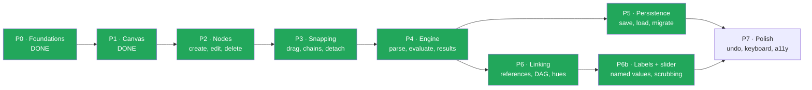
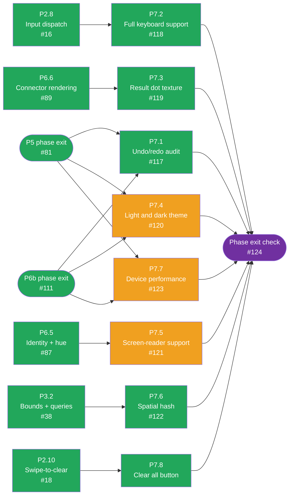

# CalcMind — Development plan

The build order, expanded into tasks an agent can pick up one at a time. Split out of
`ARCHITECTURE.md` §15, which now points here.

**This file tracks progress; `ARCHITECTURE.md` defines the design.** Never restate design detail
here — cite the section (`§8.3`) and let the architecture document stay the single authority. If a
task's acceptance criteria and the architecture ever disagree, the architecture wins and this file
is stale: fix it.

## How to use this as an agent

1. Read `AGENTS.md`, then `docs/journal/GUIDELINES.md`. Both are expected of you, and the journal
   has very likely already disproved something you are about to assume.
2. Take the lowest-numbered unchecked task whose **Depends on** is satisfied. Tasks within a phase
   are ordered so dependencies point backwards.
3. Read the architecture sections the task cites — in full, not by keyword search — before writing
   anything.
4. Build it. Check it against the task's acceptance criteria, then tick the boxes **in the same
   commit as the code**. Once every box on a task is ticked, also flip its mermaid node (if its
   phase has a dependency diagram) to the green "done" fill in that same commit — the diagram is
   read for status by colour alone; headings are never struck through.
5. Write your journal entry.

Each phase ends with a **Phase exit check** quoting §15's original acceptance criteria verbatim.
The tasks are an expansion of those criteria, not a replacement — if every task in a phase is
ticked but the exit check does not pass, the expansion missed something and the phase is not done.

### Definition of done — applies to every task below

Not repeated in individual tasks. A task with all its own boxes ticked but any of these unmet is
not finished.

- [ ] `npx tsc --noEmit`, `npm run lint`, `npm test`, `npm run build:web` all pass.
- [ ] New pure logic has tests. `ARCHITECTURE.md` §14 says what each layer's tests should cover.
- [ ] Anything user-visible has been **run and looked at** (`npm run web`), not merely
      type-checked. This is a recorded mistake — `docs/journal/2026-08-03.md` revision 8.
- [ ] Mutations go through the store's command layer, so undo works (§13). Ephemeral UI state —
      selection, drag position, keypad visibility, edit caret — stays **out** of undo history.
- [ ] `src/engine/` imports nothing from `src/store/` or any component. It is pure functions over
      plain data, which is the entire reason it is testable (§14).
- [ ] Docs the change contradicts are fixed in the same commit.
- [ ] Journal entry written per `docs/journal/GUIDELINES.md`.

---

## Status

| Phase | Goal | Tasks | State |
|---|---|---|---|
| ~~**P0**~~ | ~~Foundations~~ | — | **Done** — `08620f9` |
| ~~**P1**~~ | ~~Canvas pan/zoom~~ | — | **Done** — `08de0fc` |
| ~~**P2**~~ | ~~Nodes + keypad~~ | — | **Done** — 10/10, phase exit check verified live |
| ~~**P3**~~ | ~~Snapping~~ | — | **Done** — 7/7, phase exit check verified live |
| ~~**P4**~~ | ~~Engine~~ | — | **Done** — 9/9, phase exit check verified live |
| ~~**P5**~~ | ~~Persistence~~ | — | **Done** — 8/8, phase exit check verified live |
| ~~**P6**~~ | ~~Linking~~ | — | **Done** — 8/8, phase exit check verified live |
| ~~**P6b**~~ | ~~Labels + slider~~ | — | **Done** — 4/4, phase exit check verified live |
| **P7** | Polish | 8 | In progress — P7.1–P7.3, P7.6, P7.8 done; 3/8 remaining |

Sequencing notes, carried over from §15:

- **P4 is the critical path.** It is what turns a drawing app into a calculator, so it must not be
  deferred behind polish.
- **P5 and P6 depend only on P4** and can proceed in parallel.
- **P6b is not optional garnish.** Labels are what let a canvas be read back a week later, and the
  slider is what turns a correct dependency graph into something you can ask "what if" of. If the
  plan has to be cut, cut graphing (§17.2), not these.
- **Continuation (§8.7) is pulled forward into P4** as task P4.9. §15's own caveat: it is the
  *primary* way users create links, so leaving it in P6 risks shipping a canvas of unrelated sums.

---

## Archived phases

P0–P6b are done — every task ticked, every phase-exit check demonstrated live. Their full task
detail (architecture citations, acceptance-criteria boxes, dependency diagrams, exit-check
write-ups) has moved out of this file to keep it focused on what's left, and lives one file per
phase under `docs/archive/development-plan/`:

| Phase | Goal | Archive |
|---|---|---|
| P0 | Foundations | [`p0-foundations.md`](archive/development-plan/p0-foundations.md) |
| P1 | Canvas pan/zoom | [`p1-canvas.md`](archive/development-plan/p1-canvas.md) |
| P2 | Nodes + keypad | [`p2-nodes-keypad.md`](archive/development-plan/p2-nodes-keypad.md) |
| P3 | Snapping | [`p3-snapping.md`](archive/development-plan/p3-snapping.md) |
| P4 | Engine | [`p4-engine.md`](archive/development-plan/p4-engine.md) |
| P5 | Persistence | [`p5-persistence.md`](archive/development-plan/p5-persistence.md) |
| P6 | Linking | [`p6-linking.md`](archive/development-plan/p6-linking.md) |
| P6b | Labels + slider | [`p6b-labels-slider.md`](archive/development-plan/p6b-labels-slider.md) |

The `Status` section above stays the live summary (state, commit refs, sequencing notes);
`ARCHITECTURE.md` stays the design authority. Nothing in the archive overrides either — it is
task-level history, kept for the record rather than for picking up new work.

---

## P7 · Polish

The last phase. Gated on P5 and P6b both being done (they now are); each task below is otherwise
independent, so there is no required order within the phase beyond each task's own listed
dependency.

Green = done, amber = ready to start, grey = blocked on a dependency, purple = the phase-exit
gate. `P7.1`, `P7.4`, and `P7.7` carry no task-level dependency of their own — the phase text
above just says "gated on P5 + P6b" — but the plan sequences them behind both phases' own exit
checks rather than jumping the queue the moment each task's box would otherwise look open, shown
here as gates from P5's and P6b's tracking issues. P7.1–P7.3, P7.6, and P7.8 are done; P7.4,
P7.5, and P7.7 remain. Kept current by hand alongside the acceptance-criteria boxes below — if a
task's status here disagrees with its boxes, the boxes win and this diagram is stale.

### P7.1 — Undo/redo audit

**Objective.** Confirm the §13 guarantee across everything built since P0, rather than assuming it
survived.
**Architecture.** §13 (bounded 100-deep stack, 500ms coalescing, viewport excluded), §7.
**Touches.** `src/store/undo.ts`, tests.

- [x] Every command in `commands.ts` has an undo **and** redo test.
- [x] Rapid edits to one node within 500ms coalesce into a single entry (§13).
- [x] The stack is bounded at 100 and drops oldest entries.
- [x] Viewport changes are **still** excluded (§7). P1 established this; assert it, because six
      phases of later work could have quietly broken it.
- [x] Undo marks the document dirty and therefore saves (§13).

### P7.2 — Full keyboard support

**Objective.** The whole app usable without a pointer.
**Architecture.** §8.5 (the key map), §8.6 (selection).
**Touches.** `src/keypad/keymap.ts`, `src/app/AppShell.tsx`.
**Depends on.** P2.8.

- [x] Arrows move selection along a chain and between chains.
- [x] Every keypad action has a keyboard equivalent.
- [x] Focus is always visible; tab order is sane.
- [x] Verified by completing a full linked calculation using only the keyboard.

### P7.3 — Result dot texture

**Objective.** The §11.3 v1.1 decoration deferred from P2.4.
**Architecture.** §11.3, §1.2 (the 4×4 tile with dots at `(1,0)` and `(3,2)`), decision #9.
**Touches.** `src/nodes/ResultNode.tsx`, `src/nodes/ResultDotTexture.tsx`, `src/nodes/Cell.tsx`.
**Depends on.** P6.6.

- [x] Pattern via `react-native-svg` — already load-bearing since P6.6 — or a 4×4 tiled `Image`
      with `resizeMode: 'repeat'`.
- [x] Geometry matches §1.2: dots at `(1,0)` and `(3,2)` of a 4×4 unit tile, in `#FFD1CF`.
- [x] Identical on web and native.
- [x] Decorative only: hue and border still carry read-only-ness without it (decision #9).

### P7.4 — Light and dark theme

**Objective.** Both themes, driven from tokens.
**Architecture.** §1.2 (tokens), §5.1 (`ui/theme.ts`).
**Touches.** `src/ui/theme.ts`, `src/ui/tokens.ts`, all components.

- [ ] Theme derives from tokens; **no component hard-codes a colour**.
- [ ] Identity hues stay distinguishable in **both** themes — re-run P6.8's check against the dark
      palette rather than assuming it transfers.
- [ ] Follows the OS setting, with a manual override.

### P7.5 — Screen-reader support

**Objective.** Make the canvas comprehensible without sight.
**Architecture.** §15's acceptance criteria; §11.1 (hue must never be the only channel); §11.2.
**Touches.** all node components.
**Depends on.** P6.5.

- [ ] Every node announces its **kind, value, label, and link parent**.
- [ ] Identity and connectors are conveyed non-visually: a reference announces what it points at.
- [ ] Error states announce what is wrong, matching §11.2's "explained, not marked".
- [ ] Verified with a real screen reader — not by reading the accessibility props back in code.

### P7.6 — Spatial hash, only if measured

**Objective.** Keep snap search viable past a few hundred nodes.
**Architecture.** §8.4 (uniform hash, bucket `2 × nodeHeight`, behind the existing interface).
**Touches.** `src/chains/snapping.ts`, `src/chains/bounds.ts`.
**Depends on.** P3.2.

- [x] **Measure first.** §8.4 says O(n) is fine to ~500 nodes and is what ships. Do not build this
      without a profile showing it is needed; record the profile either way.
- [x] If needed: uniform spatial hash, bucket size `2 × nodeHeight`, inserted behind the existing
      interface with **no call-site changes** (§8.4 — this is what P3.2's interface was for).
- [x] Snap behaviour is provably identical before and after: the same test suite passes against
      both implementations.

### P7.7 — Device performance verification

**Objective.** Close the open thread P1 left behind.
**Architecture.** §11.4 (the performance budget table).
**Touches.** journal.

- [ ] Pan, zoom, node drag and slider scrub measured on a **real device**, iOS and Android. P1's
      60fps claim was verified on web only — see `2026-08-03` open threads.
- [ ] Every row of the §11.4 budget table checked against measurement, not against intent.
- [ ] Numbers recorded in the journal. If the budget is missed, that is a finding and a revision,
      not a silent adjustment to the target.

### P7.8 — Clear all button

**Objective.** A discoverable Clear all control — swipe-across-backspace (P2.10) stays for
parity with the reference app, but it is too easy to miss.
**Architecture.** §8.5 (mode strip + swipe-to-clear), decision #15 (confirm before wipe).
**Touches.** `src/keypad/Keypad.tsx`, tests.
**Depends on.** P2.10.

- [x] Mode strip exposes a **Clear all** button that raises the same confirmation as swipe-to-clear.
- [x] Only confirming clears; cancel leaves the document byte-identical (decision #15).
- [x] Clearing is still a single undo entry via `clearDocument` (§13) — no second command path.
- [x] Button is disabled when the canvas is already empty.
- [x] Verified live: press Clear all → confirm → canvas empty; undo restores.

### Phase exit check — P7

> Undo/redo across all commands with edit coalescing; full keyboard support; result dot texture;
> light/dark theme; identity palette checked for deuteranopia/protanopia; screen-reader labels
> announce node kind, value, label, and link parent; Clear all button with confirmation.

- [ ] All of the above demonstrated, with the a11y checks done using real assistive tech.

---

## Deferred beyond v1

Tracked here so they are not later rediscovered as gaps. See §17.2.

- **Graphing.** In the mature reference app a graph is a canvas object that references a formula,
  sweeps one referenced input across a range, and plots one series per dependent result with axis
  ticks colour-matched to each result's hue (§1.3). It is the clearest reason the DAG must be a
  real graph: a graph node is just another consumer. §15 says cut this before cutting P6b.
- **Engine extensions.** `^`, `%`, `!`, `mod`, and ~25 named functions applied as `sin( 2 × 30 )`,
  plus prefix/postfix operators (§10.2 extension path). Precedence climbing absorbs all of it; a
  `function` node kind is the only model change, which is why it can wait.
- **General implicit multiplication.** Adjacent *numbers* multiplying. A reasonable phase-7 opt-in
  (§9), but decision #4 says never by default — `12 34` is far more likely a mis-snap.
- **Multi-document UX.** Document browser, or one canvas that grows forever (§17.2 item 3). §12
  supports either, so this is a UI question rather than a model one.
- **Chain move vs member detach** is *not* deferred — it is P3.7, and §17.1 wants it decided with a
  real device rather than on paper.
