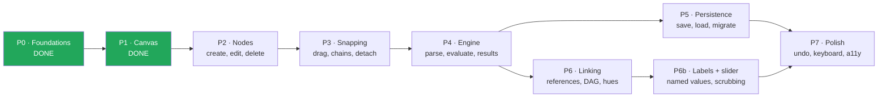

# CalcMind — Development plan

The phased build order, expanded into tasks an agent can pick up one at a time. Split out of
`ARCHITECTURE.md` §15, which now points here.

**This file tracks progress; `ARCHITECTURE.md` defines the design.** Never restate design
detail here — cite the section (`§8.3`) and let the architecture document stay the single
authority. When a task's acceptance criteria and the architecture disagree, the architecture
wins and this file is stale: fix it.

## How to use this as an agent

1. Read `AGENTS.md`, then `docs/journal/GUIDELINES.md`. Both are expected of you, and the
   journal has almost certainly already disproved something you are about to assume.
2. Pick the lowest-numbered unchecked task whose dependencies are met. Tasks inside a phase
   are ordered so that dependencies point backwards.
3. Read the architecture sections the task cites — in full, not by keyword — before writing
   anything.
4. Build it, verify it against the task's acceptance criteria, then tick the boxes **in the
   same commit as the code**.
5. Write your journal entry.

### Definition of done — applies to every task below

No task is complete without all of these. They are not repeated in each task's criteria.

- [ ] `npx tsc --noEmit`, `npm run lint`, `npm test`, `npm run build:web` all pass.
- [ ] New pure logic has unit tests; see `ARCHITECTURE.md` §14 for what each layer's tests
      should cover.
- [ ] Anything user-visible has been **run and looked at** (`npm run web`), not just
      type-checked. This is a recorded mistake — `docs/journal/2026-08-03.md` revision 8.
- [ ] Commands mutate through the store's command layer so undo works (§13). Ephemeral UI
      state (selection, drag position, keypad visibility) stays out of undo history.
- [ ] Docs that the change contradicts are fixed in the same commit.
- [ ] Journal entry written per `docs/journal/GUIDELINES.md`.

---

## Status

| Phase | Goal | State |
|---|---|---|
| ~~**P0**~~ | ~~Foundations~~ | **Done** — `08620f9` |
| ~~**P1**~~ | ~~Canvas pan/zoom~~ | **Done** — `08de0fc` |
| **P2** | Nodes + keypad | Next |
| **P3** | Snapping | Blocked on P2 |
| **P4** | Engine | Blocked on P3 — **critical path** |
| **P5** | Persistence | Blocked on P4 |
| **P6** | Linking | Blocked on P4, parallel with P5 |
| **P6b** | Labels + slider | Blocked on P6 |
| **P7** | Polish | Blocked on P5 + P6b |

Sequencing notes carried over from §15: **P4 is the critical path** — it is what turns a
drawing app into a calculator, so it must not be deferred behind polish. P5 and P6 depend only
on P4 and can proceed in parallel. **P6b is not optional garnish** — labels are what let a
canvas be read back a week later, and the slider is what turns a correct dependency graph into
something you can ask "what if" of; if the plan has to be cut, cut graphing (§17.2), not these.

---

## ~~P0 · Foundations~~ — done

~~Deps installed; `ui/tokens.ts` matches §1.2; empty store + commands compile; `tsc`, `eslint`,
`jest` green; `npm run build:web` still produces `dist/`.~~

Delivered in `08620f9`. Dependencies from §4, design tokens transcribed from §1.2, the §6
domain model with its zod mirror, and a Zustand store with immer-patch undo/redo (§13) whose
viewport writes deliberately bypass history (§7). Notes in `docs/journal/2026-08-03.md`.

## ~~P1 · Canvas~~ — done

~~Pan and pinch-zoom at 60fps on device and web; `worldToScreen`/`screenToWorld` are inverses
under unit test; zoom clamps at 0.25/4.~~

Delivered in `08de0fc`. `src/canvas/coords.ts` property-tested as exact inverses,
`src/canvas/Canvas.tsx` driving Reanimated shared values per frame and committing to the store
only on gesture end (§11.4). Web wheel pan and ctrl/⌘+wheel zoom included.

**Carried forward:** 60fps was verified on web only — no device measurement yet. See P7.7.

---

## P2 · Nodes + keypad

**Phase goal (§15).** Tap empty canvas → number node in edit mode; keypad per §8.5 with
digits, operators, parens, locale decimal key; hardware keyboard mapped; delete works; `raw`
round-trips `"3."`; `13,5` displays per locale while storing `13.5`.

Nothing in this phase evaluates anything. A chain of nodes is inert until P4 — resist wiring
arithmetic in early, because the validation and precedence rules in §9/§10.2 are subtler than
they look and a provisional version will have to be deleted.

### P2.1 — Locale-aware number display and input parsing

**Objective.** The display/storage boundary from §10.3, as pure functions, before anything
renders a number. Getting this wrong corrupts documents when they cross locales, which is why
it goes first.
**Architecture.** §10.3 (numerics and locale), decision #11.
**Touches.** `src/engine/format.ts`, `src/engine/numeric.ts`.

- [ ] `formatForDisplay(raw, locale)` renders via `Intl.NumberFormat`; this is the **only**
      place separators exist.
- [ ] `parseUserInput(text, locale)` accepts the locale separator and normalises to canonical
      `.` immediately.
- [ ] Stored `raw` keeps a canonical `.` and no grouping. Under `de-DE`, `13.5` displays as
      `13,5`; typing `13,5` stores `13.5`.
- [ ] Partial input survives verbatim: `"3."`, `"-0.5"`, `""` all round-trip unchanged.
- [ ] `decimalSeparatorFor(locale)` returns the glyph the keypad key will show.
- [ ] Property test (`fast-check`): parse ∘ format is identity over generated decimals; the
      formatter never emits a string it cannot re-parse (§14).

### P2.2 — Text measurement and node width

**Objective.** `widthOf(node)` per §8.1, memoised, so node sizing is consistent now and chain
layout can reuse it in P3.
**Architecture.** §8.1 (layout), §11.4 (memoise per `(raw, fontSize)`), §1.2 (tokens).
**Touches.** `src/chains/measure.ts`, `src/ui/tokens.ts` (read only).

- [ ] Symbol nodes use `operatorWidth` / `equalsWidth`; numbers and results use measured text
      width + `2 × numberPaddingX`, floored at `nodeHeight`.
- [ ] Cache keyed on `(raw, fontSize)`; a `raw` change invalidates that entry.
- [ ] Works identically on web and native — no DOM-only measurement API.
- [ ] Unit tests cover the `nodeHeight` floor (single digits stay square-ish) and cache
      invalidation.

### P2.3 — Node CRUD commands

**Objective.** Create, edit and delete nodes through the command layer so every mutation is
undoable.
**Architecture.** §6 (node kinds), §13 (undo, 500ms edit coalescing), §5.1.
**Touches.** `src/store/commands.ts`, `src/store/documentStore.ts`, `src/model/factories.ts`.
**Depends on.** P2.1.

- [ ] Commands: `addNumberNode(position, raw)`, `addOperatorNode`, `addParenNode`,
      `addEqualsNode`, `setNodeRaw`, `deleteNode`.
- [ ] Each produces exactly one undo entry; `setNodeRaw` calls to the same node within 500ms
      coalesce into one (§13).
- [ ] `deleteNode` on a chain member leaves the chain consistent — P3 owns re-layout, so until
      then a deleted member must not leave a dangling id in `chain.members`.
- [ ] Free nodes carry `chainId: null` and an authoritative `position` (§6).
- [ ] A no-op command records no history entry — see `2026-08-03` Findings for the
      timestamp trap that made this test flaky.

### P2.4 — Node views, one per kind

**Objective.** Render each node kind per the visual reference.
**Architecture.** §6 (kinds), §11.3 (plain `View`s with `borderRadius`, no SVG yet), §1.2
(tokens), `docs/assets/node-anatomy.svg`.
**Touches.** `src/nodes/NumberNode.tsx`, `OperatorNode.tsx`, `ParenNode.tsx`,
`EqualsNode.tsx`, `ResultNode.tsx`.
**Depends on.** P2.1, P2.2.

- [ ] One component per kind, styled from `ui/tokens.ts` — no hard-coded colours.
- [ ] `ResultNode` renders solid `#FF7E79` with the `#FFA3A0` border band and **no texture**
      (§11.3 defers texture to v1.1 → P7.3).
- [ ] `ResultNode` is read-only: it renders `derived.display` and rejects edit attempts.
- [ ] Paren depth renders as a subtle tint step (§10.2).
- [ ] `label` renders above the cell when present, in the identity hue — hue plumbing is P6, so
      until then a neutral colour is correct.
- [ ] Each is wrapped in `React.memo` and reads its own store slice via a per-node selector, so
      one node's change does not re-render its siblings (§11.4).
- [ ] A component test per kind, plus one asserting the result node rejects edits (§14).

### P2.5 — Node layer inside the canvas

**Objective.** Put nodes on the canvas at their world coordinates.
**Architecture.** §7 (transform), §8.1 (`position` is the uniform field hit testing reads),
§11.4.
**Touches.** `src/canvas/NodeLayer.tsx`, `src/canvas/Canvas.tsx`, `src/app/AppShell.tsx`.
**Depends on.** P2.4.

- [ ] Nodes are positioned with plain `left`/`top` equal to their **world** coordinates, as
      children of `Canvas` — the existing translate/scale nesting already maps them to
      `worldToScreen` without per-node arithmetic (see the comment at the top of `Canvas.tsx`).
- [ ] Panning and zooming moves nodes correctly; a node stays under the finger that drags the
      canvas at every zoom level between 0.25 and 4.
- [ ] The layer subscribes to node **ids**, not the node map, so adding a node does not
      re-render existing ones.
- [ ] Verified in a browser at several zoom levels, not just type-checked.

### P2.6 — Selection and in-place number editing

**Objective.** Tapping empty canvas creates a number node already in edit mode; tapping a node
selects it.
**Architecture.** §8.6 (selection), §8.5 (keys act on the selected node), §13 (selection is
**not** undoable).
**Touches.** `src/store/documentStore.ts` (ephemeral slice), `src/nodes/NumberNode.tsx`.
**Depends on.** P2.3, P2.5.

- [ ] `selectedNodeId` and `editingNodeId` live outside undo history.
- [ ] Tap empty canvas → new number node at that world point, in edit mode, empty `raw`.
- [ ] Tap a node → selects it. `Escape` deselects.
- [ ] An editing number node shows a caret and accepts digits, decimal key and backspace;
      backspace on empty `raw` deletes the node.
- [ ] Committing an empty `raw` removes the node rather than leaving a blank cell.
- [ ] Distinguish tap from pan: a press that moves beyond a small threshold pans the canvas and
      does **not** create a node.

### P2.7 — Keypad

**Objective.** The keypad from §8.5 — dismissible, not full-screen, operators visually
separated.
**Architecture.** §8.5 (regions table), §1.2 (tokens), decision #15.
**Touches.** `src/keypad/Keypad.tsx`, `src/app/AppShell.tsx`.
**Depends on.** P2.1 (decimal glyph).

- [ ] Regions exactly as tabulated in §8.5: digits, number editing (locale decimal, `+/-`,
      backspace), grouping `(` `)`, operator accent column `÷ × − + =`, mode strip.
- [ ] Not full-screen; dismissible; tapping empty canvas toggles it.
- [ ] The decimal key shows the locale glyph (P2.1) and inserts canonical `.`.
- [ ] `functions` and `graph` in the mode strip render as visibly disabled — they are later
      work (§10.2 extension path, §17.2), not silently missing.
- [ ] Keypad visibility is ephemeral state, outside undo.

### P2.8 — Keypad and hardware keyboard wiring

**Objective.** Make the keys do things, from both the on-screen keypad and a real keyboard,
through one command path.
**Architecture.** §8.5 (targeting rules and key map).
**Touches.** `src/keypad/keymap.ts`, `src/keypad/Keypad.tsx`, `src/app/AppShell.tsx`.
**Depends on.** P2.3, P2.6, P2.7.

- [ ] Keys act on the selected node if there is one, otherwise create a new node at the
      caret/last-tap point.
- [ ] Hardware and web keyboard map to the same commands: digits; `+ - * /` → `+ − × ÷`;
      `Enter` → `=`; `Backspace`; `Escape` deselects; arrows move selection along a chain.
- [ ] On-screen and hardware input go through **one** dispatch function, not two parallel
      implementations.
- [ ] Pressing an operator with a **result** selected is reserved for continuation (§8.7) and
      must not edit the result. Until P4.9 lands, make it a no-op with a `TODO` citing §8.7 —
      do not implement a placeholder behaviour that will have to be unlearned.
- [ ] Verified with a real keyboard in a browser.

### P2.9 — Swipe-to-clear, with confirmation

**Objective.** Tydlig's swipe-across-backspace clear, gated behind a confirm (decision #15).
**Architecture.** §8.5, decision #15.
**Touches.** `src/keypad/Keypad.tsx`, `src/store/commands.ts`.
**Depends on.** P2.7.

- [ ] Swipe across backspace raises a confirmation; only confirming clears.
- [ ] Clearing is one undo entry (§13).
- [ ] Dismissing the confirmation leaves the document untouched.

---

## P3 · Snapping

**Phase goal (§15).** Two free nodes snap into a chain; insertion between members works with a
visible caret; dragging out past `DETACH_DISTANCE` detaches without re-snapping; single-member
chains dissolve; chains lay out flush with no gaps.

All thresholds are in **world units** so behaviour is identical at any zoom (§7). Any threshold
compared in screen pixels is a bug.

### P3.1 — Chain layout pass

**Objective.** Lay a chain's members flush left-to-right from its anchor.
**Architecture.** §8.1 (the algorithm), §6.1 (`members` order is truth, never re-derived from
`x`).
**Touches.** `src/chains/layout.ts`.
**Depends on.** P2.2.

- [ ] Pure function: `(chain, nodes) → positions`. No store access.
- [ ] Members are flush — no gaps, no overlaps — with `y = anchor.y`.
- [ ] Changing a member's `raw` re-flows the chain **in the same commit** as the edit (§8.1).
- [ ] Member `position` is treated as a cache written by this pass; `anchor` + `members` remain
      the truth (§8.1, §6.1).
- [ ] Unit tests assert flushness arithmetic and that reordering `members` reorders the layout
      while identical `x` values never reorder anything.

### P3.2 — Node bounds and neighbour queries

**Objective.** The geometry snapping needs, behind an interface that can later hide a spatial
hash.
**Architecture.** §8.3 (what gets compared), §8.4 (O(n) now, hash later behind the same
interface).
**Touches.** `src/chains/bounds.ts`.
**Depends on.** P3.1.

- [ ] `boundsOf(node)`, `verticalOverlap(a, b)`, `memberBoundaries(chain)`.
- [ ] Neighbour lookup is O(n) and exposed through an interface whose call sites will not change
      when a uniform spatial hash is inserted (§8.4).
- [ ] Unit tested at exact threshold values, not just clearly-inside and clearly-outside cases.

### P3.3 — Snap candidate resolution

**Objective.** Given a dragged node, decide the single best snap outcome per frame.
**Architecture.** §8.2 (thresholds: `SNAP_DISTANCE = 28`, `SNAP_VERTICAL = 48`,
`DETACH_DISTANCE = 44`), §8.3 (the candidate-gathering pseudocode).
**Touches.** `src/chains/snapping.ts`.
**Depends on.** P3.2.

- [ ] Pure function returning one of `PREPEND` / `APPEND` / `INSERT_AT(chain, i)` /
      `NEW_CHAIN[a, b]` / none — the nearest candidate wins.
- [ ] Implements §8.3's gathering rules for both chains and free nodes.
- [ ] Thresholds are constants in world units, imported not inlined.
- [ ] Table-driven tests at the threshold boundaries, including that
      `DETACH_DISTANCE > SNAP_DISTANCE` gives hysteresis (§8.2) — a member dragged just past
      detach does **not** immediately re-snap into the slot it left.

### P3.4 — Chain mutation commands

**Objective.** Commit a snap outcome, with the bookkeeping §8.3 requires.
**Architecture.** §8.3 (bookkeeping on commit), §13.
**Touches.** `src/store/commands.ts`, `src/chains/layout.ts`.
**Depends on.** P3.1, P3.3.

- [ ] Commands for insert / append / prepend / new-chain / detach, each one undo entry.
- [ ] A chain dropping to one member **dissolves** and the member becomes free.
- [ ] An empty chain is deleted.
- [ ] A chain that loses its `=` also loses its result node.
- [ ] Detaching writes the node's authoritative `position` and sets `chainId: null`.
- [ ] Layout re-runs in the same commit as the mutation, never as a follow-up effect.

### P3.5 — Node drag gesture

**Objective.** The §8.2 drag lifecycle, at 60fps.
**Architecture.** §8.2 (state machine), §11.4 (worklets; commit only on release).
**Touches.** `src/nodes/useNodeDrag.ts`.
**Depends on.** P3.3, P3.4.

- [ ] Implements the §8.2 states: Idle → Dragging → Detaching/Snapping → Idle.
- [ ] Drag position lives in Reanimated shared values; the store is written **only on
      release** — mid-drag frames must not touch undo history (§11.4).
- [ ] Candidate recomputed per frame; the pending outcome is available to the caret (P3.6).
- [ ] Drag competes correctly with the canvas pan gesture: a press on a node drags the node, on
      empty canvas pans the canvas.
- [ ] Verified interactively at zoom 0.25 and 4 — snapping must feel the same at both.

### P3.6 — Insertion feedback

**Objective.** Show the outcome before committing it.
**Architecture.** §8.3 ("the user sees the outcome before committing").
**Touches.** `src/chains/layout.ts`, `src/nodes/useNodeDrag.ts`, `src/canvas/NodeLayer.tsx`.
**Depends on.** P3.5.

- [ ] The chain opens a gap at the pending insertion point while dragging.
- [ ] An insertion caret is drawn at that point.
- [ ] Both disappear when no candidate is in range, and the gap closes without a jump.
- [ ] Runs on the UI thread — no store write per frame.

### P3.7 — Chain move vs member detach

**Objective.** Settle §17.1, the one genuinely open interaction.
**Architecture.** §8.2, §8.3 **[assumption]**, §17.1.
**Touches.** `src/nodes/useNodeDrag.ts`.
**Depends on.** P3.5.

- [ ] Long-press 200ms on a member then move drags the **whole chain** (anchor updates); plain
      drag detaches that member.
- [ ] `Select group` (§8.6) selects the whole chain, which is the other route to moving one.
- [ ] **Decide this on a real device, not on paper.** §17.1 says the opposite mapping is
      defensible and that this is one line in `useNodeDrag`. Try both; if the shipped mapping
      is the one written here, say so in the journal with what convinced you — that closes an
      open question and belongs in a `Now known:` line.

---

## P4 · Engine — critical path

**Phase goal (§15).** `1221 + 3 - 20 =` produces a read-only `1204`; precedence correct;
`2 × (3 + 4) = 14` with balanced parens, unbalanced reads `Incomplete`; editing an input updates
the result; every error state in §10.4 renders; result node rejects edits.

The engine is pure functions over plain data and must stay free of React (§14) — that is the
whole reason it is testable. Nothing in `src/engine/` may import from `src/store/` or any
component.

### P4.1 — Tokeniser

**Objective.** Turn `chain.members` into an engine token stream.
**Architecture.** §10.1 (pipeline: drop `=` and the result node).
**Touches.** `src/engine/tokenize.ts`.

- [ ] Reads `chain.members` in stored order — never sorted by position (§6.1).
- [ ] Drops the `=` and the result node; keeps numbers, operators, parens and references.
- [ ] Number tokens carry canonical `raw`; a partial `"3."` tokenises without throwing.
- [ ] Table-driven tests.

### P4.2 — Sequence validation and chain state

**Objective.** Classify a chain into exactly one §9 state.
**Architecture.** §9 (the state machine and its rules), §10.2 (parens must balance).
**Touches.** `src/engine/validate.ts`, `src/engine/errors.ts`.
**Depends on.** P4.1.

- [ ] Returns exactly one of `Empty` / `Incomplete` / `Valid` / `Invalid` / `Evaluated` /
      `Stale` / `ErrorState`.
- [ ] Trailing operator → `Incomplete`, and renders normally with no result — this is the normal
      state of a formula being typed.
- [ ] Two adjacent numbers → `Invalid`. Not implicit multiplication, not concatenation
      (§9, decision #4).
- [ ] Two adjacent operators, or any node right of the result → `Invalid`.
- [ ] **Unbalanced parens → `Incomplete`, not `Invalid`** (§10.2) — an unclosed paren is normal
      mid-typing.
- [ ] `Invalid` deletes nothing; it marks the offending boundary with a red hairline.
- [ ] Table-driven tests over every transition in the §9 diagram.

### P4.3 — Parser

**Objective.** Tokens → AST by precedence climbing.
**Architecture.** §10.2 (grammar, associativity, the narrow implicit-multiplication rule and
the extension path).
**Touches.** `src/engine/parse.ts`.
**Depends on.** P4.2.

- [ ] Implements the §10.2 grammar. Left-associative; `× ÷` bind tighter than `+ -`.
- [ ] **Implicit multiplication only before `(`**: `10000 ( 1 + 0.04 )` parses as a product;
      two adjacent numbers remain invalid.
- [ ] Negative numbers come from `NumberNode.raw` (`"-5"`), not a unary operator node (§10.2).
- [ ] Precedence climbing, structured so `^`, prefix/postfix operators and function application
      can be added later without a rewrite (§10.2 extension path). Do not implement them now.
- [ ] Tests include `2 + 3 × 4 = 14` and `2 × (3 + 4) = 14`.

### P4.4 — Evaluator

**Objective.** AST → value, exactly.
**Architecture.** §10.3 (decimal.js, precision 34), §10.4 (errors are values).
**Touches.** `src/engine/evaluate.ts`.
**Depends on.** P4.3.

- [ ] All arithmetic in `decimal.js` at precision 34. `0.1 + 0.2` is exactly `0.3` (§14).
- [ ] Division by zero returns a `DivideByZero` error value — never `Infinity`.
- [ ] Overflow → `Overflow`; non-numeric → `NotANumber`.
- [ ] Nothing throws across a module boundary (§10.4).

### P4.5 — Display formatter

**Objective.** Value → the string on the result cell.
**Architecture.** §10.3 (display rules), and P2.1's locale layer.
**Touches.** `src/engine/format.ts`.
**Depends on.** P4.4, P2.1.

- [ ] Up to 12 significant digits, trailing zeros stripped.
- [ ] Scientific notation when `|x| ≥ 1e12` or `0 < |x| < 1e-6`.
- [ ] Locale separators applied at this layer only; stored values stay canonical (§10.3).
- [ ] Boundary tests at exactly `1e12` and `1e-6` (§14).
- [ ] Property test: the formatter never emits something it cannot re-parse.

### P4.6 — Error rendering

**Objective.** Every §10.4 state visible on the result cell.
**Architecture.** §10.4 (the six errors), §9 (`Stale` behaviour).
**Touches.** `src/nodes/ResultNode.tsx`, `src/engine/errors.ts`.
**Depends on.** P4.5, P2.4.

- [ ] `Incomplete`, `InvalidSequence`, `DivideByZero`, `Overflow`, `NotANumber` each render
      distinguishably. (`CircularReference` needs the graph — P6.3.)
- [ ] A `Stale` result keeps showing its previous value **dimmed** rather than flashing empty
      (§9).
- [ ] Errors are values on the chain, not exceptions (§10.4).
- [ ] Each state has a component test.

### P4.7 — Result node lifecycle

**Objective.** `=` creates a result; removing `=` removes it.
**Architecture.** §9 (`Valid → Evaluated → Valid`), §8.3 (a chain losing `=` loses its
result), §6 (`derived` is cache only).
**Touches.** `src/store/commands.ts`.
**Depends on.** P4.5, P3.4.

- [ ] Appending `=` to a `Valid` chain creates a `ResultNode` with `sourceChainId` set.
- [ ] Removing `=` deletes the result node.
- [ ] The result is read-only — edit attempts are rejected, not silently swallowed.
- [ ] `derived` is written as a cache and never trusted on read; the engine always wins (§6).
- [ ] Integration test: create → snap → `=` → result (§14).

### P4.8 — Recompute on edit

**Objective.** Editing an input updates the result.
**Architecture.** §11 (dirty-set recompute — the marking half, without the reference graph),
§11.4 (never a full document sweep).
**Touches.** `src/store/documentStore.ts`, `src/engine/graph.ts`.
**Depends on.** P4.7.

- [ ] Mutating a chain marks **that chain** dirty and recomputes it; untouched chains are never
      re-evaluated.
- [ ] Recompute runs in the same commit as the mutation, so no frame renders a stale-but-
      undimmed result.
- [ ] Integration test: edit an input → the result updates (§14).
- [ ] Structure `graph.ts` so P6 can extend it from "one chain" to "transitive dependents in
      topological order" without a rewrite.

### P4.9 — Continuation (pulled forward from P6)

**Objective.** Result selected + operator → a new chain seeded with a reference to it.
**Architecture.** §8.7 (the exact behaviour), §11.1 (connector in the source's hue).
**Touches.** `src/store/commands.ts`, `src/keypad/keymap.ts`.
**Depends on.** P4.7, P2.8.

> §15's own caveat: continuation is the *primary* way users create links, so leaving it in P6
> risks shipping "a canvas of unrelated sums" if P6 slips. It is listed here deliberately.

- [ ] With a result `R` selected, pressing operator `⊕` creates a new chain below-right of `R`
      containing `[ reference→R , ⊕ ]` and selects it, so the next digits land in a fresh
      number node (§8.7).
- [ ] Pressing an operator with a result selected never edits the result.
- [ ] The reference resolves to `R`'s live value; editing `R`'s inputs updates the new chain.
- [ ] The connector and hue are P6.5/P6.6 — a reference with no hue yet is correct here.
- [ ] Integration test for the whole keystroke path.

---

## P5 · Persistence

**Phase goal (§15).** Autosave debounces and force-flushes on background; kill the app
mid-edit and lose at most the debounce window; corrupt the primary file and `.bak` recovers it;
a `schemaVersion: 99` file is refused with a clear message; round-trip test passes.

A file on disk is **untrusted input** (§12.3). zod runs at that boundary before anything
reaches the store — this is why `src/model/schema.ts` was written in P0.

### P5.1 — Serialiser

**Objective.** Document → the §12.1 JSON, byte-stably.
**Architecture.** §12.1 (format and its four notes).
**Touches.** `src/persistence/serialize.ts`.

- [ ] `nodes` and `chains` serialise as **arrays** in stable id order; they are `Record`s in
      memory (§12.1).
- [ ] Keys sorted, so two identical documents produce byte-identical files.
- [ ] `derived` stripped on write (§12.3).
- [ ] Member `position` is written for self-describingness but ignored on load for members,
      which re-run layout (§12.1).
- [ ] Round-trip test: document → JSON → document is equal; serialisation is byte-stable
      across runs (§14).

### P5.2 — Load-boundary validation

**Objective.** Reject bad input before it can reach the store.
**Architecture.** §12.3 (validation at the trust boundary), §12.4 (`CURRENT_SCHEMA_VERSION`).
**Touches.** `src/model/schema.ts`, `src/persistence/load.ts`.
**Depends on.** P5.1.

- [ ] zod validates every loaded document; failures report which field, and nothing partial
      reaches the store.
- [ ] `schemaVersion` greater than `CURRENT_SCHEMA_VERSION` → **refused with a clear message**,
      file left untouched (decision #7).
- [ ] Malformed JSON is a handled outcome, not a crash.
- [ ] Tests for malformed, newer-schema and structurally-invalid-but-parseable files.

### P5.3 — Storage adapter and native implementation

**Objective.** The §12.2 interface, plus iOS/Android.
**Architecture.** §12.2 (interface and platform table), §12.3 (atomic writes).
**Touches.** `src/persistence/adapter.ts`, `adapter.native.ts`.

- [ ] `StorageAdapter` exactly as declared in §12.2.
- [ ] Native uses `@dr.pogodin/react-native-fs` at
      `DocumentDirectoryPath/calcmind/<id>.calcmind.json`.
- [ ] **Writes are atomic**: `.tmp` → fsync → rename over target. A crash mid-save leaves the
      old file or the new one, never a truncated one.
- [ ] The previous good file is retained as `.bak` — one generation (§12.3).

### P5.4 — Web adapter

**Objective.** The same interface on web.
**Architecture.** §12.2 (web row), §5.1 (platform splitting already resolves `.web.ts`).
**Touches.** `src/persistence/adapter.web.ts`.
**Depends on.** P5.3.

- [ ] IndexedDB via `idb-keyval`; transactions give atomicity for free (§12.3).
- [ ] Resolves through webpack's existing `.web.ts` extension order with **no config change**
      (§5.1) — verify, don't assume.
- [ ] Same behavioural tests as native pass against this adapter.

### P5.5 — Load pipeline

**Objective.** The §12.3 open-document flowchart, end to end.
**Architecture.** §12.3 (the load flowchart and its safety properties).
**Touches.** `src/persistence/load.ts`.
**Depends on.** P5.2, P5.3, P3.1, P4.8.

- [ ] Order per §12.3: read → JSON check (`.bak` fallback) → version check → migrate →
      zod validate → normalise arrays to maps → run chain layout → evaluate all chains in
      topological order → ready.
- [ ] A corrupt primary file recovers from `.bak`; if both fail, report unreadable and **do not
      overwrite** either.
- [ ] `derived` from the file paints immediately, then the engine recomputes and overwrites it;
      if they disagree the engine wins, silently (§12.1).
- [ ] Test: corrupt the primary, assert `.bak` recovery.

### P5.6 — Autosave

**Objective.** Save without the user thinking about it, without writing on every keystroke.
**Architecture.** §12.3 (the save sequence and force-flush triggers), §13 (undo marks dirty
too).
**Touches.** `src/persistence/autosave.ts`, `src/store/documentStore.ts`.
**Depends on.** P5.1, P5.3.

- [ ] Mutations mark dirty; writes debounce **600ms**.
- [ ] Force-flush on app background, web `visibilitychange`/`pagehide`, explicit save, and
      document switch (§12.3).
- [ ] Killing the app mid-edit loses at most the debounce window.
- [ ] `lastSavedAt` is surfaced to the store.
- [ ] Undo marks dirty and therefore saves — autosave and undo stay independent (§13).
- [ ] Autosave is suppressible, because the P6b slider needs to suspend it mid-scrub (§8.8).

### P5.7 — Migration harness

**Objective.** Make schema changes safe before one is ever needed.
**Architecture.** §12.4.
**Touches.** `src/persistence/migrations/`.
**Depends on.** P5.2.

- [ ] `Migration` type and an ascending runner, per §12.4. `migrations` stays empty — v1 is the
      origin.
- [ ] The harness itself is tested with a synthetic v0→v1 fixture pair, so the machinery is
      proven before real data depends on it.
- [ ] A documented rule that **every** future migration ships with a `before.json` /
      `after.json` fixture pair (§12.4).

### P5.8 — Export and import

**Objective.** Get documents in and out.
**Architecture.** §12.2 (the optional adapter methods).
**Touches.** `adapter.native.ts`, `adapter.web.ts`.
**Depends on.** P5.4.

- [ ] Native: export via the OS share sheet.
- [ ] Web: export as a `Blob` download; import via `<input type="file">`, upgrading to the File
      System Access API where available.
- [ ] Imported files go through the full P5.5 validation path — no shortcut for "our own"
      format.

---

## P6 · Linking

**Phase goal (§15).** Continuation (§8.7) — landed in P4.9. Dragging a result into another
chain also creates a reference; identity hues assigned deterministically and stable across
reload; edits cascade in topological order; a deliberate cycle marks only the cycle as
`CircularReference`; deleting a target leaves an *explained* `DanglingReference` with both
recovery actions.

Depends only on P4 — can run in parallel with P5.

### P6.1 — Dependency graph

**Objective.** Build the chain-level DAG from reference nodes.
**Architecture.** §11 (vertices are chains; edge `A → B` when `B` references a node in `A`).
**Touches.** `src/engine/graph.ts`.
**Depends on.** P4.8.

- [ ] Graph built from the document; vertices are chains, edges from reference nodes.
- [ ] Edges keyed `(sourceNodeId, referenceNodeId)`, **never by source alone** — one source has
      many consumers (§11.1).
- [ ] Pure; no store or React imports.
- [ ] Tests for topological order (§14).

### P6.2 — Incremental cascade

**Objective.** One edit updates everything downstream, and nothing else.
**Architecture.** §11 (mark dirty, walk transitive dependents topologically), §11.4 (dirty-set
only).
**Touches.** `src/engine/graph.ts`, `src/store/documentStore.ts`.
**Depends on.** P6.1.

- [ ] Mutating a chain recomputes it and its transitive dependents in topological order.
- [ ] Chains not downstream of the edit are never re-evaluated — assert this in a test, don't
      just believe it.
- [ ] Matches the §11 worked example: editing `1221 → 1300` gives `1303` then `2606`.
- [ ] Tests for incremental dirty propagation (§14).

### P6.3 — Cycle detection

**Objective.** A cycle degrades locally, not globally.
**Architecture.** §11 (DFS colouring at graph-build time), §10.4 (`CircularReference`).
**Touches.** `src/engine/graph.ts`.
**Depends on.** P6.1.

- [ ] DFS colouring at build time; **every chain in the cycle** enters `CircularReference`.
- [ ] The rest of the document keeps working.
- [ ] `CircularReference` renders per §11.2: name the cycle, offer to unlink the edge that
      closed it. Not a bare glyph.
- [ ] Test with a deliberate cycle asserting only the cycle is affected.

### P6.4 — Dangling references

**Objective.** Deleting a referenced value must not cascade deletes into the user's work.
**Architecture.** §11.2 (the sharpest criticism of the reference app — explain, don't mark
with punctuation).
**Touches.** `src/nodes/ReferenceNode.tsx`, `src/store/commands.ts`.
**Depends on.** P6.1.

- [ ] Deleting a referenced node leaves references `DanglingReference`; no cascading delete
      (§11).
- [ ] Rendered as a neutral struck-through cell with the **last known value dimmed** — never a
      bare `?`.
- [ ] Tapping it explains what happened and offers both actions: re-point at another value, or
      convert to a plain number freezing the last known value.
- [ ] Tests for dangling-reference state and both recovery paths (§14).

### P6.5 — Identity and hue assignment

**Objective.** The colour language of §11.1.
**Architecture.** §11.1 (identity rules, derived-never-persisted, `docs/assets/linking-model.svg`),
decision #12.
**Touches.** `src/engine/identity.ts`, node components.
**Depends on.** P6.1.

- [ ] A value acquires an identity when it is **referenced or labelled** — either one is enough
      (§11.1; the reference-only rule was wrong, see `2026-08-03` revision 1).
- [ ] No identity → no hue. Colour is spent only where it means something.
- [ ] Every reference to a value is filled with that value's hue; two cells sharing a hue are
      the same value.
- [ ] Hue is **derived at render time from traversal order and never persisted**, so it is
      stable across reloads without occupying the schema (decision #12).
- [ ] Test: save, reload, assert identical hue assignment.

### P6.6 — Connector rendering

**Objective.** Draw the links.
**Architecture.** §11.1 (all connectors shown; 1→N fanning; count badge), §11.3 (SVG overlay
sharing the canvas transform).
**Touches.** `src/canvas/ConnectorLayer.tsx`.
**Depends on.** P6.5.

- [ ] Beziers with arrowheads in the source's identity hue, in a `react-native-svg` overlay
      above the nodes, sharing the canvas transform (§11.3).
- [ ] **All** connectors are drawn, not only the selected one (decision #13). If density becomes
      a problem, fade unselected ones — do not hide them.
- [ ] 1→N: curves leave a source at fanned-out angles rather than all from one point; a source
      with more than ~4 consumers collapses to a count badge that expands on selection (§11.1).
- [ ] Colour is not the only channel — the line itself and the `Unlink from parent` affordance
      carry the same information non-chromatically (§11.1).
- [ ] Verified in a browser at several zoom levels.

### P6.7 — Drag a result into a chain

**Objective.** The second way to create a reference.
**Architecture.** §11 (dragging a result creates a reference), §8.3 (snap machinery).
**Touches.** `src/nodes/useNodeDrag.ts`, `src/store/commands.ts`.
**Depends on.** P6.1, P3.5.

- [ ] Dragging a result node into another chain inserts a **reference** to it, not a copy of its
      value and not the result node itself.
- [ ] The source chain keeps its own result.
- [ ] Snapping behaves exactly as for any other node (§8.3).

### P6.8 — Palette accessibility validation

**Objective.** Close the §11.1 open question before colour ships as load-bearing.
**Architecture.** §11.1, `docs/ARCHITECTURE.md` §17.2 item 6.
**Touches.** `src/ui/tokens.ts`, journal.
**Depends on.** P6.5.

> **This blocks P6 shipping.** §11.1 says the hue set is a first guess and must be checked for
> deuteranopia/protanopia before release, because colour carries link identity.

- [ ] The identity palette is simulated for deuteranopia and protanopia; adjacent-hue pairs are
      checked for distinguishability, and against the structural teal/amber/purple/salmon.
- [ ] Hues that fail are replaced, and `ui/tokens.ts` updated with §1.2 kept in step.
- [ ] The method and result are recorded in the journal so the check is repeatable rather than
      re-litigated.
- [ ] Non-chromatic channels confirmed sufficient to identify a link with hue ignored entirely.

---

## P6b · Labels and slider

**Phase goal (§15).** Label any value; the label renders above the declaration *and* every
reference, and editing it updates all of them (§11.1); the `10,000 = [10,000]`
declare-and-label idiom works end to end; selecting a number raises the slider popover (§8.8)
and scrubbing cascades live at 60fps as one undo entry with autosave suppressed until release.

Not garnish (§15). Labels are what let a canvas be read back a week later.

### P6b.1 — Labels on the identity

**Objective.** Edit a label once, see it everywhere.
**Architecture.** §11.1 (the label belongs to the identity, not the cell), §6 (`label` on the
node base).
**Touches.** `src/engine/identity.ts`, node components, `src/store/commands.ts`.
**Depends on.** P6.5.

- [ ] Any value can be labelled — results as often as inputs (§6, `2026-08-03` revision 2).
- [ ] The label renders above the declaring cell **and above every reference to it**.
- [ ] Editing it updates every cell sharing that identity, in one undo entry.
- [ ] Labelling a plain value grants it an identity hue even with no references (§11.1).
- [ ] Test: label a value with three references, assert all four cells update together.

### P6b.2 — Declare-and-label idiom

**Objective.** The way the reference app is actually used, end to end.
**Architecture.** §1.3 (the `10,000 = [10,000]` idiom), §8.7.
**Touches.** integration tests, `src/store/commands.ts`.
**Depends on.** P6b.1, P4.9.

- [ ] `10,000 =` produces a labelled declaration whose result can be referenced onward.
- [ ] Locale display holds throughout: `10,000` displays grouped while storing `10000` (§10.3).
- [ ] One integration test walks the whole idiom as a user would type it.

### P6b.3 — Value slider

**Objective.** Raise the §8.8 popover and scrub a number.
**Architecture.** §8.8 (range inference, tap-to-snap, bounds editing).
**Touches.** `src/nodes/ValueSlider.tsx`.
**Depends on.** P2.6.

- [ ] Selecting a number raises a slider in a popover beneath its cell, endpoints labelled.
- [ ] Range inferred per §8.8: `[0, 10^ceil(log10(|v|))]` for positive, symmetric about zero for
      negative, `[0, 10]` for zero.
- [ ] The user can edit the bounds.
- [ ] Tap snaps to integers; drag again is continuous.
- [ ] Unit tests for range inference, including `v = 0` and negatives.

### P6b.4 — Live scrub cascade

**Objective.** Make the dependency graph *felt*.
**Architecture.** §8.8 (one undo entry, autosave suppressed, dirty-subgraph recompute, frame
budget), §11.4.
**Touches.** `src/nodes/ValueSlider.tsx`, `src/persistence/autosave.ts`,
`src/engine/graph.ts`.
**Depends on.** P6b.3, P6.2, P5.6.

- [ ] Scrubbing recomputes the **dirty subgraph only** and holds 60fps.
- [ ] The whole gesture coalesces into **one** undo entry (§8.8).
- [ ] Autosave is suppressed until release — otherwise one scrub writes hundreds of documents.
- [ ] If a subgraph is too expensive, recompute **throttles to the frame budget** rather than
      dropping the interaction (§8.8).
- [ ] Verified interactively on a chain with several dependent levels.

---

## P7 · Polish

**Phase goal (§15).** Undo/redo across all commands with edit coalescing; full keyboard
support; result dot texture; light/dark theme; identity palette checked for
deuteranopia/protanopia; screen-reader labels announce node kind, value, label, and link parent.

### P7.1 — Undo/redo audit

**Objective.** Confirm the guarantee across everything built since P0, rather than assuming it.
**Architecture.** §13 (bounded 100-deep stack, 500ms coalescing, viewport excluded).
**Touches.** `src/store/undo.ts`, tests.

- [ ] Every command in `commands.ts` has an undo/redo test.
- [ ] Rapid edits to one node within 500ms coalesce into one entry.
- [ ] The stack is bounded at 100 and drops oldest entries.
- [ ] Viewport changes are still excluded (§7) — assert it, since P1 established it and later
      phases could have quietly broken it.
- [ ] Undo marks the document dirty and therefore saves (§13).

### P7.2 — Full keyboard support

**Objective.** The whole app usable without a pointer.
**Architecture.** §8.5 (key map), §8.6 (selection).
**Touches.** `src/keypad/keymap.ts`, `src/app/AppShell.tsx`.
**Depends on.** P2.8.

- [ ] Arrows move selection along a chain and between chains.
- [ ] Every keypad action has a keyboard equivalent.
- [ ] Focus is always visible; tab order is sane.
- [ ] Verified by completing a full calculation with the keyboard alone.

### P7.3 — Result dot texture

**Objective.** The §11.3 v1.1 decoration.
**Architecture.** §11.3, decision #9.
**Touches.** `src/nodes/ResultNode.tsx`.
**Depends on.** P6.6.

- [ ] Pattern via `react-native-svg` (already load-bearing from P6.6) or a 4×4 tiled `Image`
      with `resizeMode: 'repeat'`.
- [ ] Identical on web and native.
- [ ] Decorative only — hue and border still carry the meaning without it (decision #9).

### P7.4 — Light and dark theme

**Objective.** Both themes, from tokens.
**Architecture.** §1.2 (tokens), §5.1 (`ui/theme.ts`).
**Touches.** `src/ui/theme.ts`, `src/ui/tokens.ts`, all components.

- [ ] Theme derives from tokens; no component hard-codes a colour.
- [ ] Both themes checked against the P6.8 accessibility work — identity hues must stay
      distinguishable in both.
- [ ] Follows the OS setting, with a manual override.

### P7.5 — Screen-reader support

**Objective.** The canvas is comprehensible without sight.
**Architecture.** §15 acceptance criteria; §11.1 (hue must not be the only channel).
**Touches.** all node components.
**Depends on.** P6.5.

- [ ] Every node announces its **kind, value, label, and link parent**.
- [ ] Connectors and identity are conveyed non-visually — a reference announces what it points
      at.
- [ ] Error states announce what is wrong, matching §11.2's "explained, not marked".
- [ ] Verified with a real screen reader, not by reading the props back.

### P7.6 — Spatial hash, only if needed

**Objective.** Keep snapping O(1)-ish past a few hundred nodes.
**Architecture.** §8.4 (uniform hash, bucket `2 × nodeHeight`, behind the existing interface).
**Touches.** `src/chains/snapping.ts`, `src/chains/bounds.ts`.
**Depends on.** P3.2.

- [ ] **Measure first.** §8.4 says O(n) is fine to ~500 nodes and is what ships; do not build
      this without a profile showing it is needed.
- [ ] If needed: uniform spatial hash, bucket size `2 × nodeHeight`, inserted behind the
      existing interface with **no call-site changes**.
- [ ] Snap behaviour is provably identical before and after — same test suite, both
      implementations.

### P7.7 — Device performance verification

**Objective.** Close the open thread P1 left behind.
**Architecture.** §11.4 (performance budget).
**Touches.** journal.

- [ ] Pan, zoom, node drag and slider scrub all measured on a **real device**, iOS and Android.
      P1's 60fps claim was verified on web only.
- [ ] Every row of the §11.4 budget table checked against measurement.
- [ ] Numbers recorded in the journal — if the budget is missed, that is a finding and a
      revision, not a silent adjustment.

---

## Deferred beyond v1

Tracked so they are not rediscovered as gaps. See §17.2.

- **Graphing** — a graph is a canvas object that sweeps a referenced input and plots one series
  per dependent result (§1.3). The clearest reason the DAG must be a real graph: a graph node is
  just another consumer. §15 says cut this before cutting P6b.
- **Engine extensions** — `^`, `%`, `!`, `mod`, ~25 named functions, prefix/postfix operators
  (§10.2 extension path). Precedence climbing absorbs all of it; a `function` node kind is the
  only model change.
- **General implicit multiplication** — adjacent numbers multiplying. A reasonable phase-7
  opt-in (§9), but decision #4 says never by default.
- **Multi-document UX** — browser or one endless canvas (§17.2 item 3). §12 supports either.
