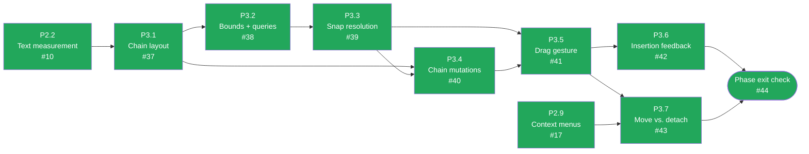

# CalcMind — Development plan archive: P3 · Snapping

**Archived.** This phase is done and its tasks are no longer active work — moved out of
`docs/DEVELOPMENT_PLAN.md` to keep that file focused on what's left. The `Status` table
and dependency diagram there still summarize this phase; this file is the historical detail
for it. `docs/ARCHITECTURE.md` remains the authority on design — nothing here overrides it.

---

## P3 · Snapping

Every threshold in this phase is in **world units** so snapping feels identical at any zoom (§7).
A threshold compared against screen pixels is a bug, and it will only show up at non-default zoom.

Green = done, amber = ready to start, grey = blocked on a dependency, purple = the phase-exit
gate. Kept current by hand alongside the acceptance-criteria boxes below — if a task's status
here disagrees with its boxes, the boxes win and this diagram is stale.

### P3.1 — Chain layout pass

**Objective.** Lay a chain's members out flush, left to right, from its anchor.
**Architecture.** §8.1 (the algorithm and what `position` means for a member), §6.1 (`members`
order is the truth and is never re-derived from `x`).
**Touches.** `src/chains/layout.ts`.
**Depends on.** P2.2.

- [x] Pure function `(chain, nodes) → positions`. No store access, no React.
- [x] Members lay out flush — no gaps, no overlaps — all at `y = anchor.y`.
- [x] Changing a member's `raw` re-flows the chain **in the same commit** as the edit (§8.1), so no
      frame ever renders a stale layout.
- [x] Member `position` is written as a cache; `anchor` + `members` remain the truth (§8.1, §6.1).
- [x] Test that reordering `members` reorders the layout, and that **identical `x` values never
      reorder anything** — the §6.1 guarantee that a rendering bug cannot change a user's answer.

### P3.2 — Node bounds and neighbour queries

**Objective.** The geometry snapping needs, behind an interface that can later hide a spatial hash.
**Architecture.** §8.3 (what gets compared), §8.4 (O(n) now; hash later behind the same interface).
**Touches.** `src/chains/bounds.ts`.
**Depends on.** P3.1.

- [x] `boundsOf(node)`, `verticalOverlap(a, b)`, `memberBoundaries(chain)`.
- [x] Neighbour lookup is O(n) and exposed through an interface whose **call sites will not change**
      when a uniform spatial hash is inserted (§8.4). P7.6 depends on this holding.
- [x] Unit tested at exact threshold values, not only clearly-inside and clearly-outside cases.

### P3.3 — Snap candidate resolution

**Objective.** Given a dragged node, decide the single best snap outcome for this frame.
**Architecture.** §8.2 (`SNAP_DISTANCE = 28`, `SNAP_VERTICAL = 48`, `DETACH_DISTANCE = 44`), §8.3
(the candidate-gathering pseudocode).
**Touches.** `src/chains/snapping.ts`.
**Depends on.** P3.2.

- [x] Pure function returning one of `PREPEND` / `APPEND` / `INSERT_AT(chain, i)` /
      `NEW_CHAIN[a, b]` / none. **The nearest candidate wins** (§8.3).
- [x] Implements §8.3's rules for chains *and* for free nodes, including which side a new chain
      orders its two members on.
- [x] Thresholds are named constants in world units, imported — never inlined at a comparison.
- [x] Table-driven tests at each threshold boundary, including the hysteresis case: because
      `DETACH_DISTANCE > SNAP_DISTANCE` (§8.2), a member dragged just past detach must **not**
      immediately re-snap into the slot it just left.

### P3.4 — Chain mutation commands

**Objective.** Commit a snap outcome, with all the bookkeeping §8.3 requires.
**Architecture.** §8.3 ("bookkeeping on commit"), §13.
**Touches.** `src/store/commands.ts`.
**Depends on.** P3.1, P3.3.

- [x] Commands for insert / append / prepend / new-chain / detach — one undo entry each.
- [x] A chain dropping to **one** member dissolves; that member becomes free with an authoritative
      `position`.
- [x] An empty chain is deleted.
- [x] A chain that loses its `=` also loses its result node.
- [x] Detach sets `chainId: null` and writes the node's authoritative `position`.
- [x] Layout re-runs **in the same commit** as the mutation, never as a follow-up effect.

### P3.5 — Node drag gesture

**Objective.** The §8.2 drag lifecycle, at 60fps.
**Architecture.** §8.2 (the state machine), §11.4 (worklets; commit only on release).
**Touches.** `src/nodes/useNodeDrag.ts`.
**Depends on.** P3.3, P3.4.

- [x] Implements the §8.2 states: Idle → Dragging → Detaching / Snapping → Idle.
- [x] Drag position lives in Reanimated shared values. The store is written **only on release** —
      no mid-drag frame may touch undo history (§11.4, and the pattern P1 already established in
      `Canvas.tsx`).
- [x] The snap candidate is recomputed per frame and exposed to the caret (P3.6).
- [x] Drag composes correctly with the canvas pan gesture: a press on a node drags the node, a
      press on empty canvas pans the canvas.
- [x] Verified interactively at zoom 0.25 **and** 4 — snapping must feel the same at both.

### P3.6 — Insertion feedback

**Objective.** Let the user see the outcome before committing to it.
**Architecture.** §8.3 ("the user sees the outcome before committing").
**Touches.** `src/chains/layout.ts`, `src/nodes/useNodeDrag.ts`, `src/canvas/NodeLayer.tsx`.
**Depends on.** P3.5.

- [x] The chain opens a gap at the pending insertion point during the drag.
- [x] An insertion caret is drawn at that point.
- [x] Both disappear when no candidate is in range, and the gap closes without a visual jump.
- [x] Runs on the UI thread — no store write per frame.

### P3.7 — Chain move vs member detach

**Objective.** Settle §17.1, the one genuinely open interaction in the design.
**Architecture.** §8.2 (`MovingChain`), §8.3, §17.1, §8.6 (`Select group` is the
other route).
**Touches.** `src/nodes/useNodeDrag.ts`.
**Depends on.** P3.5, P2.9.

- [x] Long-press 200ms on a member then move drags the **whole chain** (anchor updates); a plain
      drag detaches that member.
- [x] No conflict with P2.9's long-press context menu — one gesture, one outcome, decided
      deliberately.
- [x] **Decide this on a real device, not on paper.** §17.1 says the opposite mapping is
      defensible, that both gestures exist in the reference app, and that this is one line in
      `useNodeDrag`. Try both.
- [x] Whichever way it lands, record it in the journal with what convinced you. This closes an open
      question, so it earns a `Now known:` line — and if the shipped mapping is the opposite of the
      assumption above, update §8.3 and §17.1 in the same commit.

### Phase exit check — P3

> Two free nodes snap into a chain; insertion between members works with a visible caret; dragging
> out past `DETACH_DISTANCE` detaches without re-snapping; single-member chains dissolve; chains
> lay out flush with no gaps.

- [x] All of the above demonstrated by hand, at more than one zoom level.

Demonstrated live at zoom 0.25 and 4 (not merely type-checked — `docs/journal/2026-08-03.md`
revision 8). See `docs/journal/2026-08-04.md` for the session, including a caret-visibility
false alarm from imprecise test targeting at extreme zoom (resolved — the underlying candidate
detection is correct at both extremes) and an unrelated pre-existing finding about ctrl+wheel
zoom's `preventDefault`.
