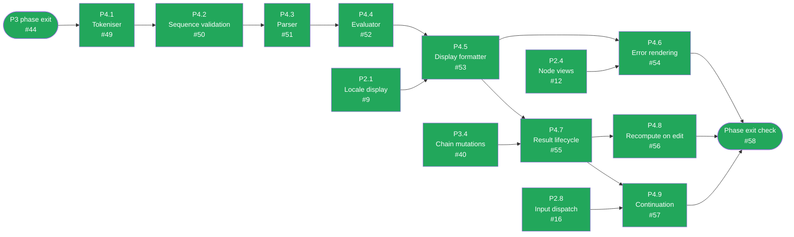

# CalcMind — Development plan archive: P4 · Engine

**Archived.** This phase is done and its tasks are no longer active work — moved out of
`docs/DEVELOPMENT_PLAN.md` to keep that file focused on what's left. The `Status` table
and dependency diagram there still summarize this phase; this file is the historical detail
for it. `docs/ARCHITECTURE.md` remains the authority on design — nothing here overrides it.

---

## P4 · Engine — critical path

The engine is pure functions over plain data and must stay free of React (§14) — that is the whole
reason it is testable. Enforced by the definition of done above.

Green = done, amber = ready to start, grey = blocked on a dependency, purple = the phase-exit
gate before it is demonstrated live — turns green once ticked, same as every other node. `P4.1`
carries no *task*-level dependency of its own (§10.1's pipeline just needs `chain.members`, which
already exists), but the plan sequences the whole phase behind P3 as the **critical path** —
shown here as a gate from P3's own phase-exit check rather than jumping the queue the moment
P4.1's box would otherwise look open. Kept current by hand alongside the
acceptance-criteria boxes below — if a task's status here disagrees with its boxes, the boxes win
and this diagram is stale.

### P4.1 — Tokeniser

**Objective.** Turn `chain.members` into a token stream the parser can consume.
**Architecture.** §10.1 (the pipeline: drop `=` and the result node).
**Touches.** `src/engine/tokenize.ts`.

- [x] Reads `chain.members` **in stored order** — never sorted by position (§6.1).
- [x] Drops the `=` and the result node; keeps numbers, operators, parens and references.
- [x] Number tokens carry canonical `raw`; a partial `"3."` tokenises without throwing.
- [x] Table-driven tests (§14).

### P4.2 — Sequence validation and chain state

**Objective.** Classify a chain into exactly one §9 state.
**Architecture.** §9 (the state machine and all its rules), §10.2 (parens must balance).
**Touches.** `src/engine/validate.ts`, `src/engine/errors.ts`.
**Depends on.** P4.1.

- [x] Returns exactly one of `Empty` / `Incomplete` / `Valid` / `Invalid` / `Evaluated` / `Stale` /
      `ErrorState`.
- [x] A trailing operator is `Incomplete`, renders normally, and produces no result — this is the
      normal state of a formula being typed, not an error (§9).
- [x] Two adjacent **numbers** → `Invalid`. Not implicit multiplication, not concatenation (§9,
      decision #4).
- [x] Two adjacent operators, or any node to the right of the result → `Invalid`.
- [x] **Unbalanced parens → `Incomplete`, not `Invalid`** (§10.2). An unclosed paren is normal
      mid-typing and must not be punished.
- [x] `Invalid` **deletes nothing** — it marks the offending boundary with a red hairline (§9).
- [x] Table-driven tests covering every transition in the §9 diagram.

### P4.3 — Parser

**Objective.** Tokens → AST, by precedence climbing.
**Architecture.** §10.2 (grammar, associativity, the narrow implicit-multiplication rule, and the
extension path).
**Touches.** `src/engine/parse.ts`.
**Depends on.** P4.2.

- [x] Implements the §10.2 grammar. Left-associative; `× ÷` bind tighter than `+ -`.
- [x] **Implicit multiplication only before `(`**: `10000 ( 1 + 0.04 )` is a product, while two
      adjacent numbers stay invalid (§10.2, decision #4).
- [x] Negative numbers come from `NumberNode.raw` (`"-5"`), **not** a unary operator node (§10.2).
- [x] Structured so `^`, prefix/postfix operators and function application can be added later
      without restructuring (§10.2 extension path). Do **not** implement them now.
- [x] Tests include `2 + 3 × 4 = 14` and `2 × (3 + 4) = 14`.

### P4.4 — Evaluator

**Objective.** AST → value, exactly.
**Architecture.** §10.3 (decimal.js at precision 34), §10.4 (errors are values, decision #3).
**Touches.** `src/engine/evaluate.ts`.
**Depends on.** P4.3.

- [x] All arithmetic in `decimal.js` at precision 34. `0.1 + 0.2` is exactly `0.3` (§14) — this is
      the reason for the dependency (decision #3).
- [x] Division by zero returns a `DivideByZero` **value** — never `Infinity` (§10.3).
- [x] Overflow → `Overflow`; non-numeric → `NotANumber`.
- [x] **Nothing throws across a module boundary** (§10.4).

### P4.5 — Display formatter

**Objective.** Value → the string on the result cell.
**Architecture.** §10.3 (display rules and the locale split).
**Touches.** `src/engine/format.ts`.
**Depends on.** P4.4, P2.1.

- [x] Up to 12 significant digits, trailing zeros stripped.
- [x] Scientific notation when `|x| ≥ 1e12` or `0 < |x| < 1e-6`.
- [x] Locale separators are applied here and nowhere else; stored values stay canonical (§10.3).
- [x] Boundary tests at exactly `1e12` and `1e-6`, and either side of both (§14).
- [x] Property test: the formatter never emits something it cannot re-parse (§14).

### P4.6 — Error rendering

**Objective.** Make every §10.4 state visible on the result cell.
**Architecture.** §10.4 (the six errors), §9 (`Stale` behaviour), §11.2 (errors are explained, not
punctuated).
**Touches.** `src/nodes/ResultNode.tsx`, `src/engine/errors.ts`.
**Depends on.** P4.5, P2.4.

- [x] `Incomplete`, `InvalidSequence`, `DivideByZero`, `Overflow`, `NotANumber` each render
      distinguishably. `CircularReference` cycle naming and Unlink landed with P6.3.
- [x] A `Stale` result keeps showing its previous value **dimmed** rather than flashing empty (§9).
- [x] No error is rendered as a bare glyph — §11.2 is the design's sharpest criticism of the
      reference app and applies to engine errors, not just broken links.
- [x] A component test per state.

### P4.7 — Result node lifecycle

**Objective.** `=` creates a result; removing `=` removes it.
**Architecture.** §9 (`Valid → Evaluated → Valid`), §8.3 (a chain losing `=` loses its result), §6
(`derived` is cache only).
**Touches.** `src/store/commands.ts`.
**Depends on.** P4.5, P3.4.

- [x] Appending `=` to a `Valid` chain creates a `ResultNode` with `sourceChainId` set.
- [x] Removing `=` deletes the result node (§8.3).
- [x] The result is read-only; edit attempts are rejected, not silently swallowed.
- [x] `derived` is written as a cache and **never trusted on read** — the engine always wins,
      silently (§6, §12.1).
- [x] Integration test: create → snap → `=` → result (§14).

### P4.8 — Recompute on edit

**Objective.** Editing an input updates the result.
**Architecture.** §11 (dirty-marking — the single-chain half, without references yet), §11.4
(dirty-set only, never a full document sweep).
**Touches.** `src/engine/graph.ts`, `src/store/documentStore.ts`.
**Depends on.** P4.7.

- [x] Mutating a chain marks **that chain** dirty and recomputes it. Untouched chains are never
      re-evaluated — assert this in a test rather than believing it.
- [x] Recompute runs in the same commit as the mutation, so no frame renders a stale-but-undimmed
      result.
- [x] Integration test: edit an input, the result updates (§14).
- [x] `graph.ts` is structured so P6.2 can extend it from "this chain" to "transitive dependents in
      topological order" **without a rewrite**.

### P4.9 — Continuation (pulled forward from P6)

**Objective.** Result selected + operator → a new chain seeded with a reference to it.
**Architecture.** §8.7 (the exact behaviour, and why it is the single most important interaction),
§11.1 (the connector is drawn in the source's hue).
**Touches.** `src/store/commands.ts`, `src/keypad/keymap.ts`, `src/engine/compute.ts`, `src/chains/measure.ts`, `src/nodes/ReferenceNode.tsx`.
**Depends on.** P4.7, P2.8.

> §15's caveat, which is why this is in P4 and not P6: continuation is the *primary* way users
> create links, so if P6 slips, the app ships as a canvas of unrelated sums and loses the point.

- [x] With result `R` selected, pressing operator `⊕` creates a chain below-right of `R` containing
      `[ reference→R , ⊕ ]` and selects it, so the next digits land in a fresh number node (§8.7).
- [x] Pressing an operator with a result selected **never edits the result** — this replaces the
      P2.8 no-op.
- [x] The reference resolves to `R`'s live value; editing `R`'s inputs updates the new chain.
- [x] Connector and hue are P6.5/P6.6. A reference with no hue yet is correct here.
- [x] Integration test covering the whole keystroke path.

### Phase exit check — P4

> `1221 + 3 - 20 =` produces a read-only `1204`; precedence correct; `2 × (3 + 4) = 14` with
> balanced parens, unbalanced reads `Incomplete`; editing an input updates the result; every error
> state in §10.4 renders; result node rejects edits.

- [x] All of the above demonstrated by hand, and `0.1 + 0.2 = 0.3` checked on the real keypad.

Demonstrated live with Playwright + Chromium against the real dev server (not type-checked only —
`docs/journal/2026-08-03.md` revision 8). `1221 + 3 - 20 = 1204`, editing `1221 → 1300` recomputes
to `1283`, `5 ÷ 0 =` renders "Division by zero" distinguishably, `0.1 + 0.2 = 0.3` exactly, an
unbalanced paren stays `Incomplete` (no result node), and the result cell rejects a digit press.
Found and fixed one real bug in the process: `2 × (3 + 4) =` — the phase exit check's own example
— evaluated to `7`, not `14`. See `docs/journal/2026-08-04.md` for the root cause (opening a paren
right after an operator discarded the pending empty operand *and* fell through to "nothing
selected", silently starting a second, disconnected chain) and the fix in `src/keypad/keymap.ts`.
