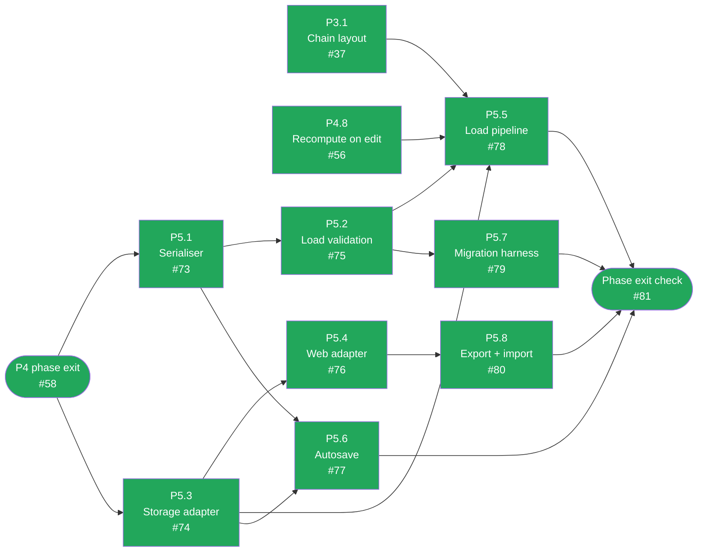

# CalcMind — Development plan archive: P5 · Persistence

**Archived.** This phase is done and its tasks are no longer active work — moved out of
`docs/DEVELOPMENT_PLAN.md` to keep that file focused on what's left. The `Status` table
and dependency diagram there still summarize this phase; this file is the historical detail
for it. `docs/ARCHITECTURE.md` remains the authority on design — nothing here overrides it.

---

## P5 · Persistence

A file on disk is **untrusted input** (§12.3). zod runs at that boundary before anything reaches
the store — which is why `src/model/schema.ts` was written back in P0.

Depends only on P4 and runs in parallel with P6.

Green = done, amber = ready to start, grey = blocked on a dependency, purple = the phase-exit
gate before it is demonstrated live — turns green once ticked, same as every other node. Neither
`P5.1` nor `P5.3` carries a task-level dependency of its own — the phase text above just says
"depends only on P4" — but the plan sequences both behind P4's own phase-exit check rather than
jumping the queue the moment either task's box would otherwise look open, shown here as a gate
from P4's tracking issue rather than an individual P4 subtask. All eight tasks are done and the
phase exit check is verified live — see below.
Kept current by hand alongside the acceptance-criteria boxes below — if a task's status here
disagrees with its boxes, the boxes win and this diagram is stale.

### P5.1 — Serialiser

**Objective.** Document → the §12.1 JSON, byte-stably.
**Architecture.** §12.1 (the format and all four notes beneath it), decision #5.
**Touches.** `src/persistence/serialize.ts`.

- [x] `nodes` and `chains` serialise as **arrays** in stable id order, while staying `Record`s in
      memory — so files diff cleanly in git (§12.1).
- [x] Keys are sorted, so two identical documents produce **byte-identical** files.
- [x] `derived` is stripped on write (§12.3).
- [x] Member `position` is written for self-describingness but is ignored for members on load,
      which re-runs layout instead (§12.1).
- [x] Round-trip test: document → JSON → document is equal; serialisation is byte-stable across
      runs (§14).

### P5.2 — Load-boundary validation

**Objective.** Reject bad input before it can reach the store.
**Architecture.** §12.3 (validation at the trust boundary), §12.4 (`CURRENT_SCHEMA_VERSION`),
decision #7.
**Touches.** `src/model/schema.ts`, `src/persistence/load.ts`.
**Depends on.** P5.1.

- [x] zod validates every loaded document. Failures name the offending field, and **nothing
      partial** reaches the store.
- [x] `schemaVersion` greater than `CURRENT_SCHEMA_VERSION` → **refused with a clear message**, and
      the file is left untouched. Guessing at an unknown shape corrupts the user's work
      (decision #7).
- [x] Malformed JSON is a handled outcome, not a crash.
- [x] Tests for malformed, newer-schema, and structurally-invalid-but-parseable files.

### P5.3 — Storage adapter and native implementation

**Objective.** The §12.2 interface, plus iOS/Android.
**Architecture.** §12.2 (interface and platform table), §12.3 (atomic writes, one `.bak`).
**Touches.** `src/persistence/adapter.ts`, `adapter.native.ts`.

- [x] `StorageAdapter` exactly as declared in §12.2.
- [x] Native uses `@dr.pogodin/react-native-fs`, documents at
      `DocumentDirectoryPath/calcmind/<id>.calcmind.json`.
- [x] **Writes are atomic**: `.tmp` → fsync → rename over target. A crash mid-save leaves either
      the old file or the new one, never a truncated one (§12.3).
- [x] The previous good file is kept as `.bak` — exactly one generation (§12.3).

`@dr.pogodin/react-native-fs` exposes no `fsync`; `writeFile`'s resolved promise is the flush
barrier before rename (Android closes/flushes the stream; see journal). Shared behavioural
contract tests live in `adapter.sharedTests.ts` for P5.4 to reuse against the web adapter.
`readBackup` is optional on the adapter; the native implementation exposes it so P5.5 can
recover when the primary is missing or corrupt without extending `read()` beyond §12.2.

### P5.4 — Web adapter

**Objective.** The same interface on web.
**Architecture.** §12.2 (web row), §5.1 (platform splitting already works in both bundlers).
**Touches.** `src/persistence/adapter.web.ts`.
**Depends on.** P5.3.

- [x] IndexedDB via `idb-keyval`; its transactions give atomicity for free (§12.3).
- [x] Resolves through webpack's existing `.web.ts` extension order with **no config change**
      (§5.1) — verify this rather than assuming it, and if a change is needed, that is a finding.
- [x] The same behavioural test suite passes against both adapters.

Verified with `enhanced-resolve` against webpack's existing extension list (no config change)
and `defineStorageAdapterContract('web', …)` against an in-memory `DocumentKeyVal` stand-in
for IndexedDB under Jest.

### P5.5 — Load pipeline

**Objective.** The §12.3 open-document flow, end to end.
**Architecture.** §12.3 (the load flowchart and its four safety properties).
**Touches.** `src/persistence/load.ts`.
**Depends on.** P5.2, P5.3, P3.1, P4.8.

- [x] Exactly the §12.3 order: read → JSON check (`.bak` fallback) → version check → migrate → zod
      validate → normalise arrays to maps → run chain layout → evaluate all chains topologically →
      ready.
- [x] A corrupt primary recovers from `.bak`. If **both** fail, report unreadable and **do not
      overwrite either** (§12.3).
- [x] `derived` from the file paints immediately, then the engine recomputes and overwrites it; on
      disagreement the engine wins, silently (§12.1, decision #6).
- [x] Test: corrupt the primary file, assert `.bak` recovery.

### P5.6 — Autosave

**Objective.** Save without the user thinking about it, without writing on every keystroke.
**Architecture.** §12.3 (the save sequence and its force-flush triggers), §13 (undo marks dirty
too).
**Touches.** `src/persistence/autosave.ts`, `src/store/documentStore.ts`.
**Depends on.** P5.1, P5.3.

- [x] Mutations mark dirty; writes debounce **600ms**.
- [x] Force-flush on app background, web `visibilitychange` / `pagehide`, explicit save, and
      document switch (§12.3).
- [x] Killing the app mid-edit loses **at most the debounce window**.
- [x] `lastSavedAt` is surfaced to the store.
- [x] Undo marks dirty and therefore saves — autosave and undo stay independent (§13).
- [x] Autosave is **suppressible**, because P6b.4's slider must suspend it mid-scrub (§8.8).
      Build the hook now; one scrub otherwise writes hundreds of documents.

### P5.7 — Migration harness

**Objective.** Make schema change safe before one is ever needed.
**Architecture.** §12.4.
**Touches.** `src/persistence/migrations/`.
**Depends on.** P5.2.

- [x] `Migration` type and an ascending runner per §12.4. `migrations` stays **empty** — v1 is the
      origin.
- [x] The harness is proven with a synthetic v0→v1 fixture pair, so the machinery is exercised
      before real user data depends on it.
- [x] The rule that every future migration ships a `before.json` / `after.json` fixture pair is
      documented where the next author will see it (§12.4: migrations are the code most likely to
      silently eat data and least likely to be exercised by hand).

### P5.8 — Export and import

**Objective.** Get documents in and out.
**Architecture.** §12.2 (the optional adapter methods).
**Touches.** `adapter.native.ts`, `adapter.web.ts`.
**Depends on.** P5.4.

- [x] Native: export through the OS share sheet.
- [x] Web: export as a `Blob` download; import via `<input type="file">`, upgrading to the File
      System Access API where available.
- [x] Imported files go through the **full** P5.5 validation path. No shortcut for "our own"
      format — an exported file is still untrusted on the way back in.

`importDocument` on both platforms returns the raw file text only (including deliberately
invalid / newer-schema fixtures in tests). P5.5's load pipeline (`openDocument`) is the sole
trust boundary — callers must feed picker results through it, with no shortcut for "our own"
format. Native also exposes `importDocument` via RNFS `pickFile` (same raw-string contract)
even though the task text only required native export.

### Phase exit check — P5

> Autosave debounces and force-flushes on background; kill the app mid-edit and lose at most the
> debounce window; corrupt the primary file and `.bak` recovers it; a `schemaVersion: 99` file is
> refused with a clear message; round-trip test passes.

- [x] All of the above demonstrated, including a real mid-edit kill and a hand-corrupted file.

Demonstrated live with Playwright + Chromium against the real dev server (not type-checked only —
`docs/journal/2026-08-03.md` revision 8), manipulating IndexedDB directly to simulate what a real
crash/corruption/newer-schema file would leave behind: autosave debounces then writes; a reload
after the 600ms debounce restores the document; killing (reloading with no graceful flush) before
the debounce fires loses only that un-debounced edit, not the whole document; a hand-corrupted
`schemaVersion: 99` file is refused, left byte-for-byte untouched on disk, and the app starts on a
blank document rather than crashing or guessing at the shape; malformed JSON is handled the same
way. `.bak` recovery is native-only (web's IndexedDB transactions are atomic by construction, so
there is no `.bak` sibling to test on this platform per `adapter.web.ts`'s own header comment) —
verified instead by the passing `adapter.native.test.ts` / `load.test.ts` suite, the correct
boundary for a platform-specific mechanism.

Found and fixed one real, load-bearing bug in the process: `openDocument` (P5.5) and
`replaceDocument` (`documentStore`) both existed, fully unit-tested, and were never wired together
anywhere in `AppShell` — the app only ever started from a fresh empty document, so every
autosaved file was silently discarded on the next launch despite being saved correctly the whole
time. Fixed by `src/app/loadOnStart.ts`; see `docs/journal/2026-08-04.md` for the finding and fix.
