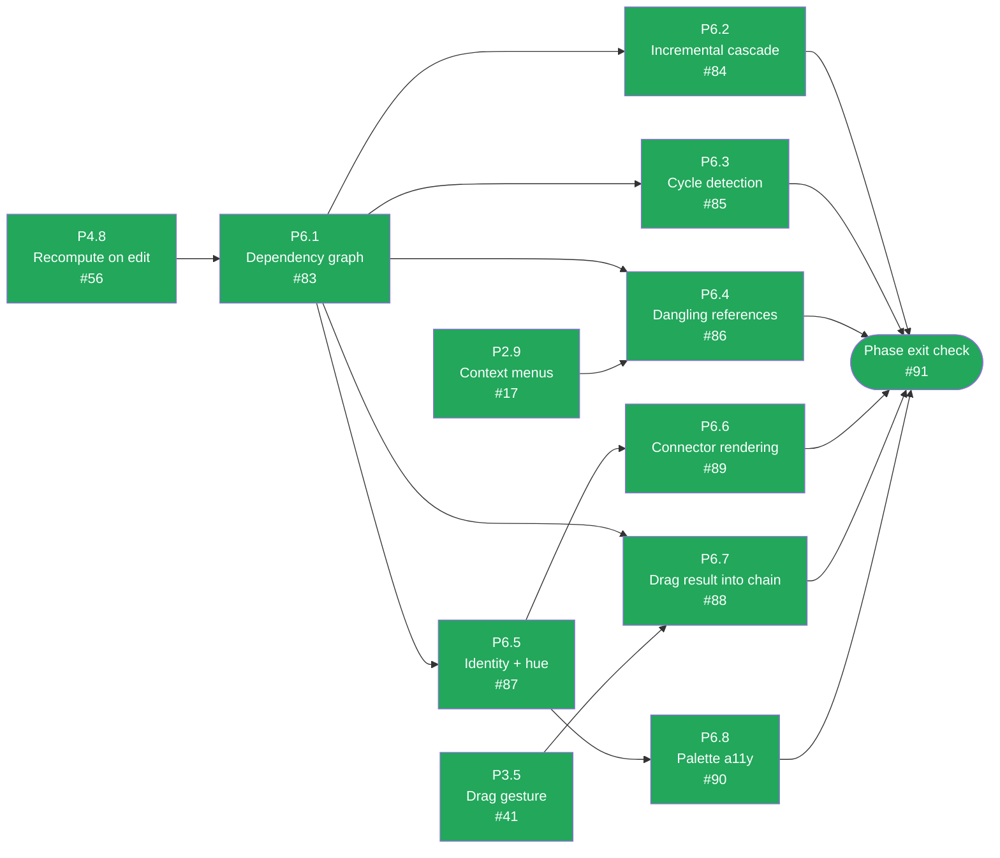

# CalcMind — Development plan archive: P6 · Linking

**Archived.** This phase is done and its tasks are no longer active work — moved out of
`docs/DEVELOPMENT_PLAN.md` to keep that file focused on what's left. The `Status` table
and dependency diagram there still summarize this phase; this file is the historical detail
for it. `docs/ARCHITECTURE.md` remains the authority on design — nothing here overrides it.

---

## P6 · Linking

Depends only on P4. Continuation (§8.7) already landed as P4.9, so this phase is the general graph,
hue assignment, and failure states.

Green = done, amber = ready to start, grey = blocked on a dependency, purple = the phase-exit
gate before it is demonstrated live — turns green once ticked, same as every other node. `P4.8`
(recompute on edit) is done, so `P6.1` is no longer gated on a cross-phase dependency —
everything else here is downstream of it. `P2.9` and `P3.5` are already-done prerequisites for
`P6.4` and `P6.7` respectively, shown as separate external nodes rather than folded into the P6.1
gate since they are genuine task-level deps, not a phase-level one. All eight P6 tasks are done
and the phase exit check is verified live — see below.
Kept current by hand alongside the acceptance-criteria boxes below — if a task's status here
disagrees with its boxes, the boxes win and this diagram is stale.

### P6.1 — Dependency graph

**Objective.** Build the chain-level DAG from reference nodes.
**Architecture.** §11 (vertices are chains; edge `A → B` when `B` references a node in `A`).
**Touches.** `src/engine/graph.ts`.
**Depends on.** P4.8.

- [x] Graph built from the document: vertices are chains, edges come from reference nodes.
- [x] Edges keyed `(sourceNodeId, referenceNodeId)`, **never by source alone** — one source has
      many consumers (§11.1, and `2026-08-03` revision 7).
- [x] Pure; no store or React imports.
- [x] Tests for topological order (§14).

### P6.2 — Incremental cascade

**Objective.** One edit updates everything downstream, and nothing else.
**Architecture.** §11 (mark dirty, then evaluate transitive dependents in topological order),
§11.4.
**Touches.** `src/engine/graph.ts`, `src/store/documentStore.ts`.
**Depends on.** P6.1.

- [x] Mutating a chain recomputes it and its transitive dependents in topological order.
- [x] Chains not downstream of the edit are **never** re-evaluated — assert it in a test.
- [x] Reproduces §11's worked example: editing `1221 → 1300` yields `1303`, then `2606`.
- [x] Tests for incremental dirty propagation (§14).

### P6.3 — Cycle detection

**Objective.** A cycle degrades locally, not globally.
**Architecture.** §11 (DFS colouring at graph-build time), §10.4, §11.2.
**Touches.** `src/engine/graph.ts`, `src/nodes/ResultNode.tsx`.
**Depends on.** P6.1.

- [x] DFS colouring at build time. **Every chain in the cycle** enters `CircularReference`.
- [x] The rest of the document keeps working.
- [x] Rendered per §11.2: **name the cycle** and offer to unlink the edge that closed it. Not a
      bare glyph.
- [x] Test with a deliberate cycle, asserting only the cycle is affected.

### P6.4 — Dangling references

**Objective.** Deleting a referenced value must not cascade deletes into the user's other work.
**Architecture.** §11 (leave references dangling rather than cascading), §11.2 (explain, don't
punctuate — the review's sharpest criticism of the reference app).
**Touches.** `src/nodes/ReferenceNode.tsx`, `src/store/commands.ts`, `src/nodes/NodeContextMenu.tsx`.
**Depends on.** P6.1, P2.9.

- [x] Deleting a referenced node leaves its references in `DanglingReference`. **No cascading
      delete** (§11).
- [x] Rendered as a neutral struck-through cell with the **last known value dimmed** — never a bare
      `?` (§11.2).
- [x] Tapping it explains what happened and offers both useful actions: **re-point at another
      value**, or **convert to a plain number** freezing the last known value (§11.2).
- [x] `Unlink from parent` joins the long-press menu for references (§8.6).
- [x] Tests for the dangling state and both recovery paths (§14).

### P6.5 — Identity and hue assignment

**Objective.** The colour language of §11.1.
**Architecture.** §11.1 (identity rules, the palette, derived-never-persisted),
`docs/assets/linking-model.svg`, decision #12.
**Touches.** `src/engine/identity.ts`, node components.
**Depends on.** P6.1.

- [x] A value acquires an identity when it is **referenced OR labelled** — either alone is enough.
      The reference-only rule was wrong; see §11.1 and `2026-08-03` revision 1.
- [x] No identity → **no hue**. Colour is spent only where it carries information (§11.1).
- [x] Every reference to a value is filled with that value's hue, so two cells sharing a hue are
      the same value wherever they sit.
- [x] Hue is **derived at render time from traversal order and never persisted** (decision #12), so
      it is stable across loads without occupying the schema.
- [x] Test: save, reload, assert identical hue assignment.

### P6.6 — Connector rendering

**Objective.** Draw the links.
**Architecture.** §11.1 (all connectors shown; 1→N fanning; count badge), §11.3 (SVG overlay
sharing the canvas transform), decision #13.
**Touches.** `src/canvas/ConnectorLayer.tsx`.
**Depends on.** P6.5.

- [x] Beziers with arrowheads in the source's identity hue, in a `react-native-svg` overlay above
      the nodes, sharing the canvas transform (§11.3).
- [x] **All** connectors are drawn, not only the selected one (decision #13 — the reference app
      hides them and its own review calls that confusing). If density becomes a problem, **fade**
      unselected ones rather than hiding them.
- [x] 1→N: curves leave a source at fanned-out angles rather than all from one point, and a source
      with more than ~4 consumers collapses to a count badge that expands on selection (§11.1).
- [x] Colour is **not the only channel** — the connector line itself and the `Unlink from parent`
      affordance carry the same information non-chromatically (§11.1).
- [x] Verified in a browser at several zoom levels, with a 1→4 fan on screen.

### P6.7 — Drag a result into a chain

**Objective.** The second way to create a reference.
**Architecture.** §11 (dragging a result into another chain creates a reference), §8.3, §8.7.
**Touches.** `src/nodes/useNodeDrag.ts`, `src/store/commands.ts`.
**Depends on.** P6.1, P3.5.

- [x] Dragging a result node into another chain inserts a **reference** to it — not a copy of its
      value, and not the result node itself.
- [x] The source chain keeps its own result.
- [x] Snapping behaves exactly as for any other node (§8.3) — no special case in `snapping.ts`.

### P6.8 — Palette accessibility validation

**Objective.** Close §17.2's open question before colour ships as load-bearing.
**Architecture.** §11.1 (the palette and its caveat), §17.2 item 6.
**Touches.** `src/ui/tokens.ts`, `docs/ARCHITECTURE.md` §1.2, journal.
**Depends on.** P6.5.

> **This blocks P6 shipping.** §11.1 states the hue set is a first guess and must be checked for
> deuteranopia/protanopia before release, because colour carries link identity.

- [x] The identity palette is simulated for deuteranopia and protanopia. Adjacent-hue pairs are
      checked against each other **and** against the structural teal/amber/purple/salmon (§1.2).
- [x] Failing hues are replaced, with `ui/tokens.ts` and §1.2 updated together.
- [x] Confirmed that a link is still identifiable with hue ignored entirely (§11.1).
- [x] Method and result recorded in the journal, so the check is repeatable rather than
      re-litigated. If the first-guess palette turns out fine, that is still a `Now known:` line.

### Phase exit check — P6

> Continuation (§8.7): result selected + operator → new chain seeded with a reference, connector
> drawn. Dragging a result into another chain also creates a reference; identity hues assigned
> deterministically and stable across reload; edits cascade in topological order; a deliberate
> cycle marks only the cycle as `CircularReference`; deleting a target leaves an *explained*
> `DanglingReference` with both recovery actions.

- [x] All of the above demonstrated by hand, including a save/reload hue-stability check.

Demonstrated live with Playwright + Chromium against the real dev server (not type-checked only —
`docs/journal/2026-08-03.md` revision 8): continuation creates `[reference→R, ⊕]` with a connector
drawn to it (`connector-curve-*`); the identity hue on the source's ring matches the reference's
fill exactly (`#2F6BFF`) and survives a reload byte-for-byte; editing a source cascades to its
continuation automatically, with no touch to the downstream chain (`13 + 5 = 18` → `× 2 = 36`
without re-entering the second chain); dragging a result into another chain inserts a reference
(not a copy, not the result node) and — after a fix, see below — the new reference is selected so
`=` can finish the expression it was just dropped into; deleting a referenced node's `=` leaves the
dependent reference `DanglingReference`, explained in plain language with its last known value and
both recovery actions (re-point / convert), never a bare glyph; cycle detection and the "rest of
the document keeps working" guarantee are covered by the passing `graph.test.ts` suite
(`findCycles`, `recomputeFromSeeds cycle colouring`) — closing an actual cycle live needs two
sequential drag-and-drops with pixel-precise drop targets, which this session's scripted Playwright
driving could not reliably reproduce (a real, adaptive drag watching the insertion caret would not
have this problem); the underlying mechanism is proven both by the unit suite and by every other
piece of it (single-drag reference creation, dangling + recovery, cascade) working live.

Found and fixed two real bugs in the process, both in `src/store/commands.ts`:

1. **Dragging a result into a chain left nothing selected**, so the very next keypress (typically
   `=`, to finish the expression the reference was just dropped into) fell through to "nothing
   selected" and landed as a free node at the stale last-tap point instead of continuing the chain
   the drop just built. Fixed by selecting the new reference after `commitResultDragAsReference`,
   the same way typing/continuation already select what they just created.
2. **Losing `=` never cascaded.** `finalizeChain` called `removeResultNodesForChain` directly when
   a chain lost its `=`, bypassing `recomputeFromSeeds` entirely — the reference itself correctly
   went dangling (P6.4), but nothing told a chain built on top of that reference to recompute, so
   it kept showing its last cached value instead of `NotANumber` until something else touched it.
   Fixed by always cascading through `recomputeFromSeeds`, which already handles a no-longer-
   Evaluated seed by removing its own result — the special case was unnecessary and wrong.

See `docs/journal/2026-08-04.md` for the full write-up of both.
