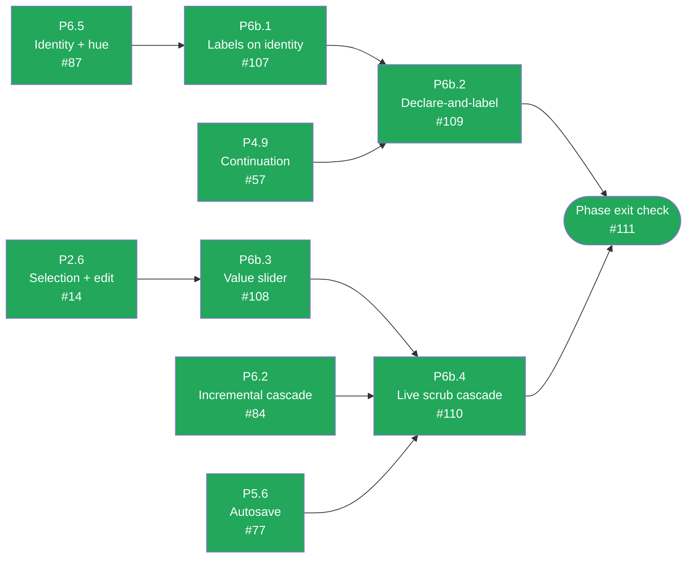

# CalcMind — Development plan archive: P6b · Labels and slider

**Archived.** This phase is done and its tasks are no longer active work — moved out of
`docs/DEVELOPMENT_PLAN.md` to keep that file focused on what's left. The `Status` table
and dependency diagram there still summarize this phase; this file is the historical detail
for it. `docs/ARCHITECTURE.md` remains the authority on design — nothing here overrides it.

---

## P6b · Labels and slider

Not garnish (§15). Labels are what let a canvas be read back a week later; the slider is what turns
a correct dependency graph into something you can interrogate.

Green = done, amber = ready to start, grey = blocked on a dependency, purple = the phase-exit
gate. All four P6b tasks are done, and the phase exit check is verified live — see below.
Kept current by hand alongside the acceptance-criteria boxes below — if a task's status here
disagrees with its boxes, the boxes win and this diagram is stale.

### P6b.1 — Labels on the identity

**Objective.** Edit a label once, see it change everywhere.
**Architecture.** §11.1 (the label belongs to the identity, not the cell), §6 (`label` on the node
base), §1.3 (labels are a headline feature of the mature reference app).
**Touches.** `src/engine/identity.ts`, node components, `src/store/commands.ts`.
**Depends on.** P6.5.

- [x] Any value can be labelled — results as often as inputs (§6, `2026-08-03` revision 2).
- [x] The label renders above the declaring cell **and above every reference to it**. §11.1's
      compound-interest example shows "Initial Deposit" three times for one identity.
- [x] Editing it updates every cell sharing that identity, in **one** undo entry.
- [x] Labelling an otherwise-plain value grants it an identity hue even with zero references
      (§11.1).
- [x] Test: label a value with three references, assert all four cells update together.

### P6b.2 — Declare-and-label idiom

**Objective.** The way the reference app is actually used, working end to end.
**Architecture.** §1.3 (the `10,000 = [10,000]` idiom), §8.7, §10.3 (locale display).
**Touches.** integration tests, `src/store/commands.ts`.
**Depends on.** P6b.1, P4.9.

- [x] `10,000 =` produces a labelled declaration whose result can be referenced onward.
- [x] Locale display holds throughout: `10,000` displays grouped while storing `10000` (§10.3).
- [x] One integration test walks the whole idiom exactly as a user would type it.

P6b.1 (labels) and P4.9 (continuation) already carried the machinery; this task was proving the
composition, the same lesson as the P5/P6 close-out (`2026-08-04` Knowledge revision 9). One
integration test (`P6b.2 declare-and-label idiom` in `src/store/commands.test.ts`) walks
`10000` `=` → label "Initial Deposit" → continue `+ 5000` `=` → edit the declaration, all through
`dispatchEditorCommand`, the same dispatch a real keystroke goes through. Verified live in a
browser too — see the phase exit check below.

### P6b.3 — Value slider

**Objective.** Raise the §8.8 popover and scrub a number.
**Architecture.** §8.8 (range inference, tap-to-snap, editable bounds).
**Touches.** `src/nodes/ValueSlider.tsx`.
**Depends on.** P2.6.

- [x] Selecting a number raises a slider in a popover anchored beneath its cell, with both range
      endpoints labelled.
- [x] Range inferred per §8.8: `[0, 10^ceil(log10(|v|))]` for positive, symmetric about zero for
      negative, `[0, 10]` for zero.
- [x] The user can edit the bounds.
- [x] Tap snaps to integers; dragging again is continuous (§8.8).
- [x] Unit tests for range inference including `v = 0`, negatives, and a value that is an exact
      power of ten.

### P6b.4 — Live scrub cascade

**Objective.** Make the dependency graph *felt* rather than merely correct.
**Architecture.** §8.8 (one undo entry, autosave suppressed, dirty-subgraph recompute, frame
budget), §11.4.
**Touches.** `src/nodes/ValueSlider.tsx`, `src/persistence/autosave.ts`, `src/engine/graph.ts`.
**Depends on.** P6b.3, P6.2, P5.6.

- [x] Scrubbing recomputes the **dirty subgraph only** (§11) and holds 60fps.
- [x] The whole gesture coalesces into **one** undo entry (§8.8).
- [x] Autosave is suppressed until release — otherwise one scrub writes hundreds of documents
      (§8.8). This is what P5.6's suppression hook was built for.
- [x] If a subgraph is too expensive, recompute **throttles to the frame budget** rather than
      dropping the interaction (§8.8).
- [x] Verified interactively on a chain several dependent levels deep.

### Phase exit check — P6b

> Label any value; the label renders above the declaration *and* every reference, and editing it
> updates all of them (§11.1); the `10,000 = [10,000]` declare-and-label idiom works end to end;
> selecting a number raises the slider popover (§8.8) and scrubbing cascades live at 60fps as one
> undo entry with autosave suppressed until release.

- [x] All of the above demonstrated by hand, with the undo stack inspected after a scrub.

Demonstrated live with Playwright + Chromium against the real dev server (not type-checked only —
`docs/journal/2026-08-03.md` revision 8): `10000 =` displays grouped as `10,000`; long-pressing the
result opens its context menu with a `Label` item; typing "Initial Deposit" renders the caption
above the declaration; continuing from it (`+ 5000 =`) creates a reference carrying the same
caption, evaluating to `15,000`; editing the declaration's input cascades to the consumer with no
touch to it (`1,000 + 5,000 = 6,000`) — the whole idiom, keystroke for keystroke. Separately,
selecting a plain number raises the slider popover with editable `[0, 10]` bounds, and dragging its
track scrubs the value live (confirmed the on-screen value changed frame to frame during the drag).
Screenshots under the session's scratch directory (`p6b-declared-labelled.png`,
`p6b-referenced-onward.png`, `p6b-slider-scrub.png`). The undo stack itself was **not** inspected
by hand this way — there is no UI affordance to trigger undo yet (keyboard undo is P7.2), so
nothing in the browser can drive it. "One undo entry per scrub" and "autosave suppressed until
release" are instead covered by P6b.4's own passing unit tests
(`beginValueScrub`/`scrubNodeValue`/`endValueScrub` in `src/store/commands.test.ts`), which call
the store directly and assert the stack length — the correct boundary for a guarantee the current
UI has no way to exercise, the same test-harness-limitation call made for P6's cycle detection.
